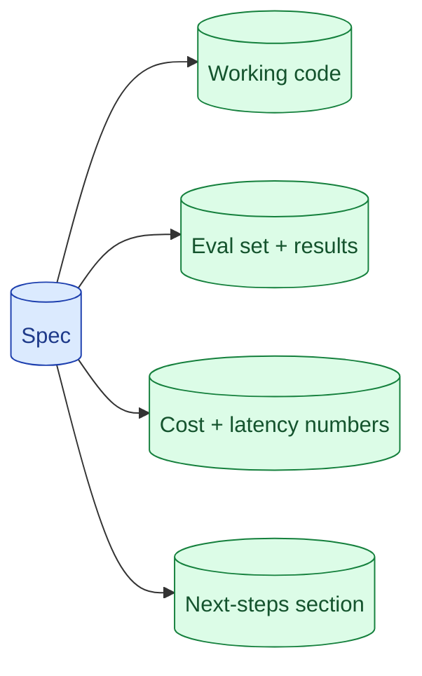

Take-homes for AI roles are won at the README. A working prompt and a clean repo is table stakes. What separates candidates: a small eval set, a cost-per-request number, a 'what I would do with another week' section. The take-home is the only round where you control the narrative.



## What every AI take-home needs in the README

The reviewer reads the README first. Make the first 30 seconds count.

The structure:

```
# Project Name

## What this does
One paragraph. The user-facing description.

## How to run it
3-5 commands. Tested. Works on a fresh checkout.

## Architecture
A diagram. The key decisions and why.

## Eval results
Numbers. On the eval set you built. With cost-per-call.

## Trade-offs and known limitations
Honest. What you chose not to do and why.

## With another week
Specific. What you would add and why it matters.
```

Six sections. A reviewer should be able to scan them in 5 minutes and know if you can think about AI systems.

The trap: spending hours on the UI and 10 minutes on the README. Invert that.

## Why a 20-example eval set is more impressive than a fancy UI

A polished UI says "I can build React components." Most candidates can.

A 20-example eval set with measured pass rates says "I think about whether my AI actually works." Most candidates do not show this.

The eval set proves you understand non-determinism, you have measured your system, and you know its failure modes. It is the single most senior thing in an AI take-home.

```python
# evals/eval_set.jsonl
{"input": "How do I reset my password?", "expected": {"category": "auth", "must_contain": ["reset link"]}}
{"input": "Cancel my subscription", "expected": {"category": "billing", "should_not_refuse": true}}
... (20 more)
```

```python
# evals/run.py
def run():
    pass, fail = 0, 0
    for case in load_eval_set():
        actual = system(case["input"])
        if matches_expectation(actual, case["expected"]):
            pass += 1
        else:
            fail += 1
    print(f"Pass rate: {pass}/{pass+fail}")
```

Half a day of work. Looks like a week of work to the reviewer.

## Showing cost-per-request rather than hand-waving

Include the numbers.

```
## Cost analysis

Average input tokens per request:  ~1200
Average output tokens per request: ~180
Model used: claude-3-7-sonnet
Cost per call: ~$0.0036 (input) + $0.0027 (output) = ~$0.0063

At 100,000 calls per day: ~$630/day, ~$19,000/month.

A cheaper alternative:
With Haiku as the small-model tier in a router, ~80% of calls
serve at ~$0.0008. Average cost drops to ~$0.0019/call.
That brings monthly cost down to ~$5,700.
```

Two paragraphs. Specific. Demonstrates you have thought about scale.

The reviewer immediately knows you can talk to a CFO about AI costs. Most candidates skip this entirely.

## The 'with another week' section as senior signal

Take-homes are time-bounded. You did not finish everything you wanted. The "with another week" section turns that into a strength.

```
## With another week, I would

1. Add a small reranker. Recall@5 is 78%; a Cohere reranker would
   likely push this above 85% based on similar projects.

2. Add structured outputs with schema validation. Currently the
   model occasionally produces malformed JSON; pin this to 99.9%
   validity.

3. Add prompt caching for the system prompt. Would cut input cost
   roughly 70%.

4. Build a per-feature cost dashboard. Currently I am estimating;
   real per-call logging would let me catch regressions automatically.
```

Specific. Quantified. Each item has a reason.

This shows the reviewer that you have thought about production. You know what you would do next. The take-home is a step, not the final product.

## Things to deliberately not do (gold-plating, deep optimisation)

You have limited time. Spend it where it counts.

**Skip:**
- Fancy UI styling.
- Custom training infrastructure.
- Performance optimisation below the obvious wins.
- Comprehensive error handling for edge cases unlikely to be tested.
- Multiple authentication strategies.
- Production-grade monitoring you cannot show.

**Spend time on:**
- The README.
- The eval set and measured results.
- Cost analysis.
- The trade-offs section.
- One thing the spec did not ask for that demonstrates depth (e.g., a tiny LLM-as-judge eval to back up your numbers).

The grading rubric, even if unstated, weighs "thoughtful engineering" over "polished demo."

## A complete take-home structure

For a typical RAG take-home with one week:

**Day 1-2.** Read the spec carefully. Build the basic prototype. End-to-end working.

**Day 3-4.** Build the eval set. Run it. Iterate on the prompts and parameters until results are reasonable.

**Day 5.** Write the README. Include all six sections. Cost numbers, eval results, trade-offs.

**Day 6.** Polish one thing that demonstrates depth (a citation feature, a cost dashboard, a small fine-tune).

**Day 7.** Final review. Run the eval set one more time. Commit. Submit.

This sequence avoids the gold-plating trap and lands all the senior signals.

## What reviewers actually grade on

Not stated but consistent across companies.

1. **Did it work?** (Table stakes; required.)
2. **Did you measure quality?** (Eval set is the biggest separator.)
3. **Do you understand cost?** (Cost numbers matter.)
4. **Did you think about trade-offs?** (Trade-off section matters.)
5. **Would you grow this into production?** (With-another-week section matters.)
6. **Is the code clean enough?** (Threshold check; not optimisation target.)
7. **Is the UI polished?** (Lowest weight unless explicit.)

Optimise for the top four. The bottom three are passing grades.

## Common mistakes

- **Spending 80% of time on the UI.** Inverts the priority.
- **No README.** "Read the code" is not a deliverable.
- **No eval set.** Biggest miss in AI take-homes.
- **No cost numbers.** Reviewer wonders if you can think about scale.
- **No "with another week" section.** Missed opportunity to show product thinking.
- **Trying to be perfect.** Time-bounded; perfection is the enemy.

## Quick recap

- README beats UI. Six sections: what, how, architecture, eval, trade-offs, next steps.
- 20-example eval set is the single biggest senior signal.
- Include cost-per-request math. Reviewers care.
- "With another week" section turns time limits into strength.
- Skip gold-plating. Optimise for thoughtful engineering signals.

This concept sits in **Stage 7 (Interview craft)** of the [AI Engineering Roadmap](/practice/ai-engineering/roadmap/).
