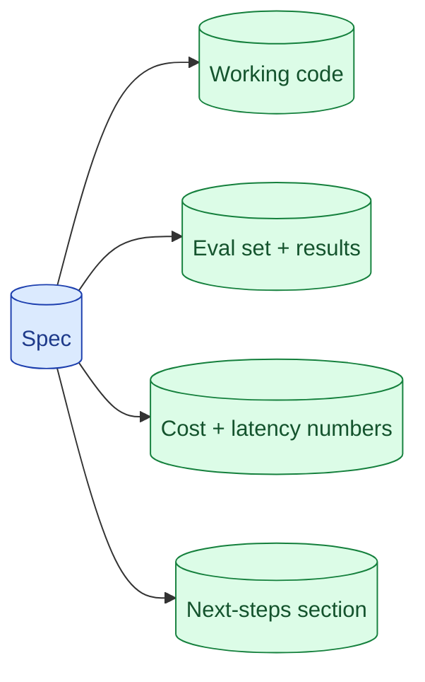

Take-homes for AI roles are won at the README. A working prompt and a clean repo is table stakes. What separates candidates: a small eval set, a cost-per-request number, a 'what I would do with another week' section. The take-home is the only round where you control the narrative.

**What this page will cover.**

- What every AI take-home needs in the README
- Why a 20-example eval set is more impressive than a fancy UI
- Showing cost-per-request rather than hand-waving
- The 'with another week' section as senior signal
- Things to deliberately not do (gold-plating, deep optimisation)

*Page coming soon.*

This concept sits in **Stage 7 (Interview craft)** of the [AI Engineering Roadmap](/practice/ai-engineering/roadmap/).
