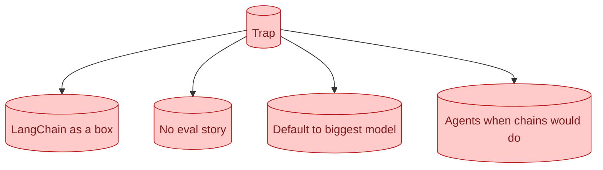

The recurring AI interview traps. Drawing LangChain as a box without saying what it does. Skipping eval entirely. Defaulting to the most expensive model without justification. Talking about agents when a chain would do. Knowing the traps in advance is half the work of avoiding them.

**What this page will cover.**

- The traps that show up across companies
- Why each trap signals junior thinking
- What to say instead, with concrete phrasing
- How to recover when you have already fallen in
- The traps that are not actually traps (and the interviewer is wrong)

*Page coming soon.*

This concept sits in **Stage 7 (Interview craft)** of the [AI Engineering Roadmap](/practice/ai-engineering/roadmap/).
