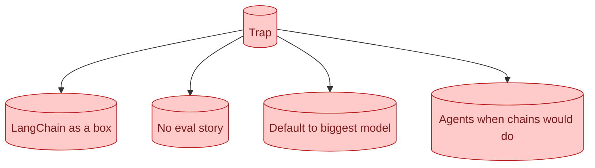

The recurring AI interview traps. Drawing LangChain as a box without saying what it does. Skipping eval entirely. Defaulting to the most expensive model without justification. Talking about agents when a chain would do. Knowing the traps in advance is half the work of avoiding them.

## The traps that show up across companies

These come up everywhere. Knowing them in advance is most of the cure.

**Trap 1: LangChain as a box.** Drawing "LangChain" as one block on the whiteboard. Skips the responsibility breakdown.

**Trap 2: No eval story.** Designing a system without saying how you know it works.

**Trap 3: Default to the biggest model.** "We'll use GPT-4." No justification, no cost discussion.

**Trap 4: Agents when chains would do.** Reaching for an agent loop when a fixed sequence of steps would solve it.

**Trap 5: Pure vector search.** "We'll use a vector DB." No mention of hybrid or reranking.

**Trap 6: No failure modes.** "What if the model is wrong?" goes unanswered.

**Trap 7: Hand-waving on cost.** "It will be cheap" without numbers.

Each one is a junior signal. Avoiding them is most of what makes a strong interview.

## Why each trap signals junior thinking

A box labelled "LangChain" hides what the system actually does. The interviewer cannot tell if you understand the pieces.

No eval story signals you have never had to maintain an AI system. Every senior team has eval-related scars.

The biggest-model default signals you have not thought about cost-vs-quality trade-offs. In production, this matters every day.

Agents-when-chains-would-do signals you have not yet learned that agents are over-applied. Senior engineers reach for simpler tools first.

Pure vector search signals you have not shipped RAG. The first time you do, you discover BM25's importance.

No failure modes signals you have not been on call for an AI system.

Hand-waving on cost signals you have not had a finance conversation about AI bills.

Each trap reflects a piece of the seniority you are trying to show. Avoiding them is the easiest way to signal experience.

## What to say instead, with concrete phrasing

For each trap, the senior version.

**Instead of "LangChain":** "I would use a thin custom wrapper around the provider SDK for the LLM call and the chain logic. I would use LangChain's document loaders if any prove useful, but I would not put the agent logic behind their abstractions."

**Instead of no eval:** "Before architecture, the headline eval metric. I want recall@5 above 80% on a 50-example golden set, running in CI, blocking any merge that drops by 5+ percentage points."

**Instead of biggest-model default:** "I would start with the cheap tier of either Anthropic or OpenAI; for this task, Haiku at $0.80/M input. If the eval set shows recall under 75%, I would test Sonnet. The cost difference is roughly 4x."

**Instead of agents when chains would do:** "I would build this as a fixed two-step chain: retrieval, then generation. An agent is only justified if the steps depend on intermediate results."

**Instead of pure vector:** "Hybrid search with vector + BM25, fused with reciprocal rank fusion, then a Cohere reranker on top 20 candidates."

**Instead of no failure modes:** "If the model is wrong, layered defence: output schema validation, citation requirement, human approval on destructive actions, eval coverage for known failure classes, production monitoring."

**Instead of hand-waving on cost:** "100,000 calls/day × 1500 tokens × $3/M = $450/day. Roughly $13,500/month. If that is too high, model routing can cut it to about $4,000."

Specific phrasing, ready to deploy.

## How to recover when you have already fallen in

You said something junior. The interviewer's body language shifted. What now?

**Self-correct gracefully.** "Let me take that back. I said LangChain; what I should have done is name the actual blocks."

**Bring in the missing dimension explicitly.** "I have not talked about eval yet; let me address that."

**Acknowledge and update.** "I picked GPT-4 by reflex. Cost matters here; I should consider Haiku first."

Recovering is itself a signal of seniority. Junior candidates double down on the wrong answer. Seniors update.

Do not pretend the mistake did not happen. Acknowledge, correct, move on.

## The traps that are not actually traps (and the interviewer is wrong)

Sometimes the "trap" is the interviewer's opinion, not best practice.

**"You should have used LangChain."** Sometimes interviewers value framework familiarity. Bare-metal is often better in production. You can defend the choice.

**"You should fine-tune."** Sometimes RAG is right and fine-tuning is wrong, but the interviewer is biased toward fine-tuning. Defend the choice with eval-driven reasoning.

**"That model is not the best."** Sometimes the interviewer prefers a specific model. Cost and quality are trade-offs; defend yours.

For these, do not cave to make the interviewer happy. Defend with reasoning. Most interviewers respect a candidate who can argue back.

The exception: when the interviewer keeps pushing the same point and you do not have a strong counter, switch. Sometimes they are right and you missed something.

## Trap-avoidance as a checklist

Before any system design round, mentally walk through this checklist.

- Have I named a specific model and justified it?
- Have I given a cost-per-call estimate?
- Have I described the eval strategy?
- Have I avoided drawing framework names as system boxes?
- Have I considered failure modes?
- Did I default to a chain before reaching for an agent?
- Did I mention hybrid search if RAG?
- Did I include reranking if RAG?

Eight items. 30 seconds to scan. Catches most traps.

## Common mistakes (the meta-mistakes)

- **Memorising answers instead of understanding them.** Interviewer probes; you flail.
- **Avoiding traps but missing the actual point.** Over-correction.
- **No clarifying questions.** You bury yourself by assuming.
- **Being defensive when corrected.** Senior engineers update.
- **Not asking for feedback at the end.** Last 60 seconds are signal.

## Quick recap

- Seven recurring traps: LangChain-as-box, no eval, biggest model, agent-when-chain, pure vector, no failure modes, hand-waving cost.
- Each one signals junior thinking. Have specific senior phrasings ready.
- Recover by self-correcting gracefully; do not double down.
- Some traps are interviewer bias. Defend reasonable choices.
- Mental checklist before any design round catches most traps.

This concept sits in **Stage 7 (Interview craft)** of the [AI Engineering Roadmap](/practice/ai-engineering/roadmap/).
