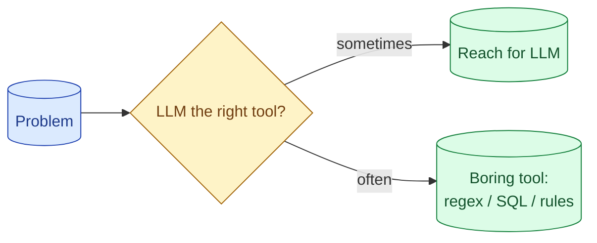

The strongest senior signal in an AI interview is the willingness to say 'this does not need an LLM.' A regex, a SQL query, a rules engine, a 50-line classifier. Picking the boring tool when it fits is the maturity that hiring managers are actually looking for.



## The cases where an LLM is the wrong tool

The honest list.

**Pattern matching.** "Extract phone numbers from text." Regex. Faster, free, deterministic, no API call.

**Exact lookup.** "Find the customer record for this ID." SQL.

**Classification with hard rules.** "Tag transactions as cash, card, or bank transfer based on the source field." A switch statement.

**Numeric calculations.** "Sum these line items." Arithmetic.

**Translation between fixed formats.** "Convert this CSV row to this JSON shape." A mapping function.

**Validation with explicit rules.** "Is this a valid SSN format?" Regex plus a checksum.

For each of these, an LLM works but is the wrong tool. Slower, more expensive, less reliable than the boring alternative.

A senior engineer says "this is a regex problem" without flinching.

## Cheaper alternatives that work better and faster

For common AI-adjacent tasks, the non-AI alternative is often dramatically better.

**Spam detection.** A Naive Bayes classifier trained on 1000 examples beats most general LLMs and runs in microseconds.

**Sentiment analysis on short text.** A specialised model (VADER, distilBERT) costs nothing per call and is often more accurate than an LLM prompt.

**Document deduplication.** Cosine similarity on embeddings + threshold beats LLM-based "are these the same?"

**Search ranking.** BM25 plus traditional learned-to-rank beats LLM rerankers for many production search systems.

**Data extraction from structured documents.** Tabular parsing (PDFs with structure) is often better with rule-based extractors than with LLMs.

The senior pattern is to know when each is right and not default to LLM.

## How to make the 'do not use AI' argument without sounding negative

The framing matters. Saying "we don't need AI here" can sound dismissive.

Better framings.

"For this specific task, a regex is cheaper, faster, and more reliable than an LLM. I would use the LLM for the harder part of this system."

"An LLM works for this, but at $0.001 per call across 10 million daily transactions, that is $10,000/day. A 50-line classifier delivers similar quality at near-zero cost."

"The LLM would handle the long tail well, but 95% of cases fit a simple rule. I would route those through the rule and send the 5% to the LLM."

You are still demonstrating sophistication. You are choosing the right tool for the job, not avoiding AI.

## Hybrid systems where the LLM does the small hard part

The senior pattern often: traditional methods for the bulk, LLM for the edges.

```
Step 1: Regex matches 80% of cases. Cheap, fast, deterministic.
Step 2: Rule-based classifier handles 15% more. Still cheap.
Step 3: LLM handles the remaining 5% (the long tail). Expensive but rare.

Net: 95% of traffic at near-zero cost, 5% at LLM cost. Average is near-zero.
```

This is the cost-optimal architecture for many tasks. The LLM is reserved for what it does best: the hard cases that no simple rule covers.

In an interview, articulating this pattern is a strong signal. You see the LLM as one tool among many, not the answer to everything.

## Why this is the question the hiring manager remembers

Hiring managers see many candidates. They blur together. What sticks: the one who challenged the premise.

"You said design a chatbot for X. Honestly, for this use case, I wonder if a structured form with conditional logic would serve users better. The conversation interface adds latency and cost without clearly improving the experience for users who know what they want."

This kind of challenge, if backed by reasoning, is memorable. Most candidates jump to the solution; this candidate questions whether the problem fits the proposed approach.

It does not mean refusing the interview question. Acknowledge the design exercise, but also note the meta-point. "Here is how I would design the chatbot. As an aside, I would also have a conversation with the product team about whether a form would be better for the primary use case."

Hiring managers remember the candidate who thinks about whether the work is the right work.

## When to definitely use AI

Equally honest about the cases where LLMs shine.

**Open-ended text generation.** Writing emails, summaries, explanations.

**Understanding nuance in unstructured text.** Sentiment that depends on context, intent classification with fuzzy boundaries.

**Multi-step reasoning with novel inputs.** Tasks where the structure is not known in advance.

**Code generation.** From spec to working code.

**Open-ended Q&A.** Where the question and answer space cannot be enumerated.

**Tasks where the failure mode of being slightly wrong is acceptable.** Recommendations, suggestions, drafts.

For these, the LLM is genuinely better than the alternatives. Knowing both lists is the senior position.

## A specific interview pattern

When the interview prompt is "design an AI feature for X," a strong opening:

```
"Before architecting the AI piece, can we talk about whether AI is
the right approach? Specifically:

- What percentage of cases can be handled by deterministic rules?
- Is the user benefit from AI primarily quality or primarily speed?
- What is the cost ceiling per interaction?

These shape the design significantly."
```

Three minutes. You demonstrated maturity, scoped the problem, and signaled that you are not just reaching for the AI hammer.

Most interviewers love this opening. The ones who do not are the ones you do not want to work for.

## When to push back on the spec

Sometimes the spec asks for something the senior thing is to question.

"Build a chatbot to handle customer refunds." A senior asks: "should this be a chatbot at all, or a self-service flow with an AI fallback for edge cases?" The framing changes; the answer might be simpler.

"Build an AI to write performance reviews." A senior asks: "what does that solve that a template plus thoughtful conversation does not?" The conversation might end with "you are right, we should not."

Pushing back well is hard. It requires confidence, reasoning, and respect for the interviewer's premise. But when it lands, it is the most memorable answer.

## Common mistakes

- **Defaulting to LLM for every task.** Reflexive; not analytical.
- **Saying "this does not need AI" without an alternative.** Dismissive.
- **Refusing to engage with the spec.** Different from questioning it.
- **Suggesting non-AI for genuinely AI-shaped tasks.** Misses where LLMs shine.
- **Sounding negative.** Frame as choosing the right tool, not avoiding AI.

## Quick recap

- The strongest senior signal: knowing when an LLM is the wrong tool.
- Pattern matching, exact lookup, hard-rule classification, numeric calculation: not for LLMs.
- Hybrid systems often win: rules for the bulk, LLM for the long tail.
- Frame the argument as "right tool for the job," not "avoiding AI."
- Sometimes the senior move is questioning whether the proposed AI feature is even needed.

This concept sits in **Stage 7 (Interview craft)** of the [AI Engineering Roadmap](/practice/ai-engineering/roadmap/).
