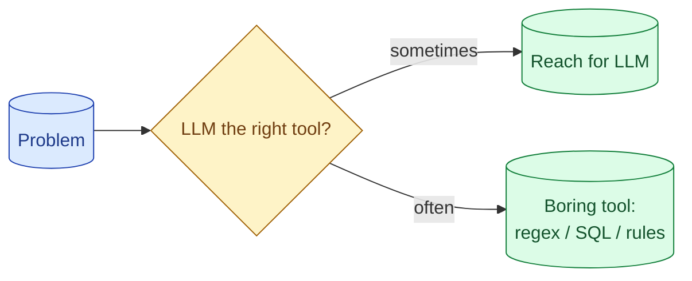

The strongest senior signal in an AI interview is the willingness to say 'this does not need an LLM.' A regex, a SQL query, a rules engine, a 50-line classifier. Picking the boring tool when it fits is the maturity that hiring managers are actually looking for.

**What this page will cover.**

- The cases where an LLM is the wrong tool
- Cheaper alternatives that work better and faster
- How to make the 'do not use AI' argument without sounding negative
- Hybrid systems where the LLM does the small hard part
- Why this is the question the hiring manager remembers

*Page coming soon.*

This concept sits in **Stage 7 (Interview craft)** of the [AI Engineering Roadmap](/practice/ai-engineering/roadmap/).
