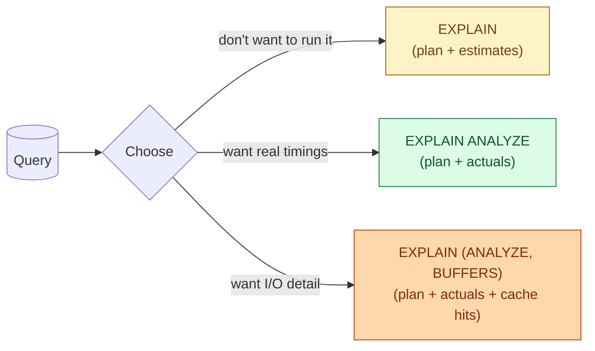
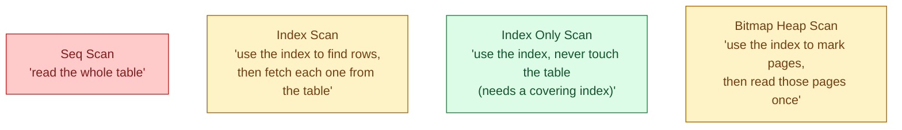
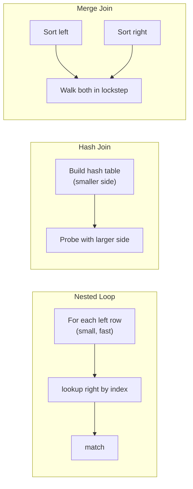
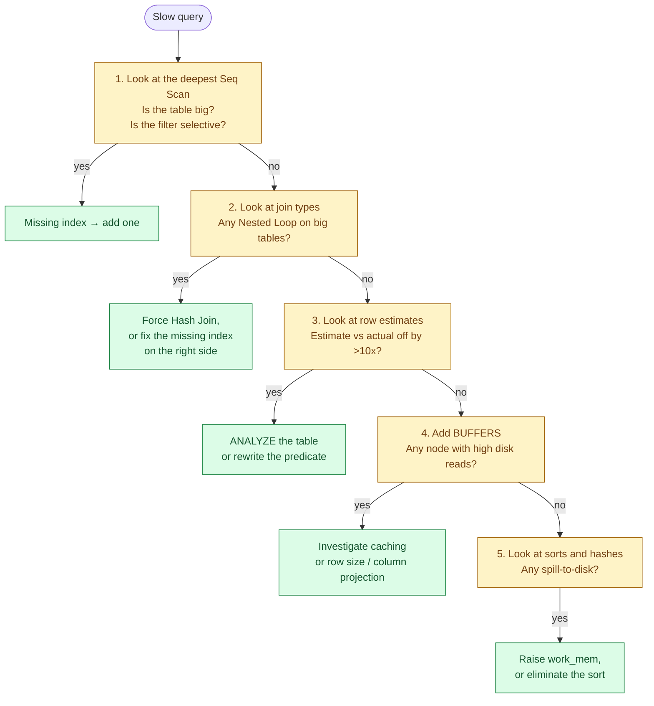

When a query is slow, you do not guess. You ask the database what it is doing. `EXPLAIN` shows the plan the database is about to use to run the query. `EXPLAIN ANALYZE` runs it and shows what actually happened. Reading these well is the single most useful SQL skill on a data team, and the one that gets junior engineers from "this query is slow, can you help?" to "this query is slow, and here is why, and here is the fix."

## The problem it solves

The same query can run in 200 milliseconds or 20 minutes. The SQL text is identical. What changed is the plan: which tables the database scanned, which order it joined them in, whether it used an index, whether it sorted in memory or spilled to disk. None of this is visible from the SQL. All of it is visible in the plan.

The plan is the bridge between "the SQL I wrote" and "the work the database did." Reading it well is how you stop being surprised.

## EXPLAIN vs EXPLAIN ANALYZE

Two commands. Different costs. Different uses.

```sql
EXPLAIN SELECT ...
```

Shows the plan the planner would use. Fast (no execution). Estimates only. Useful for "would this query even run, and what shape would it have?"

```sql
EXPLAIN ANALYZE SELECT ...
```

Actually runs the query and reports what really happened: real row counts, real timings, real loops. Pays the full cost of the query. Useful for "is the planner's guess close to reality, and where did time go?"

The rule of thumb: use `EXPLAIN` for very expensive or destructive queries (a missing `WHERE` on an `UPDATE` will not actually run), `EXPLAIN ANALYZE` for everything else.



In Postgres, the form most worth memorising is `EXPLAIN (ANALYZE, BUFFERS, VERBOSE, FORMAT TEXT)`. That gives you everything you need to diagnose 90% of slow queries.

## A real plan, top to bottom

Here is a simple plan from a Postgres query that joins two tables.

```text
Hash Join  (cost=2.50..47.23 rows=1000 width=78)
                 (actual time=0.052..1.823 rows=981 loops=1)
  Hash Cond: (o.customer_id = c.customer_id)
  ->  Seq Scan on orders o  (cost=0.00..32.00 rows=1000 width=44)
                            (actual time=0.012..0.421 rows=1000 loops=1)
        Filter: (created_at > '2026-01-01'::date)
  ->  Hash  (cost=1.50..1.50 rows=100 width=42)
            (actual time=0.029..0.029 rows=100 loops=1)
        ->  Seq Scan on customers c  (cost=0.00..1.50 rows=100 width=42)
                                     (actual time=0.005..0.018 rows=100 loops=1)
Planning Time: 0.143 ms
Execution Time: 1.901 ms
```

Read it from the inside out. The deepest indented operations run first; results bubble up to the top.

- Two `Seq Scan`s start at the leaves. One on `orders`, one on `customers`.
- The `Hash` operation builds an in-memory hash table from the smaller side (`customers`).
- The `Hash Join` at the top probes that hash table for each row from `orders`.
- Final row count: 981 rows out, taking 1.9 ms.

That is the whole shape: scan, scan, join, return. Every plan is some variation on this.

## The three things to look at first

When you have 30 seconds to triage a slow query, look at these three signals in order.

### 1. Scan type on the biggest tables

The deepest leaves of the plan are reads from disk (or cache). The type of read matters more than almost anything else.

| Scan type | What it means | Good or bad? |
|---|---|---|
| **Seq Scan** | Read the whole table | Fine for small tables. Disaster for big ones. |
| **Index Scan** | Use the index to find matching rows, then fetch | Good when the filter is selective. |
| **Index Only Scan** | Use the index and never touch the table | Great. Means a covering index. |
| **Bitmap Heap Scan** | Use an index to build a bitmap of matching pages, then fetch | Good for medium-selective filters. |
| **Parallel Seq Scan** | Multiple workers reading the table together | Fine when you actually want to read everything. |

The first red flag in any slow query: `Seq Scan` on a table with millions of rows when the `WHERE` clause should have been selective. That is almost always a missing or unusable index.

### 2. Join type

Joins do most of the heavy lifting. There are three real shapes.

| Join | How it works | Fastest when |
|---|---|---|
| **Nested Loop** | For each row on the left, look up matches on the right | The right side has an index and the left is tiny |
| **Hash Join** | Build a hash table from one side, probe with the other | Two medium-sized tables, joining on equality |
| **Merge Join** | Sort both sides, walk them in lockstep | Both sides are already sorted |

The most common surprise: a `Nested Loop` where the left side has 10 million rows and the right side has no index. That is `O(N×M)` work, which is exactly what it sounds like. Watch for this.

### 3. Estimated rows vs actual rows

Every node in the plan shows the planner's estimate (`rows=N`) and what really happened (`actual time=... rows=N`). If the two diverge by more than ~10x, the statistics are stale or the column has a weird distribution. The planner is then choosing the plan based on a wrong picture of the data.

```text
Seq Scan on orders  (cost=0.00..32.00 rows=1 width=44)
                    (actual time=0.012..120.421 rows=950000 loops=1)
```

That `rows=1` estimate next to `rows=950000` actual is the smoking gun. The planner thought one row would come out and chose a `Nested Loop`. In reality 950,000 rows came out and the loop ran 950,000 times. Fix: `ANALYZE orders` to refresh statistics, then look at the plan again.

## Scan types, in plain English



A `Seq Scan` reads every page of the table. Cheap when the table is small, expensive when it is not. A `Seq Scan` is sometimes the right choice: if you are going to read more than about 5% of the table, the planner correctly figures out that touching the index is more expensive than just reading the whole table sequentially.

An `Index Scan` walks the index to find matching keys, then reads each matching row from the table. Two round trips per match. Fast when the filter returns few rows, slow when it returns many.

An `Index Only Scan` is the same except all the columns the query needs are in the index. The table is never touched. This is the fastest read shape Postgres has. To enable one, build a covering index (an index that includes the columns in the `SELECT`, not just the `WHERE`).

A `Bitmap Heap Scan` is the planner saying "this filter returns medium-many rows, more than I want to do one-by-one but fewer than the whole table." It uses the index to build a list of pages that contain matching rows, then reads those pages in disk order. The "in disk order" part is the trick: it minimises random I/O.

## Join types, in plain English



A `Nested Loop` is fast when one side is small and the other has an index. The "for each row on the left, find matching rows on the right" shape only stays fast if the right-side lookup is `O(log N)`. Without an index it becomes `O(N×M)`, which falls over quickly.

A `Hash Join` builds an in-memory hash table from one side (usually the smaller one) and probes it once per row from the other side. The cost is the memory for the hash table and the cost of building it. Used most often in analytics queries: large fact joining medium dimension.

A `Merge Join` sorts both sides, then walks them in lockstep like a zipper. Fast when the data is already sorted (because of an index, or because of a previous operation). Slower when sorting is required, because sorting is expensive.

## What the cost number actually means

```text
Seq Scan on orders  (cost=0.00..32.00 rows=1000 width=44)
```

The two cost numbers are `startup_cost..total_cost`. Neither is seconds. They are arbitrary planner units that estimate how much disk I/O and CPU the node will do. The Postgres default is to charge 1.0 per sequential page read, 4.0 per random page read, 0.01 per row CPU work, and so on. These are tuneable but you almost never change them.

Use the cost numbers to compare nodes within the same plan, not to predict wall-clock time. Two nodes with `cost=100..200` and `cost=1.00..2.00` mean one is roughly 100x more expensive than the other. They do not mean "200 milliseconds" or "200 seconds."

When you want wall-clock time, look at `actual time` from `EXPLAIN ANALYZE`. That is in milliseconds.

## EXPLAIN (ANALYZE, BUFFERS): the I/O view

Adding `BUFFERS` shows page reads and cache hits per node. This is where the hidden cost lives.

```text
Seq Scan on orders
  Buffers: shared hit=12 read=8421
```

`shared hit=12` means 12 pages were already in Postgres's buffer cache. `read=8421` means 8421 pages had to be read from disk (or the OS page cache). On a warm cache, the same query might show `shared hit=8433 read=0` and run 30x faster. If the query is fast in your dev environment and slow in prod, the answer is often the cache.

Two practical patterns:

- Run the query twice and look at the second run's `BUFFERS`. The first run primes the cache; the second tells you what the steady-state cost is.
- A node with high `read` and low `hit` is doing real disk I/O. A node with high `hit` and low `read` is essentially free.

## The diagnostic workflow

When someone hands you a slow query, work through this list in order. Most slow queries fall over at step 1 or 2.



Going through these five questions in order solves most slow queries in under 10 minutes. If you reach step 5 without finding a smoking gun, the query is probably as fast as the schema allows and the next move is changing the schema (adding a denormalised column, pre-aggregating, materialising).

## Cross-engine: how this varies

Postgres is the cleanest version of `EXPLAIN`. Other engines use the same idea with different names.

| Engine | Command | Output format |
|---|---|---|
| **Postgres** | `EXPLAIN ANALYZE` | Tree, easy to read |
| **MySQL** | `EXPLAIN`, `EXPLAIN ANALYZE` (8.0+) | Tabular and tree |
| **BigQuery** | Execution graph in the console + `INFORMATION_SCHEMA.JOBS_BY_PROJECT` | Visual graph + bytes-shuffled stats |
| **Snowflake** | `EXPLAIN`, query profile in the UI | Tree-style profile per warehouse |
| **Databricks SQL** | Query profile UI + `EXPLAIN FORMATTED` | Visual graph + Spark plan |
| **Redshift** | `EXPLAIN`, `STL_EXPLAIN`, query monitoring | Distributed plan view |

The vocabulary changes (Postgres "Hash Join" becomes Spark "BroadcastHashJoin", BigQuery "Stage 3: JOIN"), but the concepts are the same. Three things you always look at: how each table is read, how the join is implemented, whether estimates matched reality.

In columnar warehouses (BigQuery, Snowflake, Databricks SQL), one extra thing matters: how many bytes the query scanned. Most of these warehouses charge per byte. A 5 TB scan and a 50 GB scan can produce the same answer, and the cheaper one is the better plan even if the wall-clock time is similar.

## Common patterns that make plans go wrong

These show up over and over.

**`Seq Scan` on a large table with a selective `WHERE`.** Missing index, or the index exists but the planner won't use it. Usual fixes: `ANALYZE` to refresh stats; check if the column's type matches what you are filtering on (a `timestamp` column filtered as a `text` constant disables the index); check if the index is on the right column.

**`Nested Loop` where both sides are large.** The planner thought one side would be tiny. Almost always a stats problem. Run `ANALYZE`, look at the plan again. If the estimate is still wrong, the column has a weird distribution and you may need extended statistics.

**Row estimate of `1` everywhere.** No statistics. The planner is guessing. Run `ANALYZE`. Until then, every plan it makes is fiction.

**Spill to disk on a sort or hash.** Look for `external merge Disk: 421MB` in the plan. The operation needed more memory than `work_mem` allowed. Either raise `work_mem` for this session, or rewrite the query to need less memory (smaller hash side, smaller sort).

**`Index Scan` followed by an enormous fetch.** The index found the rows fast but each fetch was a random disk read. With cold cache, this can be slower than a `Seq Scan`. Bitmap heap scans usually beat both for medium selectivity.

**A `Materialize` or `CTE Scan` node where you did not expect one.** Postgres before 12 materialised every CTE. Modern Postgres inlines CTEs by default, but you can force materialisation with `WITH x AS MATERIALIZED`. Sometimes you want this (the CTE is expensive and used 5 times); sometimes it is the bug.

## What this connects to

- **Indexes**. The plan tells you which index was used, which one was ignored, and where one is missing. See [Indexes (SD concept)](/practice/system-design/concepts/010-indexes-help-and-hurt/) for the broader picture of index design.
- **Shuffle in distributed engines**. The Postgres "Hash Join" maps onto Spark's "BroadcastHashJoin" or "SortMergeJoin" with the addition of shuffle. See [Shuffle](/practice/data-engineering/concepts/028-shuffle/) and [Broadcast joins vs shuffle joins](/practice/data-engineering/concepts/030-broadcast-vs-shuffle-joins/).
- **Cost attribution**. The plan's bytes-scanned number is the same number your warehouse bill is computed from. See [Slow query attribution](/practice/data-engineering/concepts/054-slow-query-attribution/).

## Common mistakes

- **Reading the cost as seconds.** It is not. It is an arbitrary planner unit. Compare nodes, do not predict wall-clock time from it.
- **Skipping `ANALYZE`.** `EXPLAIN` without `ANALYZE` is the planner's guess. The actuals from `ANALYZE` are what matter.
- **Tuning the query without re-running ANALYZE on the table.** Stale statistics produce bad plans. Refresh first; then read the plan; then tune.
- **Trusting the plan from your local dev environment.** Your local box has tiny data and a hot cache. Prod has large data and a cold cache. Run `EXPLAIN ANALYZE` on prod (or a prod-like copy).
- **Stopping at "it uses an index."** An index can be used badly. A `Nested Loop` with 10 million outer rows that does one index lookup per outer row is 10 million round trips. The plan is using the index; the query is still slow.
- **Adding indexes without measuring.** Each new index is a write cost on every insert and update. Add only what the slowest query needs; remove the ones nothing uses.
- **Ignoring `BUFFERS`.** Two queries with the same plan can be 30x apart on wall-clock time because of cache. `BUFFERS` is how you tell.

## Quick recap

- `EXPLAIN` shows the planner's plan. `EXPLAIN ANALYZE` runs the query and shows the truth. Always use `ANALYZE` when you can.
- Three signals matter most: the scan type on the biggest table, the join type when tables meet, the gap between estimated and actual rows.
- `Seq Scan` is fine on small tables, a red flag on big ones. `Nested Loop` is fast with an index on the inner side, a disaster without.
- Cost numbers are not seconds. Use them to compare. Use `actual time` for wall-clock.
- `EXPLAIN (ANALYZE, BUFFERS)` shows what really came from disk. The 30x gap between cold and warm cache often lives here.
- The diagnostic workflow is five questions in order. Most slow queries fall over at "missing index" or "stale statistics."

This concept sits in **Stage 1 (SQL fundamentals)** of the [Data Engineering Roadmap](/practice/data-engineering/roadmap/).
