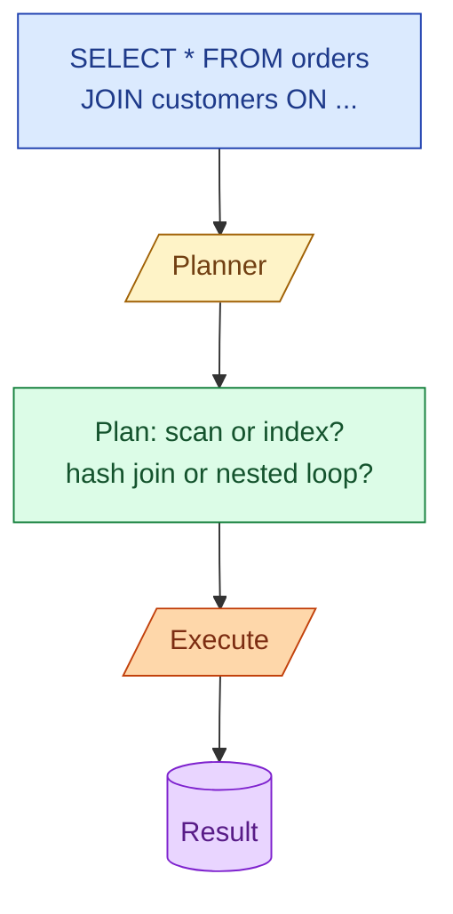

When a query is slow, you do not guess. You ask the database what it is doing. `EXPLAIN` shows the plan the database is about to use. `EXPLAIN ANALYZE` runs the query and shows what really happened. Reading these well is the single most useful SQL skill on a data team.

**What this page will cover.**

- The three things to look at first: scan type, join type, estimated vs actual rows.
- Why `seq scan` is sometimes right and sometimes a disaster.
- Hash join vs nested loop vs merge join, and when each one fits.
- The cost number is not seconds. What it actually means.
- How `EXPLAIN ANALYZE BUFFERS` exposes hidden I/O.
- The five queries that go from 60 seconds to 60 milliseconds after one well-chosen index.

*Page coming soon. Until then, see [#017 Reading an EXPLAIN plan](/practice/data-engineering/017-reading-an-explain-plan/) for the practice problem with a full walkthrough.*

This concept sits in **Stage 1 (SQL fundamentals)** of the [Data Engineering Roadmap](/practice/data-engineering/roadmap/).
