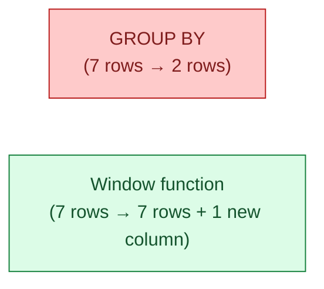
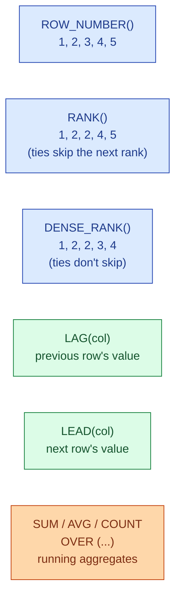
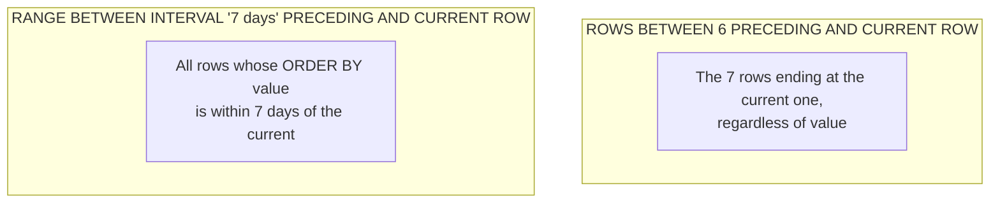

`GROUP BY` collapses many rows into one. A window function keeps every row and adds a column computed across a window of related rows. Running totals, ranks, "is this the latest row per customer?", period-over-period growth, moving averages. All of these are window functions. Once you see them, you stop writing the messy self-join versions for ever.

## The problem it solves

You want to add a "rank within customer" column to every order. With `GROUP BY` you can compute the max rank per customer, but you lose the individual orders. You need both: every order row, plus the rank column next to it. That is exactly what a window function does.



## Anatomy of the `OVER` clause

Every window function has three parts you control.

```sql
SUM(amount) OVER (
  PARTITION BY customer_id          -- 1. which rows are "related"
  ORDER BY order_date                -- 2. in what order
  ROWS BETWEEN 6 PRECEDING AND CURRENT ROW  -- 3. which rows go in the window
) AS rolling_7_day_total
```

`PARTITION BY` is the equivalent of `GROUP BY` for window functions: it splits rows into groups. `ORDER BY` tells the function which order to walk in (needed for ranks, lags, running totals). The `ROWS BETWEEN` part defines the frame: which rows around the current one go into the computation.

If you skip `PARTITION BY`, the window is the whole result set. If you skip `ORDER BY`, the function operates on the partition with no ordering (which is fine for `SUM` but produces nonsense for `LAG`).

## The six functions you use 95% of the time



| Function | What it does | Common use |
|---|---|---|
| `ROW_NUMBER()` | 1, 2, 3, … per partition | Pick the latest row per customer |
| `RANK()` | Ties get the same rank, next rank is skipped | Sales leaderboard with ties |
| `DENSE_RANK()` | Ties get the same rank, no gaps | "Top 3 distinct scores" |
| `LAG(col, n)` | Value from `n` rows back | Day-over-day, week-over-week |
| `LEAD(col, n)` | Value from `n` rows ahead | Compute time-to-next-event |
| `SUM / AVG / COUNT OVER` | Running totals or moving averages | Cumulative revenue, 7-day average |

## The three patterns you will write every week

**Latest row per customer.** The cleanest version of "give me the most recent order for each customer."

```sql
SELECT *
FROM (
  SELECT *,
         ROW_NUMBER() OVER (PARTITION BY customer_id
                            ORDER BY order_date DESC) AS rn
  FROM orders
) t
WHERE rn = 1;
```

This beats every other approach (correlated subquery, max-then-self-join, distinct-on tricks) for readability and for performance on most engines.

**Running total.** Cumulative revenue per customer, ordered by date.

```sql
SELECT customer_id, order_date, amount,
       SUM(amount) OVER (PARTITION BY customer_id
                         ORDER BY order_date
                         ROWS UNBOUNDED PRECEDING) AS lifetime_revenue
FROM orders;
```

**Period-over-period.** "What was last week's revenue, compared to this week's?"

```sql
SELECT week,
       revenue,
       LAG(revenue, 1) OVER (ORDER BY week) AS prev_week,
       revenue - LAG(revenue, 1) OVER (ORDER BY week) AS week_over_week_change
FROM weekly_revenue;
```

## Frames: `ROWS` vs `RANGE`

The frame controls which rows go into the window for the current row. Two common ones.



`ROWS` counts rows. Best when "the last 7 records" is what you mean. `RANGE` looks at the ordering value. Best when "the last 7 days" is what you mean, even if some days have multiple rows or some days are missing. For trailing 7-day averages, `RANGE` is almost always more correct.

The default frame, if you write `OVER (PARTITION BY ... ORDER BY ...)` without a `ROWS`/`RANGE` clause, is `RANGE BETWEEN UNBOUNDED PRECEDING AND CURRENT ROW`. That can surprise you when ties in the `ORDER BY` value lump rows together. When in doubt, write the frame explicitly.

## Performance notes

Window functions are not free, but they are usually cheaper than the alternatives.

- A `PARTITION BY` triggers a sort if the data is not already sorted by that column. Indexes can help.
- Multiple window functions over **the same window** are computed in one pass. `SUM(...) OVER w` and `AVG(...) OVER w` with the same `w` are essentially free together. Use named windows to make this explicit:

```sql
SELECT customer_id,
       SUM(amount)  OVER w AS total,
       AVG(amount)  OVER w AS average,
       COUNT(*)     OVER w AS orders
FROM orders
WINDOW w AS (PARTITION BY customer_id);
```

- Multiple windows with **different** `PARTITION BY` or `ORDER BY` each add a sort. The query plan shows this; check it with `EXPLAIN ANALYZE`.
- A window function and a `GROUP BY` in the same query order: aggregation first, then windows. You cannot use a window function inside a `GROUP BY`'s aggregate.

## Common mistakes

- **Forgetting `ORDER BY` on `LAG`/`LEAD`/`ROW_NUMBER`.** Without it, the function still runs, but the answer is non-deterministic. Always order.
- **Writing `WHERE rn = 1` in the same query as `ROW_NUMBER()`.** The `WHERE` runs before the window function. You need a subquery, a CTE, or `QUALIFY` (Snowflake, BigQuery, Databricks).
- **Confusing `RANK` and `DENSE_RANK`.** Ties skip a rank in `RANK`, do not skip in `DENSE_RANK`. Pick the one that matches your stakeholder's mental model.
- **Using the default frame and getting surprised.** Write the frame out when in doubt. `ROWS UNBOUNDED PRECEDING` for running totals; `ROWS BETWEEN 6 PRECEDING AND CURRENT ROW` for "last 7 rows"; `RANGE BETWEEN ...` when you mean a time window.
- **Reaching for a window function when `GROUP BY` is what you wanted.** If you do not need the individual rows in the output, `GROUP BY` is simpler.

## Quick recap

- A window function adds a computed column without collapsing rows.
- Three parts: `PARTITION BY` (groups), `ORDER BY` (sequence), frame (which rows).
- Six functions cover almost everything: `ROW_NUMBER`, `RANK`, `DENSE_RANK`, `LAG`, `LEAD`, and `SUM/AVG/COUNT OVER`.
- Latest-per-group, running totals, and period-over-period are the three patterns you use weekly.
- Multiple window functions on the same window share one pass. Different windows each add a sort.

This concept sits in **Stage 1 (SQL fundamentals)** of the [Data Engineering Roadmap](/practice/data-engineering/roadmap/).
