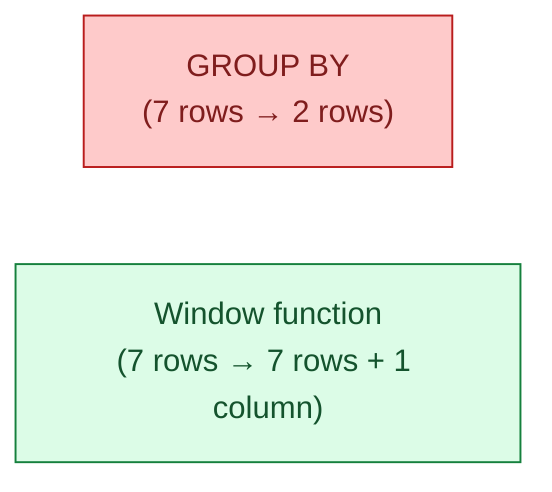

`GROUP BY` collapses many rows into one. A window function keeps every row and adds a column computed across a window of related rows. Running totals, ranks, moving averages, "is this the latest row per customer?" — all of these live in window functions, not in subqueries.

**What this page will cover.**

- The three parts: function, `OVER`, optional `PARTITION BY` and `ORDER BY`.
- The four functions you use most: `ROW_NUMBER`, `RANK`, `LAG`, `LEAD`.
- Running totals and moving averages with frames (`ROWS BETWEEN ... AND ...`).
- The "latest row per customer" pattern that beats every other approach.
- Why the same window expression repeated four times gets optimised to one scan.

*Page coming soon. Until then, see [#020 Window functions vs GROUP BY](/practice/data-engineering/020-window-functions-vs-group-by/) for the practice problem with worked examples.*

This concept sits in **Stage 1 (SQL fundamentals)** of the [Data Engineering Roadmap](/practice/data-engineering/roadmap/).
