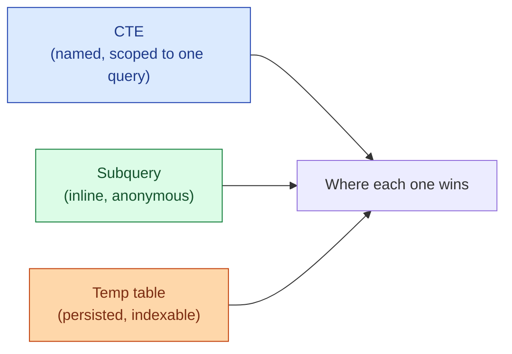

A CTE is the `WITH x AS (...)` block at the top of a query. A subquery is the same thing tucked inside the `FROM`. A temp table is the same query result persisted for a session. They look almost identical. They behave very differently at scale.

**What this page will cover.**

- Readability vs performance: which one each format actually wins.
- Why a CTE used five times in a query is sometimes computed five times.
- When the planner inlines a CTE (modern Postgres) and when it doesn't.
- Materialised CTEs in Postgres 12+ (`WITH x AS MATERIALIZED`).
- Temp tables: when you need an index on intermediate results.
- The decision tree: readability first, then check the plan.

*Page coming soon. Until then, see [#018 CTE vs subquery](/practice/data-engineering/018-cte-vs-subquery/) for the practice problem with side-by-side examples.*

This concept sits in **Stage 1 (SQL fundamentals)** of the [Data Engineering Roadmap](/practice/data-engineering/roadmap/).
