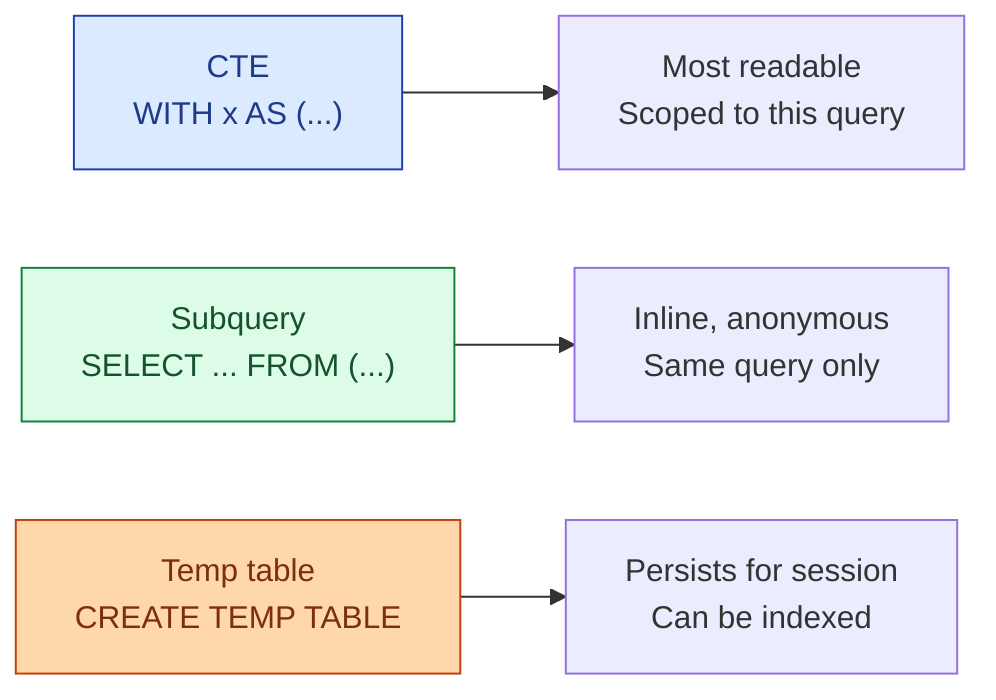
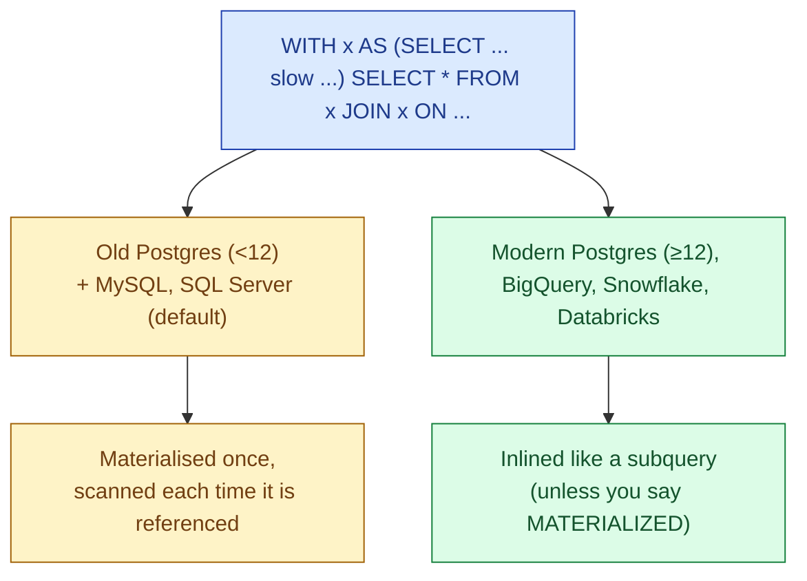

A CTE is the `WITH x AS (...)` block at the top of a query. A subquery is the same thing tucked inside a `FROM` or `WHERE`. A temp table is the same query result, persisted for the duration of a session. They look almost identical. They behave very differently at scale.

## The problem they all solve

A query that does five things in one statement is hard to read, hard to debug, and hard to test. Splitting the work into named intermediate steps fixes the readability problem. The question is which splitting tool to reach for.



## The same query, three ways

A small example: get the top 10 customers by lifetime spend.

**Subquery:**

```sql
SELECT *
FROM customers c
JOIN (
  SELECT customer_id, SUM(amount) AS lifetime
  FROM orders
  GROUP BY customer_id
) totals ON totals.customer_id = c.customer_id
ORDER BY totals.lifetime DESC
LIMIT 10;
```

**CTE:**

```sql
WITH totals AS (
  SELECT customer_id, SUM(amount) AS lifetime
  FROM orders
  GROUP BY customer_id
)
SELECT c.*, totals.lifetime
FROM customers c
JOIN totals USING (customer_id)
ORDER BY totals.lifetime DESC
LIMIT 10;
```

**Temp table:**

```sql
CREATE TEMP TABLE totals AS
SELECT customer_id, SUM(amount) AS lifetime
FROM orders
GROUP BY customer_id;

CREATE INDEX ON totals (customer_id);   -- the thing CTEs can't do

SELECT c.*, totals.lifetime
FROM customers c
JOIN totals USING (customer_id)
ORDER BY totals.lifetime DESC
LIMIT 10;
```

The result is identical. The performance and ergonomics differ.

## Performance: the real story

Most people repeat one of two myths. "CTEs are an optimisation barrier" and "CTEs are free". The truth is that both are sometimes true, depending on the database and the version.



**Modern engines inline CTEs.** Postgres 12+, BigQuery, Snowflake, Databricks SQL treat a CTE the same way they treat a subquery: as a logical block the planner can rewrite. A CTE used five times is computed five times unless the planner decides materialising once is cheaper. You do not have to think about it.

**Older engines materialised CTEs.** Postgres 11 and earlier always computed a CTE once, stored the result, and re-scanned it. That was a real optimisation barrier; it was sometimes faster, sometimes slower. You had to know.

**Force materialisation if you actually want it.** Modern Postgres lets you write `WITH x AS MATERIALIZED (SELECT ...)`. Use this when the CTE is expensive and referenced multiple times and you genuinely want one shared computation.

In a 2026 codebase on a modern engine, CTEs and subqueries are equivalent for performance. Pick the one that reads better. Subqueries are sometimes shorter. CTEs are almost always more readable for anything beyond two levels.

## When a temp table is the right call

CTEs and subqueries live and die with the statement. A temp table sticks around for the session. That sticky property buys you four things.

- **Indexes.** You can `CREATE INDEX` on a temp table. You cannot on a CTE.
- **Reuse across multiple queries.** Compute once, query 10 times in the same session.
- **Statistics.** Some engines re-`ANALYZE` a temp table after creation, giving the planner better numbers than it could infer from a CTE.
- **Inspection.** You can `SELECT * FROM temp_table` to look at intermediate results while debugging.

The cost is that you are now responsible for a thing. It exists. You have to know it exists. You have to clean it up if your session lives a long time. In an ad-hoc analysis session that is fine. In a dbt model it is almost never the right tool; the model itself plays the role of a temp table, with statistics, indexes, and lifetime managed.

## The decision

| Use this | When |
|---|---|
| **Subquery** | One-off, used once, fits in one line of thought |
| **CTE** | Used once or twice, you want a name, readability matters |
| **CTE chain** | Building up a multi-step transformation step by step |
| **`MATERIALIZED` CTE** | Same CTE referenced 3+ times and the computation is expensive |
| **Temp table** | Session-scoped reuse, want an index, want to inspect intermediate results |
| **dbt model** | Persisted, scheduled, tested. The grown-up version of a temp table. |

A practical rule: write the CTE version first. If a profile shows the CTE being recomputed multiple times and the cost is significant, add `MATERIALIZED`. If the work needs to persist beyond the statement, move it to a temp table or a dbt model.

## Common mistakes

- **Believing the "CTEs are slow" myth on modern Postgres.** It was true. It is not any more (12+).
- **Adding `MATERIALIZED` everywhere by default.** That brings back the optimisation barrier the planner removed. Add it where it earns its keep.
- **Reaching for a temp table when a CTE would do.** The temp table has lifetime, cleanup, and operational cost. Default to the CTE.
- **Nesting subqueries 6 levels deep.** That is a CTE chain hiding. Refactor.
- **Putting a CTE in a transaction-scoped session and forgetting to clean it up.** Temp tables in long-lived sessions linger.
- **Using a CTE for recursion in MySQL 5.x.** Recursive CTEs landed in MySQL 8.0. Pre-8.0 you needed a procedural loop.

## Quick recap

- All three split a query into named steps and improve readability.
- On modern engines (Postgres 12+, BigQuery, Snowflake, Databricks SQL), CTEs and subqueries are equivalent for performance.
- Use a CTE for readability by default. Reach for `MATERIALIZED` when the same CTE is used many times.
- Use a temp table when you need an index, statistics, session-scoped reuse, or inspection.
- A dbt model is the persisted, tested, scheduled version of a temp table. For anything that runs more than once, prefer the dbt model.

This concept sits in **Stage 1 (SQL fundamentals)** of the [Data Engineering Roadmap](/practice/data-engineering/roadmap/).
