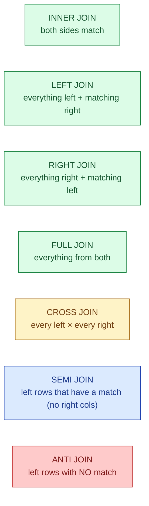

Most people use `INNER JOIN` and `LEFT JOIN`. That covers 80% of cases. The other five join shapes exist because there are five questions SQL needs to answer cleanly, and faking them with the first two leads to subtle bugs.

**What this page will cover.**

- Each join shape with one concrete question it answers ("which customers placed an order this month?").
- `EXISTS` and `NOT EXISTS` as the SQL way to write semi and anti joins.
- The `IN` vs `EXISTS` vs `LEFT JOIN ... WHERE IS NULL` debate, settled.
- Why `CROSS JOIN` is sometimes the right answer and not a bug.
- The duplicate-row trap when you join on a non-unique key.
- How the planner picks hash vs nested-loop vs merge join.

*Page coming soon. Until then, see [#016 SELECT DISTINCT hiding join bugs](/practice/data-engineering/016-select-distinct-hiding-join-bugs/) for one of the most common JOIN traps.*

This concept sits in **Stage 1 (SQL fundamentals)** of the [Data Engineering Roadmap](/practice/data-engineering/roadmap/).
