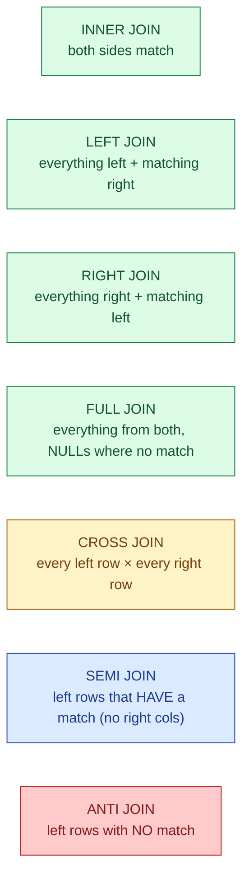
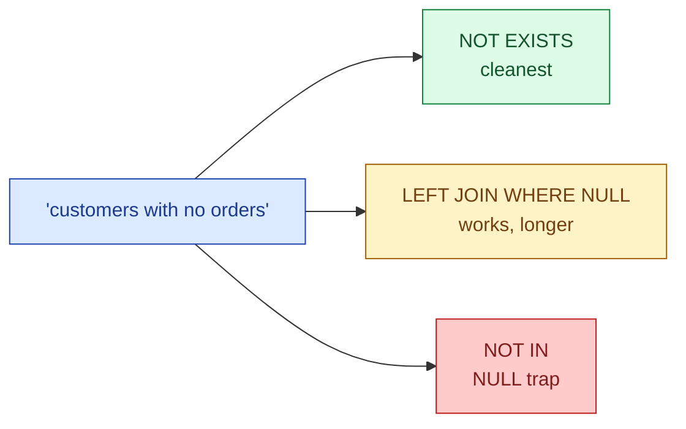
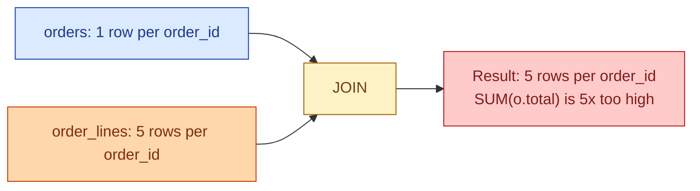

Most people use `INNER JOIN` and `LEFT JOIN`. That covers 80% of cases. The other five shapes exist because there are five questions SQL needs to answer cleanly, and faking them with the first two leads to subtle bugs that hide in production for months.

## The problem

Every join answers a question. The shape determines which rows survive the join and how missing values are treated. Pick the wrong shape and the dashboard has the wrong number, the row count is silently doubled, or customers without orders quietly disappear from the report.



## Each shape, one example each

| Shape | One-line question | SQL |
|---|---|---|
| **INNER** | Which customers placed an order this month? (drop customers with no orders) | `customers INNER JOIN orders ON ...` |
| **LEFT** | Every customer, with their orders if any | `customers LEFT JOIN orders ON ...` |
| **RIGHT** | Every order, with its customer if known | `orders RIGHT JOIN customers ON ...` |
| **FULL** | Every customer and every order, lined up where they match | `customers FULL JOIN orders ON ...` |
| **CROSS** | Every combination of region and product (for forecasting) | `regions CROSS JOIN products` |
| **SEMI** (`EXISTS`) | Customers who placed at least one order, no order detail needed | `WHERE EXISTS (SELECT 1 FROM orders ...)` |
| **ANTI** (`NOT EXISTS`) | Customers who placed no orders | `WHERE NOT EXISTS (SELECT 1 FROM orders ...)` |

Use `LEFT` instead of `RIGHT` whenever you can. Same semantics, just flip the table order. `RIGHT JOIN` exists for completeness; in 10 years of code review you will see it 3 times.

## Semi and anti joins: the cleaner way

SQL does not have a `SEMI JOIN` keyword. You write it as `EXISTS`. Same for anti.

```sql
-- semi join: customers who have at least one order
SELECT c.*
FROM customers c
WHERE EXISTS (SELECT 1 FROM orders o WHERE o.customer_id = c.customer_id);

-- anti join: customers with no orders
SELECT c.*
FROM customers c
WHERE NOT EXISTS (SELECT 1 FROM orders o WHERE o.customer_id = c.customer_id);
```

People often write these as `LEFT JOIN ... WHERE right_col IS NULL` or `IN (...)` and `NOT IN (...)`. The `EXISTS` form is faster on most engines, handles `NULL` correctly (`NOT IN` does not, see [NULL semantics](/practice/data-engineering/concepts/005-null-semantics/)), and reads as the question you asked.



## The duplicate-row trap

This is the bug that hides for months. You join on a column that is not unique on the right side, and your fact table doubles up.

```sql
-- orders has one row per order
-- order_lines has many rows per order

SELECT o.order_id, SUM(o.total) AS total_sum
FROM orders o
JOIN order_lines ol USING (order_id)
GROUP BY o.order_id;
```

Each order row now appears once per line item. `SUM(o.total)` multiplies. Every order with 5 line items is counted 5 times. The aggregate is wrong by 5x.



Fixes, ordered from cleanest to messiest:

1. **Aggregate the right side first**, then join. `SELECT order_id, SUM(line_total) FROM order_lines GROUP BY 1`, then join that to `orders`.
2. **Join, then aggregate with `DISTINCT`** on the right-side key. Still wasteful; the duplicates were created and then thrown away.
3. **`SELECT DISTINCT`** at the end. Almost always covers a bug. If you find yourself reaching for this, stop and ask "why did the rows duplicate?"

The general rule: when you join two tables, know the grain (one row per what?) of each side. If both sides are unique on the join key, you are safe. If one side is not, your join multiplies. See [grain](/practice/data-engineering/concepts/010-grain/).

## Performance: how the database joins

The planner picks one of three algorithms. You will see them in `EXPLAIN`.

| Algorithm | How it works | Fast when |
|---|---|---|
| **Nested Loop** | For each left row, look up right by index | Left is small, right has an index |
| **Hash Join** | Build a hash table from the smaller side, probe with the other | Two medium tables, equality join |
| **Merge Join** | Sort both sides, walk in lockstep | Both sides already sorted |

The shape of the join (inner, left, anti, etc.) is logical. The algorithm is physical. The same `LEFT JOIN` can be executed as a nested loop or a hash join depending on stats and indexes. Reading the plan tells you which one happened. See [Reading an EXPLAIN plan](/practice/data-engineering/concepts/001-reading-an-explain-plan/).

## Common mistakes

- **`LEFT JOIN` and then filtering with `WHERE right_col = something`.** That filter turns the `LEFT JOIN` back into an `INNER JOIN` because `NULL = something` is false and the row drops. Move the condition to the `ON` clause if you meant to keep the unmatched rows.
- **`NOT IN` with a column that can be `NULL`.** Returns zero rows whenever any value on the right is `NULL`. Use `NOT EXISTS` instead.
- **Forgetting the grain on the right side of a join.** Duplicates the left side silently. Always check.
- **`SELECT DISTINCT` after a join.** Hides a multiplication bug. Find the bug.
- **Joining on a calculated column (`ON LOWER(a) = LOWER(b)`).** Most planners cannot use an index on a function applied at query time. Either pre-compute the column or use a functional index.
- **Mixing `USING` and `ON`.** `USING (col)` produces one column in the result; `ON a.col = b.col` produces two. Picking one consistently makes the codebase easier to read.

## Quick recap

- Seven join shapes. Five are core (INNER, LEFT, FULL, SEMI via EXISTS, ANTI via NOT EXISTS). RIGHT and CROSS are situational.
- Semi and anti joins are `EXISTS` and `NOT EXISTS`. Faster than `IN`/`NOT IN`. Handle `NULL` correctly.
- The duplicate-row trap: knowing the grain of each side is the only real defence.
- The shape is logical; the algorithm (nested loop, hash, merge) is physical. Plan tells you which one happened.
- `LEFT JOIN` followed by a `WHERE` on a right-side column accidentally turns into an `INNER JOIN`. Use `ON` instead.

This concept sits in **Stage 1 (SQL fundamentals)** of the [Data Engineering Roadmap](/practice/data-engineering/roadmap/).
