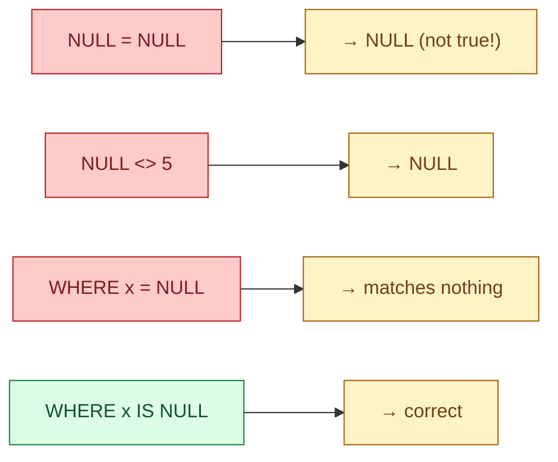

In most programming languages, `NULL` means "no value" and behaves like one. In SQL, `NULL` means "unknown" and follows three-valued logic: every comparison can be true, false, or NULL. Most data bugs in SQL trace back to forgetting that.

**What this page will cover.**

- Three-valued logic explained in one paragraph.
- `IS NULL` vs `= NULL`. Why one works and the other never does.
- `COUNT(*)` vs `COUNT(col)`: the difference that bites every junior.
- `NULL` in aggregations (SUM, AVG): silently ignored, sometimes wrong.
- `NOT IN` with a NULL on the right side: returns zero rows. Always.
- `COALESCE`, `NULLIF`, `IS DISTINCT FROM`: the three tools that make NULL safe.

*Page coming soon.*

This concept sits in **Stage 1 (SQL fundamentals)** of the [Data Engineering Roadmap](/practice/data-engineering/roadmap/).
