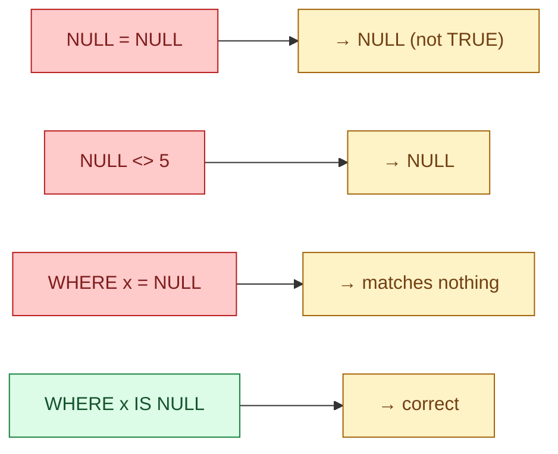
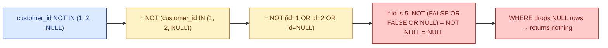

In most programming languages, `NULL` means "no value" and behaves like one. In SQL, `NULL` means "unknown" and follows three-valued logic: every comparison can be `TRUE`, `FALSE`, or `NULL`. Most data bugs in SQL trace back to forgetting that.

## The problem

Two emails are missing. Are they the same email? You do not know. SQL agrees with you: comparing `NULL = NULL` returns `NULL`, not `TRUE`. The same logic applies to `NULL > 0`, `NULL || 'x'`, and almost every other operation. The rule: any expression that touches `NULL` returns `NULL` unless the operator is built specifically to handle it.



## Three-valued logic

| `A` | `B` | `A AND B` | `A OR B` | `NOT A` |
|---|---|---|---|---|
| TRUE | TRUE | TRUE | TRUE | FALSE |
| TRUE | FALSE | FALSE | TRUE | FALSE |
| TRUE | NULL | NULL | TRUE | FALSE |
| FALSE | FALSE | FALSE | FALSE | TRUE |
| FALSE | NULL | FALSE | NULL | TRUE |
| NULL | NULL | NULL | NULL | NULL |

Read the third row: `TRUE AND NULL` is `NULL`, not `TRUE`. That is the headline rule. `WHERE` keeps only rows where the predicate evaluates to `TRUE`. A row with `NULL` predicate is dropped, just like a row with `FALSE`. That is how `WHERE x = NULL` silently matches zero rows.

## The traps that produce wrong dashboards

### Trap 1. `= NULL` vs `IS NULL`

```sql
-- wrong: matches nothing
SELECT * FROM customers WHERE email = NULL;

-- right
SELECT * FROM customers WHERE email IS NULL;
```

### Trap 2. `COUNT(*)` vs `COUNT(col)`

```sql
SELECT
  COUNT(*)       AS total_rows,        -- counts every row
  COUNT(email)   AS rows_with_email,   -- counts rows where email IS NOT NULL
  COUNT(DISTINCT email) AS unique_emails -- excludes NULL
FROM customers;
```

`COUNT(col)` silently ignores `NULL`. This is the right default for "how many customers have an email" but the wrong default for "how many customers do we have." Pick the one that matches the question.

### Trap 3. `NOT IN (subquery)` with `NULL` in the subquery

```sql
-- customers who never placed an order, naive version
SELECT * FROM customers
WHERE customer_id NOT IN (SELECT customer_id FROM orders);
```

If any `customer_id` in `orders` is `NULL`, the entire `NOT IN` returns no rows. Always. Even for customers who clearly have no orders. The reason is three-valued logic: `customer_id <> NULL` is `NULL`, and `WHERE` drops `NULL` rows.



Fix: use `NOT EXISTS`. It is immune to this and is faster on most engines.

```sql
SELECT * FROM customers c
WHERE NOT EXISTS (
  SELECT 1 FROM orders o WHERE o.customer_id = c.customer_id
);
```

### Trap 4. `SUM`/`AVG` ignore `NULL`, but `COUNT(*)` does not

```sql
SELECT
  SUM(amount),   -- ignores NULLs, sums the rest
  AVG(amount),   -- divides sum by COUNT(amount), not COUNT(*)
  COUNT(*)       -- counts every row including the NULL ones
FROM payments;
```

If half your rows have `NULL` amounts, `AVG(amount)` is the average of the non-null half, not the average of all rows. That is usually what you want, but make sure you know which version your stakeholders are asking for. If you want "average across all rows, treating missing as zero", write `AVG(COALESCE(amount, 0))`.

### Trap 5. `string || NULL = NULL`

```sql
SELECT first_name || ' ' || last_name FROM users;
```

If `last_name` is `NULL`, the entire expression is `NULL`. Common fix: `COALESCE(last_name, '')` so missing values render as empty string instead of nuking the whole concatenation.

## The three tools that make NULL safe

| Function | What it does |
|---|---|
| `COALESCE(a, b, c, ...)` | Return the first non-NULL argument |
| `NULLIF(a, b)` | Return NULL if `a = b`, else return `a` |
| `IS DISTINCT FROM` | Like `<>`, but treats `NULL = NULL` as the same value (so the comparison can return TRUE/FALSE, not NULL) |

```sql
-- COALESCE: fill in a default
SELECT COALESCE(country, 'unknown') FROM customers;

-- NULLIF: avoid divide-by-zero
SELECT revenue / NULLIF(orders, 0) AS revenue_per_order FROM daily;

-- IS DISTINCT FROM: real not-equal that handles NULL
SELECT * FROM customers
WHERE email IS DISTINCT FROM 'old@example.com';
-- finds rows where email is anything other than 'old@example.com',
-- INCLUDING rows where email IS NULL.
```

`IS DISTINCT FROM` is the version of `<>` that data engineers wish was the default. Use it when you want "different value, treating missing as different from any present value."

## Common mistakes

- **`= NULL` instead of `IS NULL`.** The most common SQL bug in any language.
- **`COUNT(col)` when you meant `COUNT(*)`.** Silently undercounts.
- **`NOT IN (subquery)` without guarding against `NULL` in the subquery.** Use `NOT EXISTS`.
- **Forgetting that `NULL <> NULL` is `NULL`.** `IS DISTINCT FROM` is the fix.
- **String concatenation that hits a `NULL`.** Wrap with `COALESCE` or use `CONCAT_WS` which skips `NULL` arguments.
- **`AVG` over a column with many `NULL`s and expecting `COUNT(*)` in the denominator.** It is `COUNT(col)`.
- **Joining on a nullable column.** `NULL = NULL` is `NULL`, so the rows do not match. If you actually want them to match, use `IS NOT DISTINCT FROM` in the `ON` clause.

## Quick recap

- `NULL` means "unknown", not "nothing". Three-valued logic: TRUE / FALSE / NULL.
- `IS NULL`, not `= NULL`. `IS DISTINCT FROM`, not `<>`.
- `COUNT(*)` counts rows; `COUNT(col)` ignores `NULL`s. `SUM` and `AVG` also ignore `NULL`s.
- `NOT IN` with a `NULL` in the subquery returns no rows. `NOT EXISTS` is the safe version.
- Three tools: `COALESCE` (default), `NULLIF` (avoid divide-by-zero), `IS DISTINCT FROM` (real not-equal).
- When in doubt, add `WHERE col IS NOT NULL` and check whether the row count changes.

This concept sits in **Stage 1 (SQL fundamentals)** of the [Data Engineering Roadmap](/practice/data-engineering/roadmap/).
