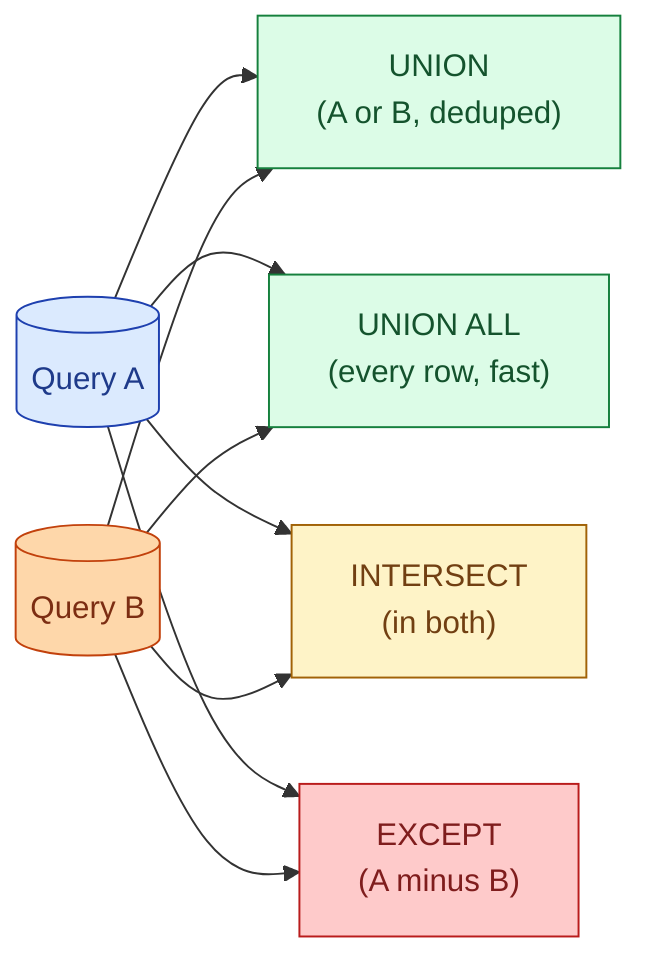
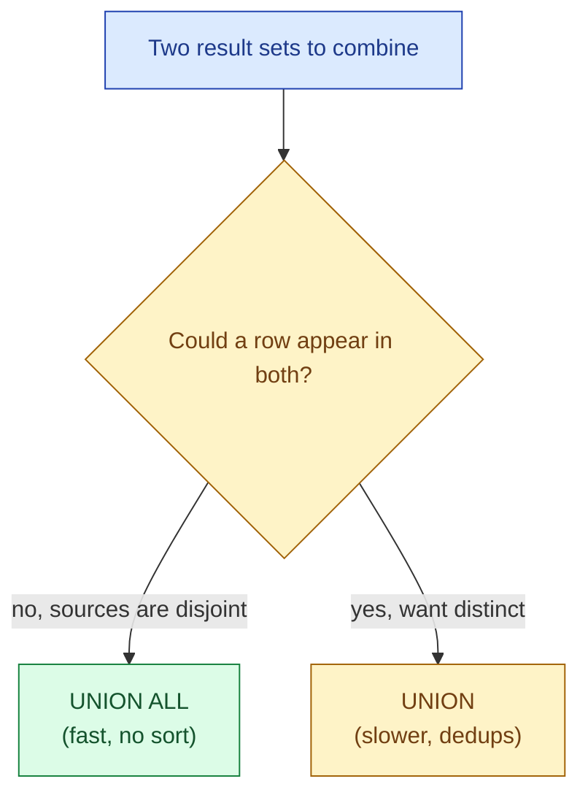

A `JOIN` matches rows from two tables side by side. A set operation stacks two query results on top of each other. If you find yourself joining on a fake key just to combine two result sets, you wanted a set operation.

## The problem

You ran two queries that return the same columns. You want one combined result. Or you want only the rows that appear in both. Or only the rows in one but not the other. None of these are joins. They are set operations.



## The four operations

| Operation | Returns | Deduplicates? |
|---|---|---|
| `UNION` | Rows in A or B | Yes |
| `UNION ALL` | Rows in A or B | No (every row, even exact duplicates) |
| `INTERSECT` | Rows in both A and B | Yes |
| `EXCEPT` (Postgres, BigQuery, Databricks) / `MINUS` (Oracle, Snowflake also accepts) | Rows in A but not B | Yes |

The big practical decision is `UNION` vs `UNION ALL`. `UNION` sorts both sides and deduplicates, which is expensive and almost never what you want for combining disjoint result sets. `UNION ALL` just concatenates, which is fast and correct when you know the two sides do not overlap.

```sql
-- two sources, no overlap: use UNION ALL
SELECT 'web' AS source, customer_id, amount FROM web_orders
UNION ALL
SELECT 'mobile' AS source, customer_id, amount FROM mobile_orders;

-- finding distinct values: UNION (or just SELECT DISTINCT)
SELECT country FROM customers_eu
UNION
SELECT country FROM customers_us;

-- finding values present in both regions
SELECT country FROM customers_eu
INTERSECT
SELECT country FROM customers_us;

-- finding values present in EU but not US
SELECT country FROM customers_eu
EXCEPT
SELECT country FROM customers_us;
```

## The `UNION` vs `UNION ALL` rule



The default in a code review should be `UNION ALL`. If you genuinely need a dedup, write `UNION` and add a comment about why. The `UNION` cost grows with both inputs and is often the slowest part of a multi-source ETL job.

## Type and column rules

All branches of a set operation must agree on column count, column types (or implicitly castable), and column order. Column names come from the **first** branch; everyone else's names are ignored.

```sql
-- works: same shape
SELECT customer_id, amount FROM web_orders
UNION ALL
SELECT customer_id, amount FROM mobile_orders;

-- works: types compatible
SELECT customer_id, amount::numeric FROM web_orders   -- numeric
UNION ALL
SELECT customer_id, amount FROM mobile_orders;         -- integer, casts up

-- broken: column order swapped
SELECT customer_id, amount FROM web_orders
UNION ALL
SELECT amount, customer_id FROM mobile_orders;   -- types now mismatched
```

In CSV-driven ETL it is easy to swap two columns by accident. Always name the columns the same way in every branch.

## The diff-two-tables pattern

A common debugging pattern: "are these two tables identical?" Set operations make it a one-query answer.

```sql
-- rows in old but not new, plus rows in new but not old
(SELECT * FROM old_table
 EXCEPT
 SELECT * FROM new_table)
UNION ALL
(SELECT * FROM new_table
 EXCEPT
 SELECT * FROM old_table);
```

If this returns zero rows, the tables are identical (set-wise; duplicates are collapsed by `EXCEPT`). If it returns rows, those are the diff: anything in one but not the other.

For tables with timestamps that always differ, project the columns you care about:

```sql
(SELECT order_id, total, status FROM old_table EXCEPT
 SELECT order_id, total, status FROM new_table)
UNION ALL
(SELECT order_id, total, status FROM new_table EXCEPT
 SELECT order_id, total, status FROM old_table);
```

This is the simplest data validation tool in SQL.

## Performance notes

- `UNION ALL` is essentially free: concatenate streams, no sort, no hash.
- `UNION` triggers a sort or a hash distinct. On large inputs this can dominate the query.
- `INTERSECT` and `EXCEPT` also dedupe by default. Postgres supports `INTERSECT ALL` and `EXCEPT ALL` if you want to keep duplicates (rare but useful in certain reconciliation scenarios).
- `ORDER BY` and `LIMIT` apply to the **whole** combined result, not each branch. Parenthesise if you want per-branch ordering.

## Common mistakes

- **`UNION` when `UNION ALL` would do.** The most common performance bug in this group. The dedup cost can be huge.
- **Mismatched column count or order.** Easy to introduce when refactoring. Name your columns the same way every time.
- **Trusting the second branch's column names.** They are silently dropped. The first branch wins.
- **Putting `ORDER BY` in a middle branch.** It applies to the whole result. Use parentheses if you want per-branch ordering.
- **`EXCEPT` for "rows in A that are not in B" while expecting to keep duplicates.** `EXCEPT` collapses duplicates. Use `EXCEPT ALL` (Postgres) or a `NOT EXISTS` join if you need to preserve duplicate counts.
- **Using `UNION` instead of `INSERT INTO ... SELECT ... UNION ALL ...`** for incremental loads. Both work, but `UNION` adds a sort no one asked for.

## Quick recap

- Four operations: `UNION`, `UNION ALL`, `INTERSECT`, `EXCEPT`. All combine result sets vertically.
- `UNION ALL` is the default. Add `UNION` only when you genuinely need dedup.
- Column count, order, and types must match across branches. First branch wins on names.
- `(A EXCEPT B) UNION ALL (B EXCEPT A)` is the cheapest "are these tables identical?" query in SQL.
- `ORDER BY` and `LIMIT` apply to the whole combined result.

This concept sits in **Stage 1 (SQL fundamentals)** of the [Data Engineering Roadmap](/practice/data-engineering/roadmap/).
