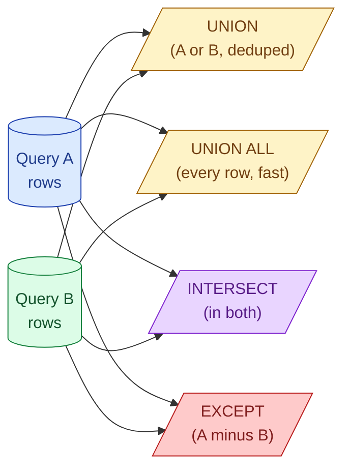

A JOIN matches rows across two tables side by side. A set operation stacks two query results on top of each other. When you find yourself joining on a fake key just to combine two result sets, you wanted a set operation.

**What this page will cover.**

- `UNION` vs `UNION ALL`: when the dedup is hiding a row-count bug.
- Why `UNION ALL` is almost always what you want for performance.
- `INTERSECT` as the cleaner version of "exists in both".
- `EXCEPT` (or `MINUS` in Oracle) as the cleaner version of anti-join.
- Column compatibility rules: same count, same types, same order.
- The diff-two-tables trick: `(A EXCEPT B) UNION ALL (B EXCEPT A)`.

*Page coming soon.*

This concept sits in **Stage 1 (SQL fundamentals)** of the [Data Engineering Roadmap](/practice/data-engineering/roadmap/).
