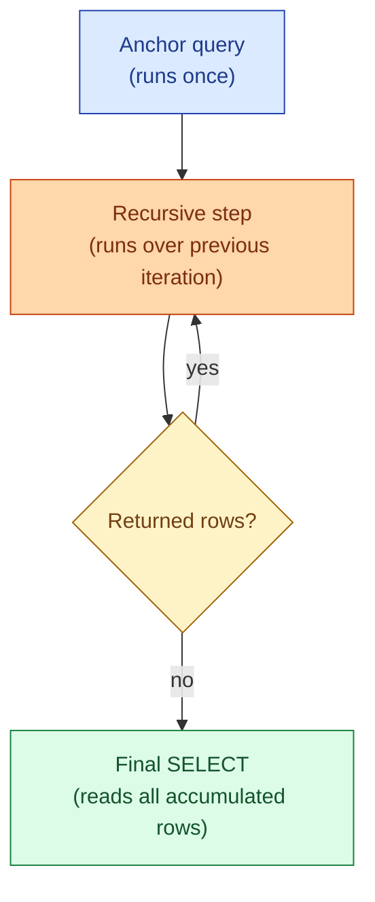
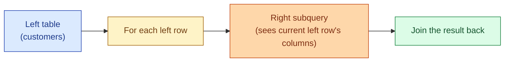

Plain SQL is set-based and one-pass. Two features extend it for the cases where that is not enough. A **recursive CTE** lets a query reference itself, which is how you walk a hierarchy or generate a sequence. A **LATERAL join** lets the right side of a join see the columns of the current left row, which is how you get "top 3 per customer" in one query.

Both look intimidating the first time. Both have one canonical shape you learn once and reuse for ever.

## Recursive CTE: the shape

Every recursive CTE has three parts. Learn the shape, fill in the blanks.

```sql
WITH RECURSIVE cte_name AS (
  -- 1. anchor: the starting row(s)
  SELECT ...

  UNION ALL

  -- 2. recursive step: refer to the CTE itself
  SELECT ...
  FROM cte_name
  JOIN ...
)
SELECT * FROM cte_name;  -- 3. final query
```

The anchor runs once. The recursive step runs again and again, each time using the previous iteration's output as input, until the recursive step returns zero rows. Then the final query reads everything that was accumulated.



## Use case 1: walk a hierarchy

The classic problem: an `employees` table where each row has a `manager_id` pointing to another employee. Find every report (direct and indirect) under one person.

```sql
WITH RECURSIVE org AS (
  -- anchor: the CEO
  SELECT employee_id, name, manager_id, 0 AS level
  FROM employees
  WHERE employee_id = 1

  UNION ALL

  -- recursive step: anyone whose manager is in org so far
  SELECT e.employee_id, e.name, e.manager_id, org.level + 1
  FROM employees e
  JOIN org ON e.manager_id = org.employee_id
)
SELECT * FROM org;
```

Each iteration finds one more level of the tree. The `level` column is a free souvenir from the recursion: it tells you how deep each person sits.

The same pattern works for any tree or graph: category trees, bill-of-materials, friend-of-friend, dependency chains.

## Use case 2: generate a sequence

Need a row per day for the last 90 days, even days with no events? Recursive CTE.

```sql
WITH RECURSIVE dates AS (
  SELECT CURRENT_DATE - 89 AS day
  UNION ALL
  SELECT day + 1 FROM dates WHERE day < CURRENT_DATE
)
SELECT * FROM dates;
```

(In Postgres, `generate_series` is the cleaner tool for this specific case. The recursive CTE form works in engines without `generate_series`.)

## The termination rule

A recursive CTE must terminate. If the recursive step always returns rows, the query runs for ever (or until the engine's recursion limit kicks in). Two ways to keep it safe:

1. **A natural termination condition.** Walking a tree terminates when you hit the leaves. Generating dates terminates when you reach the end.
2. **A guard.** A `level < 100` check, or a visited-set tracked in a column. Useful when the data has cycles you cannot rule out (e.g., an org chart where someone reports to themselves through a chain of edits).

Postgres has `max_recursion_depth`; SQL Server's default cap is 100. Know your engine's limit before you ship.

## LATERAL JOIN: the shape

A normal join's right side is evaluated once: it does not know which left row it is being matched against. `LATERAL` removes that restriction. The right side can reference columns from the current left row.

```sql
SELECT c.customer_id, recent.order_id, recent.order_date
FROM customers c
JOIN LATERAL (
  SELECT order_id, order_date
  FROM orders o
  WHERE o.customer_id = c.customer_id    -- here: c.customer_id is visible
  ORDER BY order_date DESC
  LIMIT 3
) recent ON true;
```

This returns up to three rows per customer: their three most recent orders. Without `LATERAL`, the subquery cannot reference `c.customer_id`, and you have to fall back to a window-function trick.



In other dialects: BigQuery and Snowflake support a similar feature via `CROSS JOIN UNNEST` or `LATERAL FLATTEN`. SQL Server calls it `CROSS APPLY` (and `OUTER APPLY` for the left-join variant).

## Top-N per group: window vs LATERAL

The "top 3 orders per customer" problem has two clean answers.

**Window function:**

```sql
SELECT * FROM (
  SELECT *, ROW_NUMBER() OVER (PARTITION BY customer_id ORDER BY order_date DESC) AS rn
  FROM orders
) t
WHERE rn <= 3;
```

**LATERAL:**

```sql
SELECT c.customer_id, recent.*
FROM customers c
JOIN LATERAL (
  SELECT * FROM orders o
  WHERE o.customer_id = c.customer_id
  ORDER BY order_date DESC
  LIMIT 3
) recent ON true;
```

When the left side is small and the right side is huge, `LATERAL` is often faster: the planner can use an index lookup per customer instead of sorting the whole orders table. When the right side is small, the window form is usually fine and easier to read. Check `EXPLAIN ANALYZE` on real data.

## Common mistakes

- **Forgetting `UNION ALL` and writing `UNION`** in a recursive CTE. `UNION` triggers a dedup on every iteration and is much slower. Use `UNION ALL` and let the recursion naturally avoid duplicates, or add an explicit visited-set.
- **No termination condition.** The recursion runs until the engine's depth limit and then errors. Always have a stopping rule.
- **Referencing the recursive CTE twice in the recursive step.** Postgres rejects this. The recursive reference must appear exactly once.
- **Using `LATERAL` when a simple correlated subquery would do.** A scalar `SELECT (...)` in the column list is often shorter than a `JOIN LATERAL`.
- **Forgetting `ON true` after `JOIN LATERAL`.** Postgres requires it (the join condition is inside the subquery itself).
- **Walking a graph that has cycles without a guard.** Org charts and category trees occasionally cycle. Track visited nodes.

## Quick recap

- A recursive CTE has three parts: anchor, recursive step, final query. The recursive step keeps running until it returns zero rows.
- The two use cases that cover 90%: walking a hierarchy and generating a sequence.
- Always use `UNION ALL` (not `UNION`) and always have a termination condition.
- `LATERAL JOIN` lets the right side of a join see the current left row's columns. The canonical use is "top N per group with index support."
- Window functions and `LATERAL` both solve top-N-per-group. `LATERAL` wins when the left side is small and the right has a good index.

This concept sits in **Stage 1 (SQL fundamentals)** of the [Data Engineering Roadmap](/practice/data-engineering/roadmap/).
