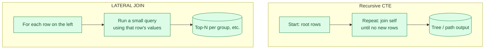

Most queries are flat. A few problems are not: walking a parent-child tree, finding the next event after each event, applying a function row by row. Recursive CTEs handle the hierarchy ones. Lateral joins handle the row-by-row ones. Both replace messy procedural code with one SQL statement.

**What this page will cover.**

- Recursive CTE shape: anchor query `UNION ALL` recursive query.
- Walking a manager-employee hierarchy in one query.
- Bill-of-materials and category trees with depth limits.
- Lateral joins for top-N per group (faster than window function for big tables).
- `CROSS JOIN LATERAL` and `LEFT JOIN LATERAL`: the two flavours.
- When recursion is too slow and you want a `closure_table` instead.

*Page coming soon.*

This concept sits in **Stage 1 (SQL fundamentals)** of the [Data Engineering Roadmap](/practice/data-engineering/roadmap/).
