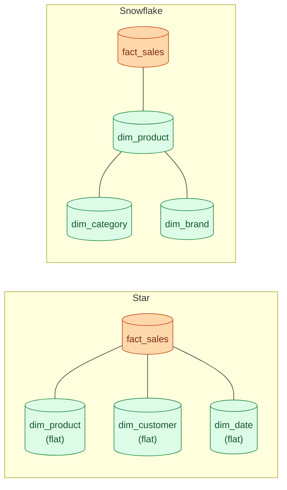

A star schema puts one fact table in the middle with denormalised dimension tables hanging off it. A snowflake schema does the same but normalises the dimensions further into smaller tables. Star reads faster. Snowflake stores tighter. Most warehouses pick star and accept the duplication.

**What this page will cover.**

- When star wins: fewer joins, simpler dashboards, denormalised by design.
- When snowflake makes sense: regulated industries where dimension truth must be normalised.
- The "galaxy" / fact-constellation when you have multiple fact tables sharing dimensions.
- Why columnar warehouses make the snowflake performance argument almost moot.
- The cost of denormalisation: keeping dimension rebuilds consistent.

*Page coming soon.*

This concept sits in **Stage 2 (Data modeling and warehousing)** of the [Data Engineering Roadmap](/practice/data-engineering/roadmap/).
