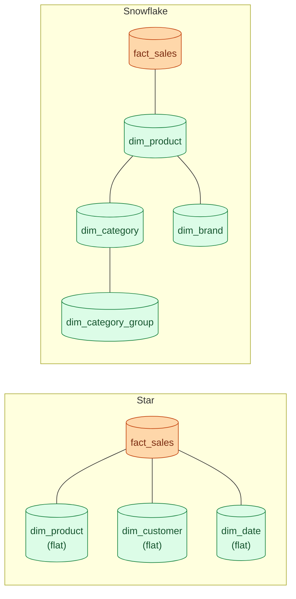
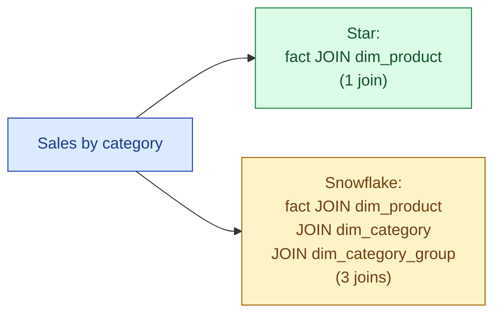
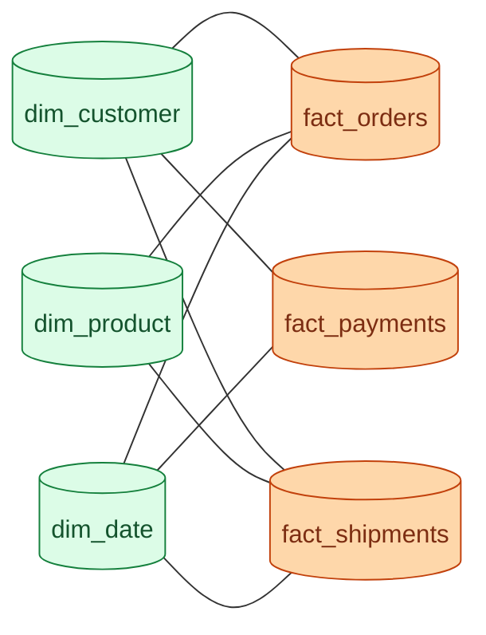

A star schema puts one fact table in the middle with denormalised dimension tables hanging off it. A snowflake schema does the same but normalises the dimensions further into smaller tables. Star reads faster. Snowflake stores tighter. On a modern columnar warehouse, star wins almost every time.

## The two shapes



In a star, `dim_product` has every product attribute on it: `product_name`, `category_name`, `category_group`, `brand_name`. In a snowflake, those higher-level attributes get pushed out to `dim_category`, `dim_brand`, `dim_category_group`. The fact joins through the product dim, which joins through the category dim, and so on.

## Worked example

A star `dim_product`:

```sql
CREATE TABLE dim_product (
    product_sk     bigint primary key,
    product_id     text,
    product_name   text,
    category_id    text,
    category_name  text,
    category_group text,
    brand_id       text,
    brand_name     text,
    list_price     numeric
);
```

The snowflake version splits it:

```sql
CREATE TABLE dim_product (
    product_sk    bigint primary key,
    product_id    text,
    product_name  text,
    category_sk   bigint references dim_category,
    brand_sk      bigint references dim_brand,
    list_price    numeric
);

CREATE TABLE dim_category (
    category_sk        bigint primary key,
    category_id        text,
    category_name      text,
    category_group_sk  bigint references dim_category_group
);
```

A "sales by category" query on the star is one join. On the snowflake it is three.

## Why star usually wins

Two reasons, both about modern warehouses.

First, columnar storage. Repeating `category_name = 'Shoes'` on a million product rows costs almost nothing. Run-length encoding crushes the column down to a handful of bytes. The "wasted space" argument for snowflake assumed row storage from 1995.

Second, joins are not free. Snowflake schemas force extra joins on every query. On a 10 TB fact table, one extra hash join is real work. Three extra joins is a noticeable bill.



## When snowflake actually makes sense

A short list, because it is genuinely short.

- **Regulated industries** where the category hierarchy is its own source of truth, owned by a different team, and must be modelled separately for audit reasons.
- **Very large dimensions** (hundreds of millions of rows) where the saved storage on a column with low cardinality is meaningful.
- **Dimension reuse across many marts** where the same brand or category lookup is referenced from a dozen places and the team wants exactly one place to update it.
- **MDM-backed reference data** where the hierarchy lives in a master data system and the warehouse is mirroring it.

For most teams none of these apply. Flatten the dim, ship the star, move on.

## The galaxy / fact constellation

Real warehouses have more than one fact table. Orders, payments, shipments, support tickets. They share dimensions (customer, product, date). That shape is sometimes called a galaxy or a fact constellation.



The shared dims here are conformed dimensions (see [Conformed dimensions](/practice/data-engineering/concepts/013-conformed-dimensions/)). Getting them right is what makes the galaxy work; getting them wrong is what makes "customer count" disagree across reports.

## Cost of denormalisation

The thing that genuinely costs money on a star is rebuilding the flat dim when an attribute changes. If you rename a category, every `dim_product` row for that category has to update. On a snowflake you update one row in `dim_category`.

In practice this matters less than it sounds. Dimensions are small. A `dim_product` with a million rows rebuilds in seconds on any decent warehouse. The fact rebuild is the expensive part, and that does not change between star and snowflake.

## Common mistakes

- **Reaching for snowflake "because it's more normalised."** Normalisation is a constraint for transactional systems. The warehouse has different goals: fast scans, simple queries, easy BI. Star fits those goals better.
- **Building a snowflake to save storage on columnar.** Run-length encoding already saves that storage. You are paying with extra joins for nothing.
- **Flattening a dim that has a genuine many-to-many.** A product belongs to many categories? Do not flatten; use a bridge table or accept one row per (product, category).
- **Forgetting that snowflake makes BI tools harder.** Looker, Tableau, Power BI all assume star-shaped joins. A snowflake forces extra join steps in every explore.
- **Treating the choice as global.** Most marts are clean stars. One regulated mart can still be a snowflake. Pick per mart, not per warehouse.
- **Modelling "in case we need it later."** Build the star you need now. Snowflake-ing later is easy; un-snowflaking is the hard direction.

## Quick recap

- Star: fact in the middle, flat denormalised dims. The default on columnar warehouses.
- Snowflake: dims normalised into their own dim tables. More joins, less duplication.
- Modern columnar storage makes the snowflake storage argument almost irrelevant.
- Galaxy / fact constellation: multiple facts sharing conformed dims. The shape of a real warehouse.
- Snowflake only when a dim is regulated, huge, or shared across many marts that all need the same updates.

This concept sits in **Stage 2 (Data modeling and warehousing)** of the [Data Engineering Roadmap](/practice/data-engineering/roadmap/).
