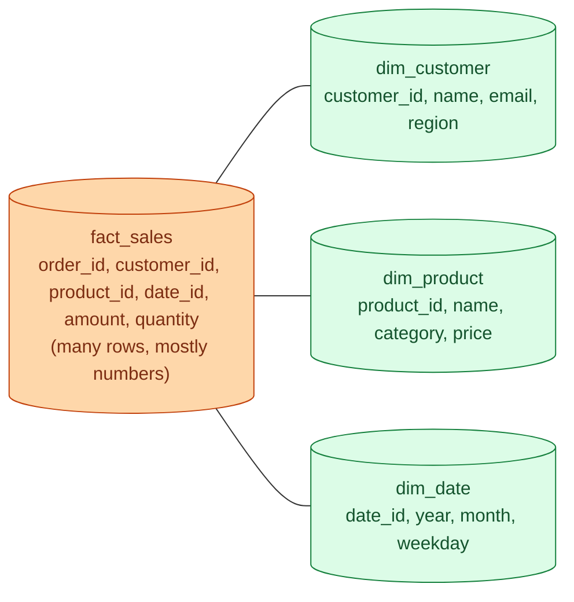

A fact table holds events: orders placed, clicks, sensor readings, payments. A dimension table describes the actors and things involved: which customer, which product, which day. Facts grow forever and are mostly numbers. Dimensions are mostly text and grow slowly.

**What this page will cover.**

- The three types of fact tables: transaction, periodic snapshot, accumulating snapshot.
- Additive, semi-additive, and non-additive measures.
- Why a `dim_date` table beats `date_trunc` everywhere.
- Degenerate dimensions (order number on the fact row, no dim table).
- Junk dimensions for the leftover flags.
- The bridge table when a fact has a many-to-many with a dimension.

*Page coming soon.*

This concept sits in **Stage 2 (Data modeling and warehousing)** of the [Data Engineering Roadmap](/practice/data-engineering/roadmap/).
