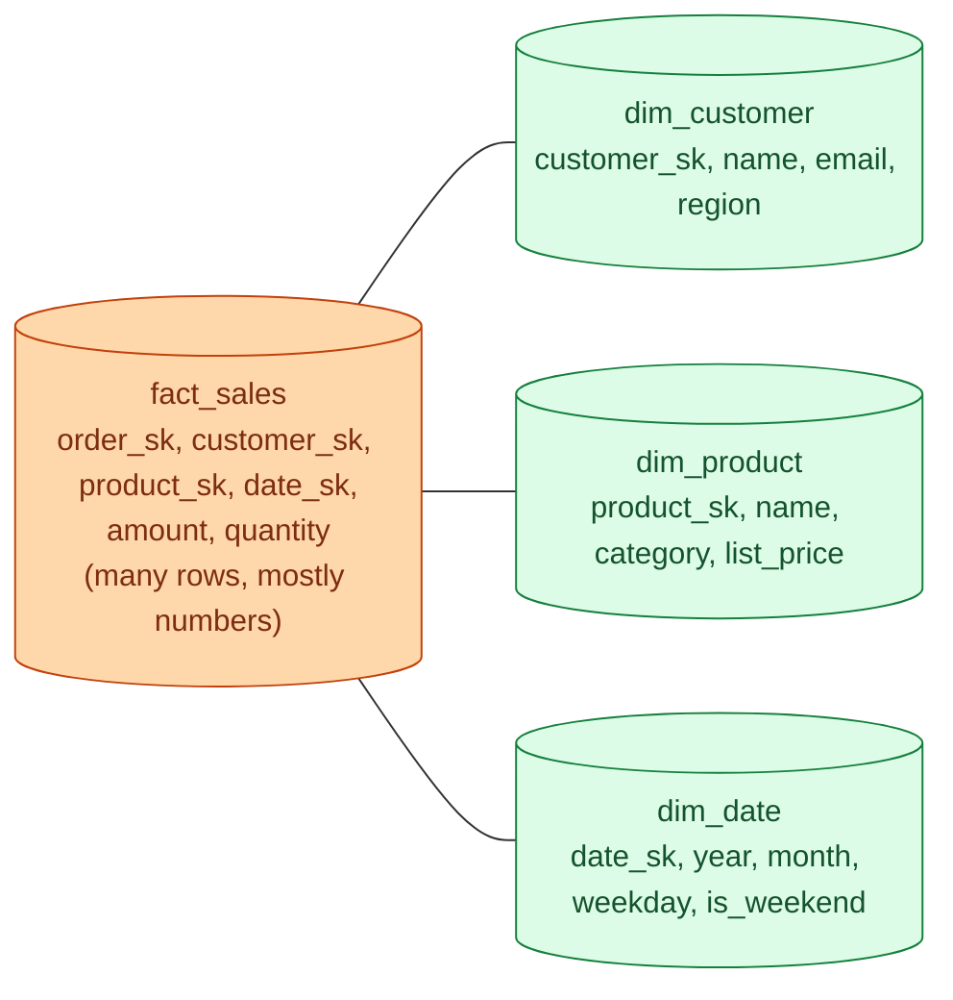
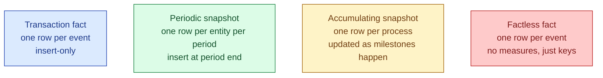

A fact table holds events: orders placed, clicks, sensor readings, payments. A dimension table describes the actors and things involved: which customer, which product, which day. Facts grow forever and are mostly numbers. Dimensions are mostly text and grow slowly. Almost every analytical schema is some variant of this split.

## The shape



The fact row says "on date X, customer Y bought product Z for amount A." Every column in the fact is either a foreign key to a dim or a number you can aggregate. Every column in the dim is descriptive.

## The four flavours of fact table

Not every fact table is the same shape. There are four common types and they answer different questions.

| Type | One row per | Used for |
|---|---|---|
| **Transaction** | Each event | "How many orders today?" Standard fact. |
| **Periodic snapshot** | Entity per period | "Account balance at end of each month" |
| **Accumulating snapshot** | A process instance, updated as it progresses | "Order placed -> picked -> shipped -> delivered" |
| **Factless** | An event with no numeric measure | "Student attended class on date X" |



Transaction is the default and what most people mean when they say "fact table." Periodic snapshot is how you do balances and inventory. Accumulating snapshot is how you measure cycle time on a multi-step process. Factless is how you record events that have no number (an attendance, an opt-in, a click that did not convert).

## Worked example: orders fact plus dims

```sql
CREATE TABLE dim_customer (
    customer_sk   bigint primary key,
    customer_id   text,
    name          text,
    email         text,
    region        text,
    signup_date   date
);

CREATE TABLE dim_product (
    product_sk   bigint primary key,
    product_id   text,
    name         text,
    category     text,
    list_price   numeric
);

CREATE TABLE dim_date (
    date_sk     int primary key,
    full_date   date,
    year        int,
    month       int,
    weekday     int,
    is_weekend  boolean
);

CREATE TABLE fact_orders (
    order_sk     bigint primary key,
    order_id     text,         -- degenerate dimension
    customer_sk  bigint references dim_customer,
    product_sk   bigint references dim_product,
    date_sk      int references dim_date,
    quantity     int,
    amount       numeric,
    discount     numeric
);
```

`order_id` is a degenerate dimension: a dim key with no dim table, kept on the fact row because the business uses it directly. `quantity`, `amount`, `discount` are the measures.

A "sales by month and category" query is one fact + two dim joins:

```sql
SELECT d.year, d.month, p.category, SUM(f.amount) AS revenue
FROM fact_orders f
JOIN dim_date d    ON f.date_sk = d.date_sk
JOIN dim_product p ON f.product_sk = p.product_sk
GROUP BY d.year, d.month, p.category;
```

## Additive, semi-additive, non-additive

Measures sit on fact rows. How they aggregate is not all the same.

| Type | Sums across | Example |
|---|---|---|
| **Additive** | Every dimension | `amount`, `quantity`. Sum across customers, products, days. All fine. |
| **Semi-additive** | Some dimensions | Account balance. Sum across customers makes sense. Sum across days does not. |
| **Non-additive** | None | Ratios, percentages, distinct counts. Aggregate the components, then compute. |

Confusing these is the root of half of all "the dashboard numbers are wrong" bugs. If `account_balance` is on a daily snapshot fact and someone does `SUM(account_balance)` across dates, they get a number that is meaningless and looks plausible.

The rule: store the additive components on the fact. Compute the non-additive metric at query time.

```sql
-- wrong: dividing pre-aggregated averages
SELECT AVG(daily_avg_basket) FROM daily_summary;

-- right: store the components, divide at query time
SELECT SUM(revenue) / SUM(order_count) AS avg_basket FROM fact_orders;
```

## Why dim_date beats date_trunc everywhere

A `dim_date` table with one row per calendar day is one of the highest-value tables in any warehouse. It is small (a few thousand rows for decades of dates) and lets you answer questions like "first Monday of each fiscal quarter" or "is this a public holiday in Sweden" without writing date arithmetic in every query.

```sql
CREATE TABLE dim_date AS
SELECT
    EXTRACT(EPOCH FROM d)::int / 86400 AS date_sk,
    d AS full_date,
    EXTRACT(YEAR FROM d)::int AS year,
    EXTRACT(MONTH FROM d)::int AS month,
    EXTRACT(DOW FROM d)::int AS weekday,
    EXTRACT(DOW FROM d) IN (0, 6) AS is_weekend,
    -- ... fiscal quarter, holiday flag, etc.
FROM generate_series(DATE '2015-01-01', DATE '2035-12-31', INTERVAL '1 day') AS d;
```

Now "weekend sales" is `WHERE d.is_weekend`, not a `CASE` on `EXTRACT(DOW FROM ...)` copy-pasted into every query.

## Common mistakes

- **Mixing grains in one fact table.** "One row per order, except for promotions where it is per line." Two grains in one table is two facts. Split them.
- **Putting descriptive text on the fact.** `product_name` on `fact_orders` looks convenient and dies the first time the product is renamed. Keep descriptions on the dim, keep keys on the fact.
- **Summing semi-additive measures across time.** Balances, inventory levels, headcounts. They aggregate across entities, not across dates.
- **Storing computed ratios on the fact.** Averages of averages are wrong. Store the numerator and denominator; compute the ratio at query time.
- **No `dim_date`.** Every analytics team rebuilds the same fiscal-quarter logic five times across five queries. Build the dim once.
- **Forgetting the degenerate dimension.** `order_id` is not a dim table, but it belongs on the fact for tracing back to the source system.
- **Using the natural key as the fact foreign key.** When the customer's natural key changes upstream, every old fact row breaks. Use surrogates (see [Surrogate vs natural keys](/practice/data-engineering/concepts/012-surrogate-vs-natural-keys/)).

## Quick recap

- Fact = events, mostly numbers, grows forever. Dim = descriptions, mostly text, grows slowly.
- Four fact flavours: transaction, periodic snapshot, accumulating snapshot, factless. Most are transaction.
- Additive measures sum across every dim. Semi-additive sum across some. Non-additive sum across none; compute from components.
- Degenerate dimension = a key on the fact row with no dim table.
- A `dim_date` table is small, cheap, and removes date arithmetic from every query.

This concept sits in **Stage 2 (Data modeling and warehousing)** of the [Data Engineering Roadmap](/practice/data-engineering/roadmap/).
