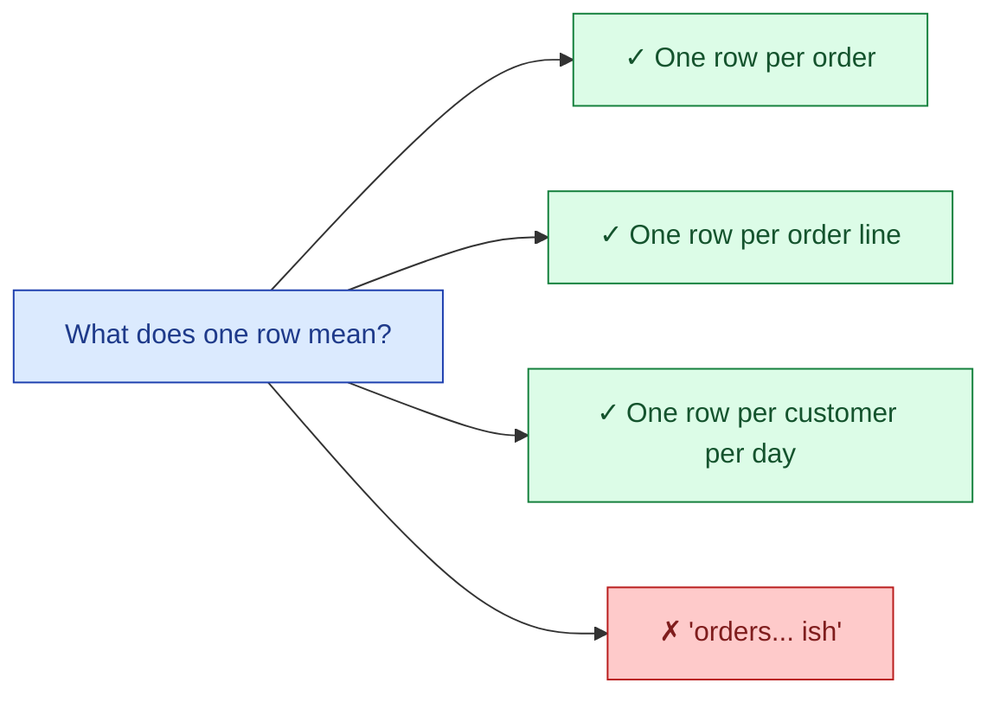

The grain of a table is what one row represents. "One row per order." "One row per order line." "One row per customer per day." Every modeling question gets easier once the grain is named out loud. Every modeling bug gets harder once the grain is fuzzy.

**What this page will cover.**

- Naming the grain in one sentence as the first modeling move.
- The order header vs order line decision and what each enables.
- Periodic snapshot grain: one row per entity per day vs per month.
- The "double-counting" bug when grain is unclear and someone joins one-to-many.
- Why dashboards silently disagree when two tables share a name but not a grain.
- The grain change as the most expensive migration in any data warehouse.

*Page coming soon. Until then, see [#094 Versioning a breaking grain change](/practice/data-engineering/094-versioning-a-breaking-grain-change/) for the practice scenario.*

This concept sits in **Stage 2 (Data modeling and warehousing)** of the [Data Engineering Roadmap](/practice/data-engineering/roadmap/).
