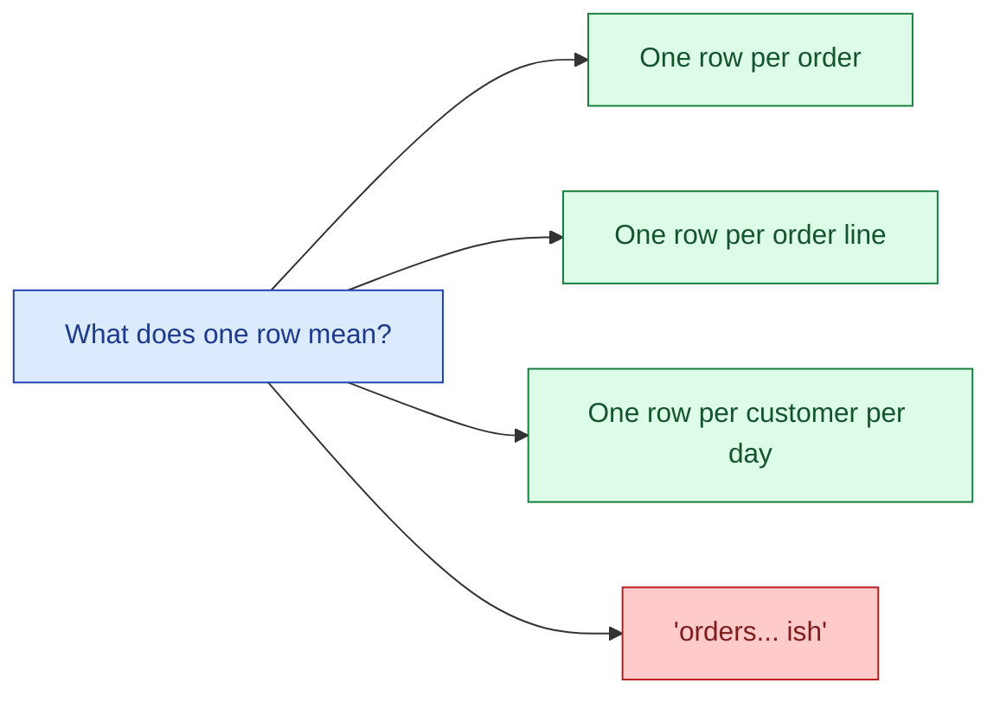
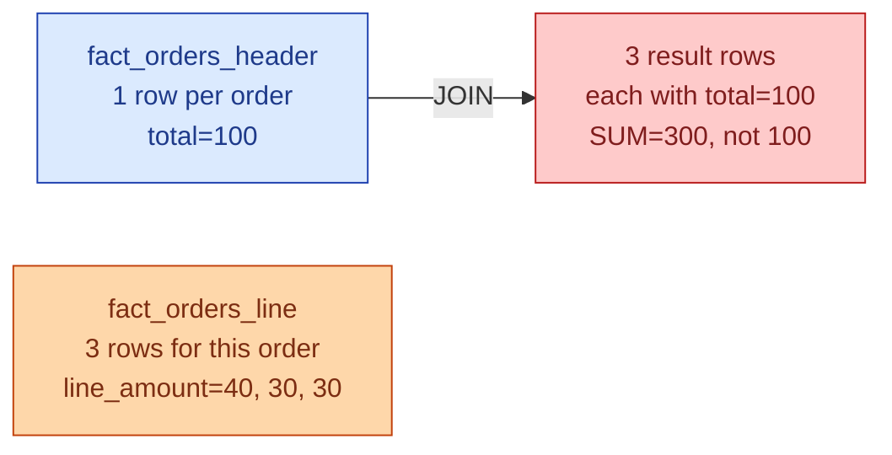

The grain of a table is what one row represents. "One row per order." "One row per order line." "One row per customer per day." Every modeling question gets easier once the grain is named out loud. Every modeling bug gets harder once the grain is fuzzy. If I had to pick one rule to enforce on every fact table I have ever shipped, it would be this: declare the grain in the first sentence of the table's doc.

## What grain actually means



The first three are grains. The fourth is what you get when nobody wrote the grain down and the table grew by accretion. Tables with fuzzy grain are how you end up with `SUM(amount)` returning numbers that change depending on which dim you joined to.

## Order header vs order line

The same business concept can be modelled at two grains. Both are valid; they answer different questions.

**Order header grain.** One row per order. The total amount, the customer, the order date.

```sql
CREATE TABLE fact_orders_header (
    order_sk     bigint primary key,  -- one per order
    order_id     text,
    customer_sk  bigint,
    date_sk      int,
    total_amount numeric,
    line_count   int
);
```

**Order line grain.** One row per order line. Product, quantity, line amount.

```sql
CREATE TABLE fact_orders_line (
    order_line_sk bigint primary key,  -- one per (order, line)
    order_id      text,
    customer_sk   bigint,
    date_sk       int,
    product_sk    bigint,
    quantity      int,
    line_amount   numeric
);
```

`SUM(line_amount)` on the line table equals `SUM(total_amount)` on the header table. Both answer "what's revenue?" The line table also answers "what's revenue by product?" The header table cannot.

Pick the finer grain when in doubt. You can always aggregate up. You cannot disaggregate.

## The double-counting bug

This is the bug that grain solves and the bug that fuzzy grain causes. Here it is in three lines of SQL.

```sql
SELECT SUM(o.total_amount)
FROM fact_orders_header o
JOIN fact_orders_line l ON o.order_id = l.order_id;
```

The header has one row per order. The line has many rows per order. Joining one-to-many duplicates the header row once per line. `SUM(total_amount)` now counts each order's total once per line. If the average order has 3 lines, revenue triples.



The fix is to pick one grain and stay there. Either work at line grain and sum `line_amount`, or work at header grain and never join to lines for measure aggregation.

Most production "the dashboard is wrong" tickets are some version of this. Two tables at different grains, joined as if they were at the same grain.

## Declaring grain explicitly

In every fact table's documentation, the first sentence should be the grain. Not the description. Not the source. The grain.

```yaml
# dbt model doc
models:
  - name: fact_orders_line
    description: |
      Grain: one row per (order_id, order_line_number).
      A row is created when an order is placed and never updated.
    columns:
      - name: order_line_sk
        tests: [unique, not_null]
```

A `unique` test on the grain key (or composite key) is how you enforce the grain in the pipeline. If the test fails, something upstream changed the grain and the rest of the model is now wrong.

## Periodic snapshot grain

Snapshots have grain too, and it is usually a composite: entity plus time bucket.

```sql
CREATE TABLE fact_account_balance_daily (
    balance_sk    bigint primary key,
    account_sk    bigint,
    date_sk       int,
    balance       numeric,
    -- grain: one row per (account_sk, date_sk)
    UNIQUE (account_sk, date_sk)
);
```

The grain question for a snapshot is "one row per WHAT per WHEN." If you cannot answer both halves, the snapshot is going to misbehave the first time someone reloads a partial day.

The choice of WHEN matters. Daily snapshots are common. Monthly snapshots save storage but lose mid-month resolution. Hourly snapshots cost 24x more rows than daily. Pick once, document, do not waffle.

## When two tables share a name but not a grain

This is the silent killer of cross-team dashboards.

The marketing team builds `customer_metrics` at grain "one row per customer per day with marketing engagement counts." The finance team builds `customer_metrics` at grain "one row per customer with lifetime value." Both tables are called `customer_metrics`. Both have a `customer_id` column. A dashboard joins them.

The marketing one has 1000 rows per customer (one per day). The finance one has 1 row per customer. After the join, every finance row appears 1000 times. Lifetime value summed across the dashboard is 1000x the real number.

The fix is naming discipline. Grain belongs in the table name (`customer_daily_engagement`, `customer_lifetime_value`) and in the docs. "Two tables with the same name" is the warning sign.

## Changing the grain later

Changing the grain of a fact table is the most expensive migration in a warehouse. Every downstream model that aggregates the fact assumes the grain. Every dashboard that filters the fact assumes the grain. Every test on uniqueness assumes the grain.

The migration pattern that works:

1. Build the new fact at the new grain alongside the old one (`fact_orders_v2`).
2. Migrate downstream models one at a time, with paired tests showing the numbers match where they should.
3. Deprecate the old fact only after every consumer has moved.
4. Drop the old fact in a planned cleanup, not silently.

Anything faster breaks dashboards in ways the consumers find before you do.

## Common mistakes

- **No declared grain.** The table doc says what columns are on it, not what one row means. Every consumer guesses.
- **Joining two tables at different grains without aggregating first.** The double-count bug. Aggregate the many-side down to the one-side's grain first.
- **Mixing grains in one table.** "Mostly per-order, but promotions are per-line." Split it.
- **Putting grain only in a Slack message.** It will be lost. Put it in the model doc and enforce it with a uniqueness test.
- **Snapshotting without committing to a frequency.** "Daily, except weekends, except when the pipeline failed." Pick one rhythm and backfill the gaps.
- **Changing grain in place.** Build the new grain alongside, migrate, then drop. Never change grain on the same table name.
- **Treating grain as a documentation problem.** It is a uniqueness constraint. Test it.

## Quick recap

- Grain = what one row represents. Declare it in one sentence per fact table.
- "One row per order" vs "one row per order line" are different grains and answer different questions. Pick the finer when in doubt.
- The double-count bug comes from joining tables at different grains without aggregating first.
- Periodic snapshots have composite grain: entity plus time bucket. Both halves need a name.
- Two tables with the same name and different grains is the silent killer of cross-team dashboards.
- Changing grain is the most expensive migration. Build the new fact alongside, migrate, deprecate.

This concept sits in **Stage 2 (Data modeling and warehousing)** of the [Data Engineering Roadmap](/practice/data-engineering/roadmap/).
