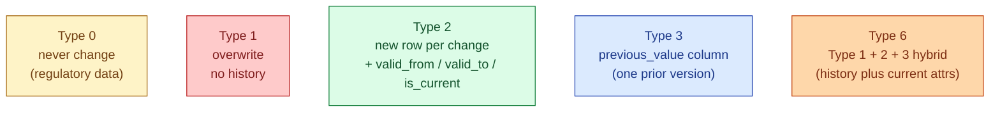
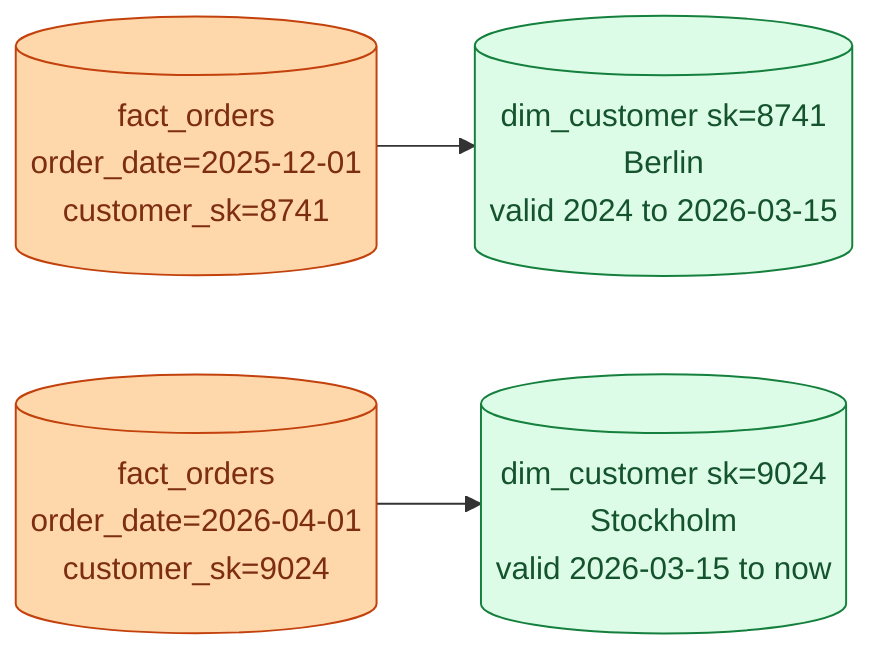

A customer's city used to be Berlin. Now it is Stockholm. Should last year's orders show Berlin or now show Stockholm? There is no universally right answer. It depends on what people ask the dashboard. Slowly Changing Dimensions (SCDs) are the named patterns for handling this question consistently.

## The choices



In practice, 90% of warehouse dims are a mix of Type 1 (for fields where history does not matter) and Type 2 (for fields where it does). Type 3 is rare. Type 6 is Type 2 with a few extra columns. Type 0 is for fields the business has decided are immutable.

## Type 1: overwrite

The simplest pattern. The dim row gets updated in place. No history.

```sql
-- before
customer_sk | name  | city
       8741 | Anna  | Berlin

UPDATE dim_customer SET city = 'Stockholm' WHERE customer_sk = 8741;

-- after
customer_sk | name  | city
       8741 | Anna  | Stockholm
```

Every fact joined to this dim now shows Anna's city as Stockholm, including last year's orders. Good when "current value" is what you want everywhere. Bad when you need to know what the city was at the time of the order.

## Type 2: history with start/end and current flag

The default for any dim where history matters. A change creates a new row. The old row is closed out with a `valid_to` date. A boolean `is_current` flag makes "current state" queries fast.

```sql
CREATE TABLE dim_customer (
    customer_sk   bigint primary key,   -- surrogate, one per version
    customer_id   text,                 -- natural key, repeats across versions
    name          text,
    city          text,
    valid_from    timestamp,
    valid_to      timestamp,
    is_current    boolean
);
```

Worked example: Anna moves from Berlin to Stockholm on 2026-03-15.

```text
customer_sk | customer_id | name | city      | valid_from | valid_to            | is_current
       8741 | C-100       | Anna | Berlin    | 2024-01-01 | 2026-03-15 00:00:00 | false
       9024 | C-100       | Anna | Stockholm | 2026-03-15 | 9999-12-31 00:00:00 | true
```

Two rows. Same `customer_id`. Different `customer_sk`. The fact table for last year's orders references `customer_sk = 8741`, which still says Berlin. The fact table for orders after March 15 references `customer_sk = 9024`, which says Stockholm. History is preserved on both sides.



## The MERGE pattern for Type 2

The load looks like this. New source row comes in; you compare it to the current dim version; if anything tracked has changed, close the current row and insert a new one.

```sql
-- close out rows whose tracked attributes have changed
UPDATE dim_customer d
SET    valid_to = current_timestamp,
       is_current = false
FROM   staging_customer s
WHERE  d.customer_id = s.customer_id
  AND  d.is_current = true
  AND  (d.name <> s.name OR d.city <> s.city);

-- insert the new current row
INSERT INTO dim_customer (customer_id, name, city, valid_from, valid_to, is_current)
SELECT s.customer_id, s.name, s.city, current_timestamp, '9999-12-31', true
FROM   staging_customer s
LEFT JOIN dim_customer d
       ON d.customer_id = s.customer_id AND d.is_current = true
WHERE  d.customer_id IS NULL                       -- brand new
   OR  (d.name <> s.name OR d.city <> s.city);     -- changed
```

In practice almost no one writes this by hand. `dbt snapshot` is the standard implementation:


```sql

{{
    config(
        target_schema='snapshots',
        unique_key='customer_id',
        strategy='check',
        check_cols=['name', 'city']
    )
}}
SELECT * FROM {{ source('crm', 'customers') }}

```


dbt manages the `valid_from`, `valid_to`, and surrogate key. You declare which columns to watch.

## Type 3: previous value column

Add a column for the prior value. Holds exactly one version of history.

```sql
customer_id | name | city      | previous_city
C-100       | Anna | Stockholm | Berlin
```

Useful in narrow situations: a sales territory reorg where every analyst needs "the new territory and the one before" but nobody cares about anything older. Falls down as soon as the attribute changes again. Rare in practice.

## Type 6: hybrid

Type 6 is Type 2 with extra "current value" columns on every row. The row stores both the historical city and the current city as of today.

```sql
customer_sk | customer_id | name | city_at_time | city_current | valid_from | valid_to   | is_current
       8741 | C-100       | Anna | Berlin       | Stockholm    | 2024-01-01 | 2026-03-15 | false
       9024 | C-100       | Anna | Stockholm    | Stockholm    | 2026-03-15 | 9999-12-31 | true
```

This lets one query answer both "what was Anna's city at order time?" and "what is Anna's city today?" without re-joining to a separate current-state table. The downside: `city_current` has to be updated on every old row every time the attribute changes.

## Picking a type per column

The decision is per column, not per dim. On `dim_customer`:

| Column | Type | Why |
|---|---|---|
| `name` | Type 1 | Spelling fixes should propagate to all history |
| `city` | Type 2 | Orders should reflect the city at the time |
| `signup_date` | Type 0 | Never changes |
| `email` | Type 1 or Type 2 | Depends on whether email is used as an attribution dim |

A real `dim_customer` is a mix. dbt snapshots track only the columns you list in `check_cols`; everything else is Type 1 by default.

## Common mistakes

- **Using natural keys as fact foreign keys with Type 2.** The natural key now matches multiple dim rows. The join goes one-to-many and the fact double-counts. Use surrogate keys on fact tables joining to Type 2 dims.
- **Forgetting `is_current`.** Without it, every "current state" query has to compute `WHERE valid_to > now()`. The flag is redundant but fast.
- **Setting `valid_to` to NULL on the current row.** Half of SQL operators handle NULL badly. Use `9999-12-31` instead.
- **Type 2 on every column.** Most attributes do not need history. Pick the ones the business actually asks about over time.
- **Type 2 with no `unique_key`.** dbt snapshot will silently insert duplicates on every run. Always declare the unique key.
- **Changing the SCD type after launch.** A dim that started as Type 1 cannot be made Type 2 retroactively; the history is gone. Pick correctly at the start, or accept the gap.
- **Loading Type 2 from a source that does not have a change timestamp.** You will treat the latest snapshot as "the truth" and lose any changes between loads. CDC or a real changelog is needed.

## Quick recap

- Type 1 overwrites. No history. Good for spelling fixes and "I only care about current."
- Type 2 inserts a new row per change with `valid_from`, `valid_to`, `is_current`. The default for anything where history matters.
- Type 3 adds a `previous_X` column. One step of history. Rare.
- Type 6 hybrid: Type 2 plus a current-value column for fast "today's value" queries.
- Pick the SCD type per column, not per table.
- `dbt snapshot` is the standard implementation of Type 2 and removes the hand-written MERGE.

This concept sits in **Stage 2 (Data modeling and warehousing)** of the [Data Engineering Roadmap](/practice/data-engineering/roadmap/).
