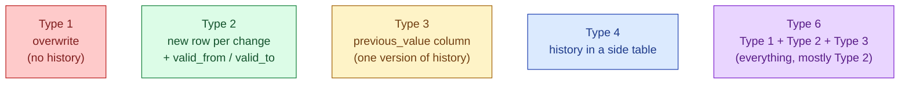

A customer's city used to be Berlin. Now it is Stockholm. Should last year's orders still show Berlin or now show Stockholm? There is no universally right answer — it depends on what people will ask the dashboard. Slowly Changing Dimensions (SCDs) are the named patterns for handling this.

**What this page will cover.**

- Each SCD type with one concrete question it answers.
- Why Type 2 is the most common in real warehouses.
- The `valid_from`, `valid_to`, `is_current` triple for Type 2.
- The MERGE pattern that loads a Type 2 dimension without breaking history.
- Type 0: the "never change this" version (regulatory data).
- The dbt snapshot pattern for Type 2 the easy way.

*Page coming soon. Until then, see [#010 Slowly Changing Dimensions](/practice/data-engineering/010-slowly-changing-dimensions/) for the practice problem.*

This concept sits in **Stage 2 (Data modeling and warehousing)** of the [Data Engineering Roadmap](/practice/data-engineering/roadmap/).
