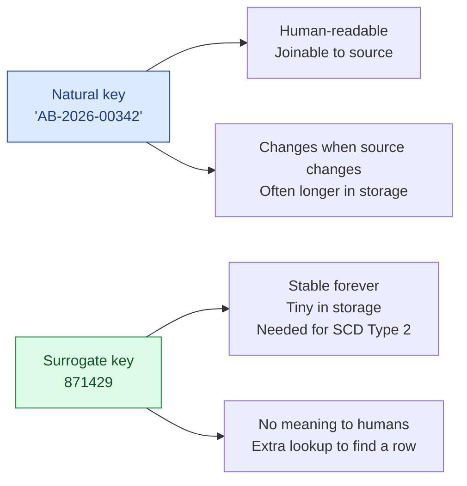

A natural key is the ID the business already has: an order number, an email address, a SKU. A surrogate key is a meaningless integer (or UUID) the warehouse generates. Both work. Picking the right one per table is one of those quiet modeling decisions that matters more than it looks.

**What this page will cover.**

- Why dimension tables with Type 2 SCD must use surrogate keys (the natural key is no longer unique).
- The fact-table convention: surrogate keys to dimensions, natural key as a "degenerate dimension".
- Auto-incrementing vs hash-based surrogate keys (and why hash beats auto-increment for distributed warehouses).
- Composite natural keys: when one column isn't enough.
- The trap of using emails or phone numbers as natural keys (they change).

*Page coming soon.*

This concept sits in **Stage 2 (Data modeling and warehousing)** of the [Data Engineering Roadmap](/practice/data-engineering/roadmap/).
