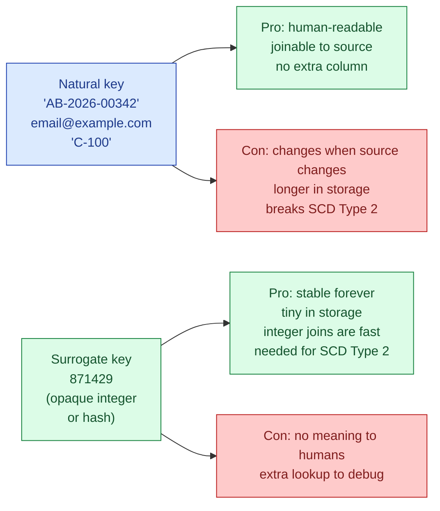
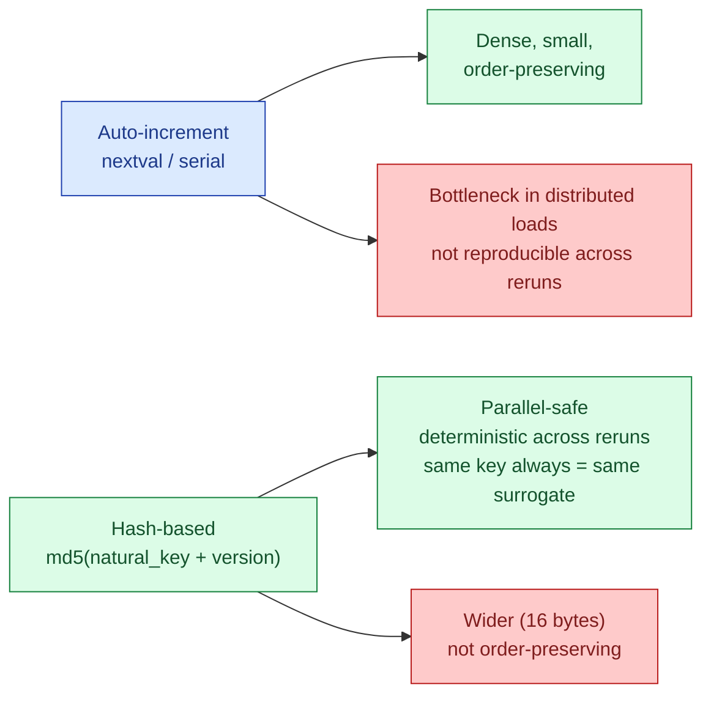

A natural key is the ID the business already has: an order number, an email address, a SKU. A surrogate key is a meaningless integer (or hash) the warehouse generates. Both work. Picking the right one per table is one of those quiet modeling decisions that matters more than it looks, and gets every team into trouble at least once.

## The two flavours



The convention I follow on every warehouse I have built: surrogate keys on dim tables, surrogate foreign keys on fact tables, natural key kept as an attribute for traceability.

## Why surrogate keys win in a warehouse

Four reasons, in order of how often they hurt you when you skip them.

**SCD Type 2 needs them.** A Type 2 dim has multiple versions of the same business entity. The natural key (`customer_id = C-100`) repeats across versions. The fact table needs to point to one specific version. That requires a key that is unique per version, which is the surrogate.

**Integer joins are fast.** Hash joins on a `bigint` are noticeably cheaper than on a `varchar(64)`. On a 10 TB fact table this matters; on a 10 GB one it does not. Plan for the table you will have in two years.

**Source keys change.** The CRM gets replaced. The merchant migrates billing systems. `customer_id` format changes from numeric to UUID. A surrogate key isolates the warehouse from upstream churn. Mappings change in one place: the dim load.

**Type safety.** A surrogate column is `bigint` everywhere. A natural key is sometimes text, sometimes int, sometimes prefixed. Joining `text` to `bigint` either silently casts or quietly errors out depending on the engine.

## Worked example

A clean dim + fact pattern:

```sql
CREATE TABLE dim_customer (
    customer_sk  bigint primary key,    -- surrogate, warehouse-generated
    customer_id  text not null,          -- natural key, from source
    name         text,
    email        text,
    region       text,
    valid_from   timestamp,
    valid_to     timestamp,
    is_current   boolean
);

CREATE TABLE fact_orders (
    order_sk     bigint primary key,
    order_id     text,                   -- natural / degenerate dim
    customer_sk  bigint references dim_customer,   -- FK to surrogate
    product_sk   bigint references dim_product,
    date_sk      int    references dim_date,
    amount       numeric
);
```

The fact joins on `customer_sk`. The business sees `customer_id` on the dim. Both keys exist; each does what it is good at.

## Auto-increment vs hash-based surrogates

Two ways to generate a surrogate key.

**Auto-increment (sequence).** A database sequence assigns the next integer. Simple, dense, tiny.

```sql
customer_sk = nextval('dim_customer_seq');
```

Fine for a single Postgres warehouse. Painful in a distributed engine: every worker would need to coordinate to get a unique sequence, which is exactly the bottleneck the engine is built to avoid.

**Hash-based.** Compute a deterministic hash of the natural key (plus, for Type 2, the version timestamp).

```sql
customer_sk = md5(customer_id || '|' || valid_from)::uuid;
-- or with Snowflake / Databricks
customer_sk = MD5(CONCAT(customer_id, '|', valid_from))
```



Hash beats auto-increment on every distributed warehouse I have used (BigQuery, Snowflake, Databricks). The killer feature is reproducibility: if I drop the dim and reload it from source, every surrogate key comes out the same, so every fact table that points to it still works. With auto-increment, a reload renumbers everything.

For Type 2 specifically, the hash input has to include the version identifier (the `valid_from`, or a hash of the changing attributes). Otherwise every version of the same business entity gets the same surrogate, and the whole point breaks.

## When natural keys are fine

Small reference dims that you control and that never change. `dim_country`, `dim_currency`, `dim_status`. The natural key is short, stable, and human-readable. Adding a surrogate buys nothing.

```sql
CREATE TABLE dim_country (
    country_code char(2) primary key,    -- 'SE', 'BD', 'US'
    name         text,
    region       text
);
```

`country_code = 'SE'` is shorter than any surrogate would be, and the ISO standard guarantees stability. Same for currency, ISO date, language code. Use the natural key.

The boundary: dims that are owned outside the warehouse and might change format. Customer, product, order, employee. Those get surrogates.

## Composite natural keys

Sometimes the business "ID" is two columns. An order line is unique by `(order_id, line_number)`. A daily price is unique by `(product_id, price_date)`. The natural key is the composite.

When you build a surrogate for these, hash the composite:

```sql
order_line_sk = md5(order_id || '|' || line_number);
```

The delimiter (`|`) matters. Without it, `('AB', '12')` and `('AB1', '2')` collide.

## The email and phone trap

Two natural keys that look stable and are not:

- **Email.** People change jobs. People merge accounts. People deliberately rotate emails to avoid marketing. If you key `dim_customer` on email, your "customer count" silently doubles when someone updates their email.
- **Phone number.** Sweden's `+46 70 xxx xx xx` becomes `+46 76 xxx xx xx` when the carrier reassigns the block. Phone numbers are recycled across people.

Both belong as attributes, not as keys. The actual key is whatever the source system uses internally (`customer_id`, `account_id`, an immutable UUID).

## Common mistakes

- **Joining facts to dims by natural key when the dim is Type 2.** The natural key matches every version. Fact rows multiply. Always use the surrogate on Type 2 dim joins.
- **Auto-increment surrogates on a distributed warehouse.** The reload-renumbers-everything bug. Switch to hash.
- **Hashing without a delimiter.** Composite key collisions. Always use a delimiter the natural key cannot contain.
- **Hashing without the version field for Type 2.** Every version of the same entity gets the same surrogate. The dim breaks silently.
- **Adding a surrogate to every tiny reference table.** `dim_country` with a `country_sk` plus the ISO code is two columns where one would do.
- **Using email or phone as a primary key.** People change them. The "customer" you thought was one is now two.
- **Storing only the surrogate.** Always keep the natural key as a column too. Debugging without it is painful.

## Quick recap

- Natural key = the source's ID. Surrogate key = a warehouse-generated opaque integer or hash.
- Dim tables get surrogates. Fact tables hold surrogate FKs plus the natural key as a degenerate dimension.
- Type 2 dims require surrogates; the natural key repeats across versions.
- Hash surrogates beat auto-increment on distributed warehouses because reloads stay reproducible.
- Small stable reference dims (country, currency, status) can stay on natural keys.
- Email and phone are not keys. They look stable. They are not.

This concept sits in **Stage 2 (Data modeling and warehousing)** of the [Data Engineering Roadmap](/practice/data-engineering/roadmap/).
