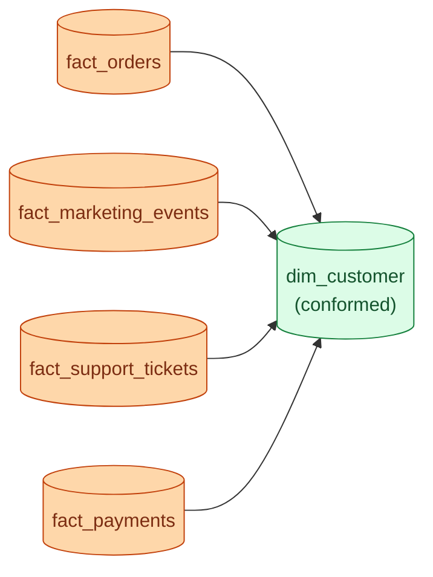

If the marketing team and the finance team both have their own "customer" dimension, every report they produce will quietly disagree. A conformed dimension is the shared, governed version that every fact table joins to. One row per customer. One spelling of the name. One agreed definition.

**What this page will cover.**

- The bus matrix: facts on rows, conformed dimensions on columns.
- Why conformed dimensions need a single owner and a single update cadence.
- The "outrigger" pattern when a fact needs a slightly different view of the same dimension.
- Migrating from siloed dimensions to conformed ones without breaking dashboards.
- The role of data contracts and tests in keeping a conformed dimension trustworthy.
- The "almost conformed" trap and how to spot it.

*Page coming soon.*

This concept sits in **Stage 2 (Data modeling and warehousing)** of the [Data Engineering Roadmap](/practice/data-engineering/roadmap/).
