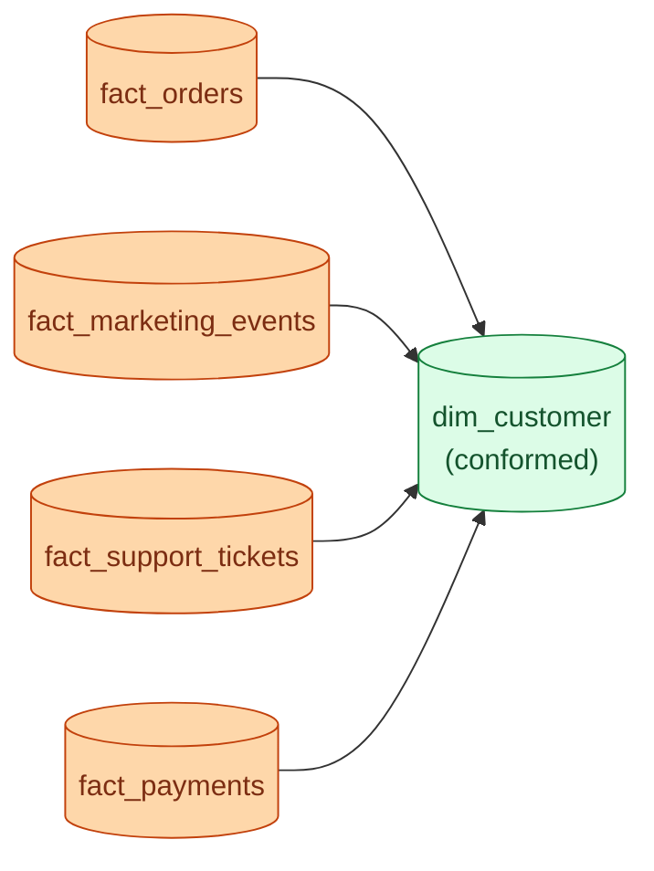
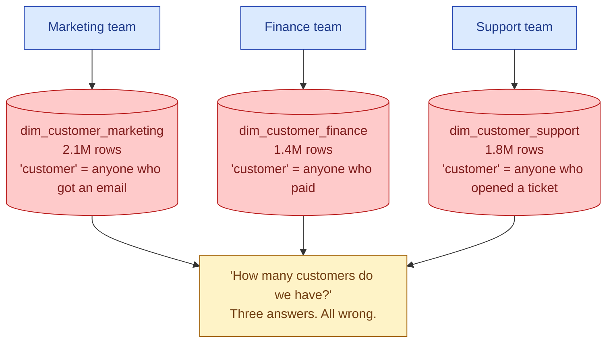
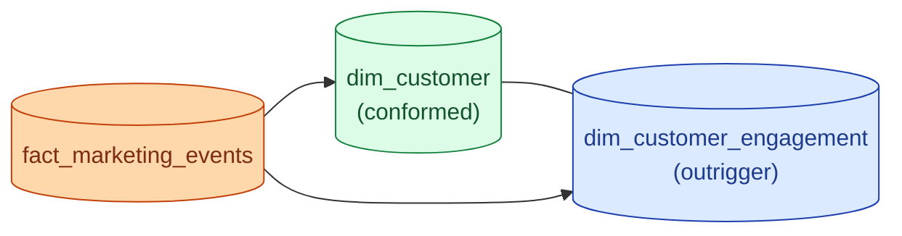

If the marketing team and the finance team both have their own "customer" dimension, every report they produce will quietly disagree. A conformed dimension is the shared, governed version that every fact table joins to. One row per customer. One spelling of the name. One agreed definition of what a customer is.

## The shape



Every fact that needs to talk about a customer joins to the same `dim_customer`. Customer count by region matches whether you ask the orders mart, the marketing mart, or the support mart. That is what "conformed" means.

## The failure mode

Without conformed dims, you get this:



Each team's `dim_customer` is defensible on its own. None of them are wrong inside their domain. They are incompatible with each other, and the C-suite report that combines them is nonsense.

The fix is not to argue about which definition is right. The fix is to build one conformed dim with the union of identities, and let each fact's measures define who counts as a "customer" for that fact.

## What "conformed" actually requires

Three things, none of them technical.

1. **One owner.** One person (or one team) is accountable for the dim. They reject PRs that change the grain or the column semantics. Without an owner, the dim drifts and stops being conformed.
2. **One update cadence.** Every consumer knows when the dim is refreshed. If marketing rebuilds it nightly and finance rebuilds it weekly, the two will be out of sync within a day.
3. **One schema, with versioning.** Column additions are backward-compatible. Column renames or removals go through a deprecation window. Breaking changes get a new dim version, not a silent overwrite.

The technical implementation is the easy part. Governance is the hard part.

## The bus matrix

Kimball's bus matrix is the planning artefact for conformed dimensions. Fact tables on rows, dimensions on columns. A check mark means "this fact uses this dim."

| Fact \ Dim | Customer | Product | Date | Store | Employee |
|---|---|---|---|---|---|
| fact_orders | yes | yes | yes | yes |  |
| fact_shipments | yes | yes | yes | yes |  |
| fact_payments | yes |  | yes |  |  |
| fact_support_tickets | yes |  | yes |  | yes |
| fact_marketing_events | yes | yes | yes |  |  |
| fact_employee_actions |  |  | yes |  | yes |

The matrix is what tells you which dims need to be conformed (the ones with check marks in more than one row) and which are local. `dim_employee` is only used by two facts; small risk. `dim_customer` is used by every fact; biggest risk if it drifts.

I draw this on a whiteboard at the start of every new warehouse. It is the cheapest way to see where the modeling pain will land.

## Worked example: migrating from siloed to conformed

The starting state: three teams, three dim_customer tables.

```sql
-- marketing
CREATE TABLE marketing.dim_customer (
    customer_id  text,
    email        text,
    first_event  timestamp,
    consent      boolean
);

-- finance
CREATE TABLE finance.dim_customer (
    cust_no       text,            -- different column name
    legal_name    text,
    billing_addr  text
);
```

Step one is build the conformed dim. It needs the union of the natural keys (mapped) and the union of attributes that any consumer needs.

```sql
CREATE TABLE conformed.dim_customer (
    customer_sk       bigint primary key,
    customer_id       text not null,         -- canonical natural key
    name              text,
    email             text,
    legal_name        text,
    billing_address   text,
    marketing_consent boolean,
    first_seen        timestamp,
    -- ...
);
```

Step two is map every existing source's customer key to the canonical `customer_id`. This is where the work lives. Email is the obvious mapping; sometimes you also need a manual MDM layer.

Step three is migrate each fact one at a time to point at `conformed.dim_customer` via surrogate key. Existing siloed dims keep running until every consumer has moved. Then drop them.

Cutting all consumers over at once never works. Migrate incrementally.

## The outrigger

Sometimes a fact needs a slightly different view of the same dim. Marketing wants `dim_customer` enriched with engagement scores; finance wants it enriched with credit scores.



The outrigger is a satellite dim joined off the main dim. It holds attributes specific to one consumer area without polluting the conformed dim that everyone else uses. The conformed dim stays small and stable; the outrigger handles the per-team enrichment.

## The "almost conformed" trap

The most dangerous failure mode is not two completely different dims. It is two dims that are 95% the same and 5% different in ways nobody documented.

Both dims have `customer_id`, `name`, `region`. But `region` in marketing's dim is the customer's signup region (never changes). `region` in finance's dim is the current billing region (changes when they move). A join between facts from both teams now shows the same column meaning two different things.

How to spot it: cross-team uniqueness tests. If both dims have `customer_id`, build a daily check that compares the columns. The first time `region` disagrees for the same customer is the moment you discover the dims are not conformed.

## Common mistakes

- **Two teams each building their own `dim_customer`.** The single most common cause of "the numbers do not match" tickets. Build it once, share it.
- **Conformed dim with no owner.** Drifts within a quarter. Assign a person.
- **Conformed dim with no tests.** Uniqueness, not-null, and referential integrity tests are the contract that keeps it conformed.
- **Different refresh cadences across consumers.** Marketing sees yesterday's dim, finance sees last week's. Pick one cadence.
- **Mixing local and conformed dims with the same name.** `dim_customer` in two schemas, where one is conformed and one is team-local, is a maintenance trap. Name the local ones explicitly: `dim_customer_marketing_local`.
- **Pushing per-team attributes into the conformed dim.** It bloats and starts to look team-specific. Use an outrigger instead.
- **Skipping the bus matrix.** You will discover dimension overlap by fixing broken reports. Draw the matrix once and skip half the pain.

## Quick recap

- Conformed dim = one shared dim that every fact joins to. The unit of trust in a multi-team warehouse.
- The failure mode is each team building its own and reports disagreeing.
- The bus matrix (facts on rows, dims on columns) tells you which dims need conformance.
- Conformance is governance: one owner, one cadence, one schema with versioning.
- Outriggers handle per-team enrichment without polluting the shared dim.
- "Almost conformed" (same name, slightly different semantics) is the silent killer. Cross-team tests catch it.

This concept sits in **Stage 2 (Data modeling and warehousing)** of the [Data Engineering Roadmap](/practice/data-engineering/roadmap/).
