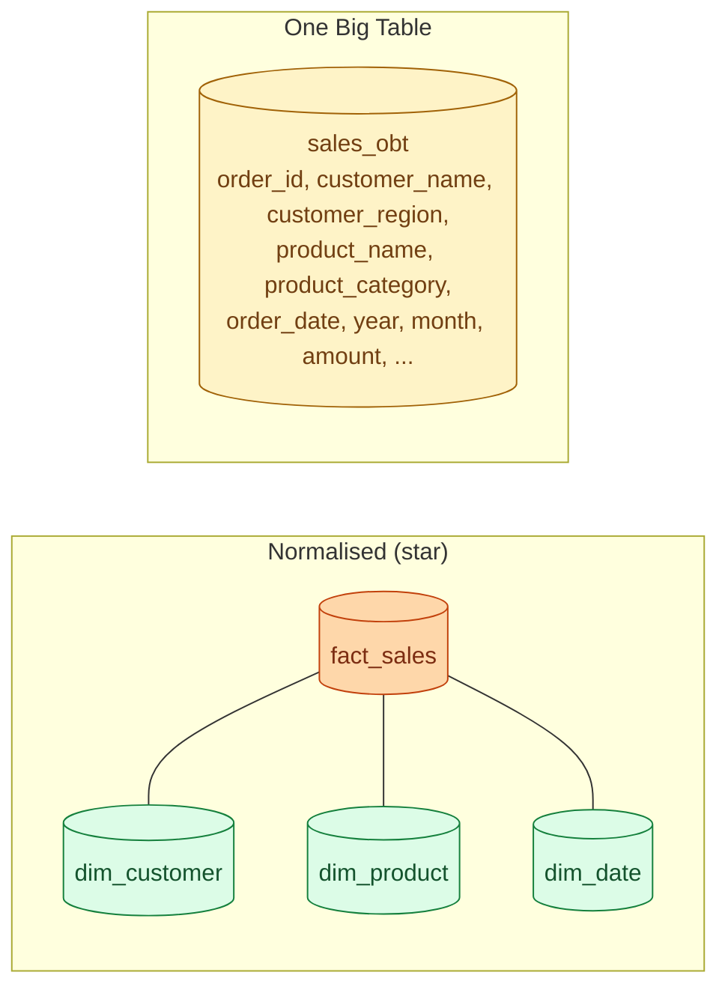
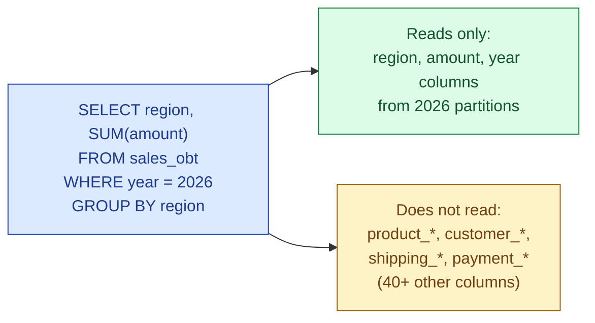
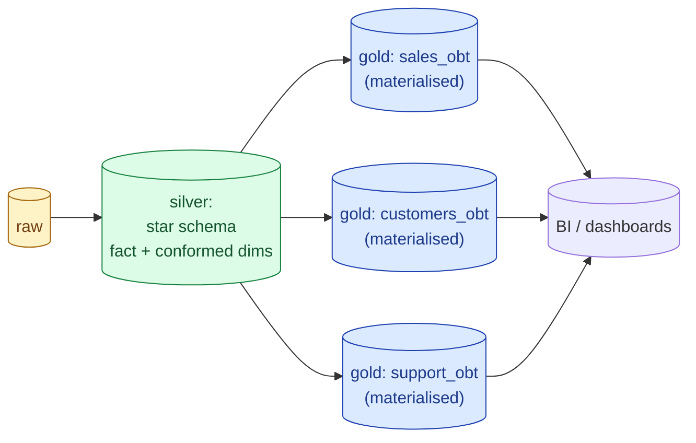

A star schema joins a fact table to several dim tables at query time. One Big Table (OBT) flattens all of that into a single wide table, with dim columns repeated on every fact row. Columnar warehouses make OBT cheap, BI tools love it, and small teams ship dashboards faster on it. The trade-off is that change becomes more expensive once multiple consumers depend on the same wide table.

## The two shapes



The OBT version has every attribute the dashboard needs already joined in. A "sales by region by month by category" query reads four columns and never touches a join.

## Why this works now and did not used to

Two things changed.

**Columnar storage.** Repeating `region = 'Sweden'` on a million rows in a row-store cost a million times the bytes. In a column store, run-length encoding collapses that to a few bytes per distinct value. The "denormalisation costs storage" argument is mostly dead for analytical workloads.

**Predicate and column pruning.** When you `SELECT amount FROM sales_obt WHERE year = 2026`, the engine reads only the `amount` and `year` columns from only the partitions where `year = 2026`. The other 50 columns in the OBT are not read. You pay for what you query.



On Parquet, Iceberg, Delta, BigQuery, Snowflake, the same idea holds. The query's cost is roughly proportional to the columns and partitions it touches, not the table's total width.

## Worked example

The star:

```sql
SELECT
    c.region,
    p.category,
    d.year,
    d.month,
    SUM(f.amount) AS revenue
FROM fact_sales f
JOIN dim_customer c ON f.customer_sk = c.customer_sk
JOIN dim_product  p ON f.product_sk  = p.product_sk
JOIN dim_date     d ON f.date_sk     = d.date_sk
WHERE d.year = 2026
GROUP BY c.region, p.category, d.year, d.month;
```

The OBT:

```sql
SELECT
    customer_region,
    product_category,
    year,
    month,
    SUM(amount) AS revenue
FROM sales_obt
WHERE year = 2026
GROUP BY customer_region, product_category, year, month;
```

Same answer. One table. No joins. BI tools, especially the drag-and-drop ones, are dramatically easier to wire up against the OBT.

## When OBT wins

- **Small team, single BI tool.** Nobody is building five different marts off the same fact. The OBT is the mart.
- **Dashboards and exports.** Workloads that read a few columns of a wide table benefit most from columnar pruning.
- **Looker / Mode / Tableau as the consumer.** These tools work better against flat models. Joins in the BI layer are slow and confusing.
- **ML feature tables.** A flat row per training example is what a model trainer wants. Building it from a star every time is friction.
- **Reverse ETL targets.** Pushing data to Salesforce or HubSpot wants a flat customer-level row, not a star.

## When OBT costs you

- **Many consumers.** Five teams reading the same OBT means every column change is a coordinated migration.
- **Dim reuse across facts.** If `dim_customer` is referenced from `fact_orders`, `fact_payments`, `fact_support`, flattening it three times into three OBTs duplicates the customer-attribute logic three times. When the definition of `customer_segment` changes, all three OBTs rebuild.
- **Type 2 history on dims.** OBTs typically copy the current dim value at fact-time. Bolting Type 2 on top of an OBT works but the joins get awkward; you might as well have stayed with a star.
- **Large dims that change often.** Every change forces a rewrite of every OBT row referencing that dim. The cost of denormalisation is the rebuild, not the storage.
- **Storage cost (rarely).** On petabyte-scale tables the extra width does add up. On most teams' workloads it does not matter.

## The modern hybrid

The pattern most production warehouses converge on: model in a star at the silver layer, expose OBTs at the gold layer as views or materialised tables.



The star handles modeling discipline: one place to define a customer, one place to manage Type 2 history, one place for conformed dims. The OBTs handle consumption: one wide table per BI use case, rebuilt from the star.

The gold OBT is the cache of the star for consumers who do not want to join. When the dim changes, you rebuild the OBT. The source of truth stays in the star.

## A small worked dbt sketch


```sql
-- silver/dim_customer.sql (star)
SELECT customer_sk, customer_id, name, region, segment
FROM   {{ ref('stg_customer') }};

-- silver/fact_sales.sql (star)
SELECT order_sk, customer_sk, product_sk, date_sk, amount
FROM   {{ ref('stg_orders') }};

-- gold/sales_obt.sql (denormalised)
SELECT
    f.order_sk,
    f.order_id,
    c.name AS customer_name,
    c.region AS customer_region,
    c.segment AS customer_segment,
    p.name AS product_name,
    p.category AS product_category,
    d.full_date AS order_date,
    d.year,
    d.month,
    f.amount
FROM   {{ ref('fact_sales') }} f
JOIN   {{ ref('dim_customer') }} c ON f.customer_sk = c.customer_sk
JOIN   {{ ref('dim_product') }}  p ON f.product_sk  = p.product_sk
JOIN   {{ ref('dim_date') }}     d ON f.date_sk     = d.date_sk;
```


The OBT is one model, rebuilt on the same cadence as its inputs. If you decide later to add `customer_lifetime_value`, you add it to `dim_customer` once and the OBT picks it up on the next rebuild.

## Common mistakes

- **Going straight to OBT with no star underneath.** Works on day one. By month six, every change in customer logic requires editing five OBTs.
- **Treating OBT as "denormalised so I can be lazy."** OBT is a conscious choice for a consumption pattern, not an excuse to skip modeling.
- **OBT with Type 2 history copied poorly.** If you need history, model it in the star and flatten point-in-time snapshots into the OBT.
- **Forgetting to partition the OBT.** A wide flat table with no partitioning kills the column-pruning advantage. Always partition on the dominant filter (usually date).
- **Joining two OBTs together.** If two OBTs share a customer, the redundant customer columns will not agree as soon as either rebuilds. Join the underlying star, do not join two OBTs.
- **Putting business logic in the OBT only.** The transformation lives in the gold model. The next consumer who needs the same metric copy-pastes it. Push shared logic down to the star.
- **Underestimating OBT rebuild time.** Full rebuilds of a 1 TB OBT are not instant. Incremental models matter.

## Quick recap

- OBT = a single wide table with dim attributes denormalised onto fact rows. Star = fact + dims joined at query time.
- Columnar storage and column pruning make OBT cheap on modern warehouses.
- OBT wins for small teams, single-tool BI, dashboards, ML feature tables, reverse ETL.
- OBT costs you when many consumers depend on it, when dims are reused across many facts, or when Type 2 history is required.
- The common production pattern: model the star at silver, materialise OBTs at gold per consumption use case.
- An OBT is a cache of the star, not a replacement for it.

This concept sits in **Stage 2 (Data modeling and warehousing)** of the [Data Engineering Roadmap](/practice/data-engineering/roadmap/).
