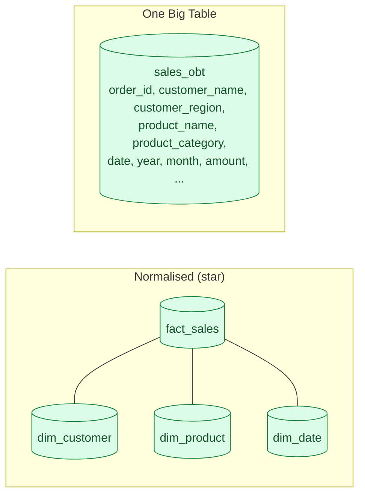

A normalised star schema joins a fact table to several dimension tables at query time. One Big Table (OBT) flattens all of that into a single wide table, with denormalised dimension columns repeated on every fact row. Columnar warehouses make this cheap, and BI tools love it.

**What this page will cover.**

- Why columnar storage flips the cost of denormalisation (you only read the columns you query).
- The dbt + Looker / Mode workflow that defaults to OBT.
- When OBT wins: dashboards, exports, BI tools, anything column-oriented.
- When normalisation still wins: large dimensions that change often, source-of-truth tables.
- The middle ground: a star at the bronze/silver layer, OBT at the gold layer.
- The cost: storage and rebuild time grow with every column.

*Page coming soon.*

This concept sits in **Stage 2 (Data modeling and warehousing)** of the [Data Engineering Roadmap](/practice/data-engineering/roadmap/).
