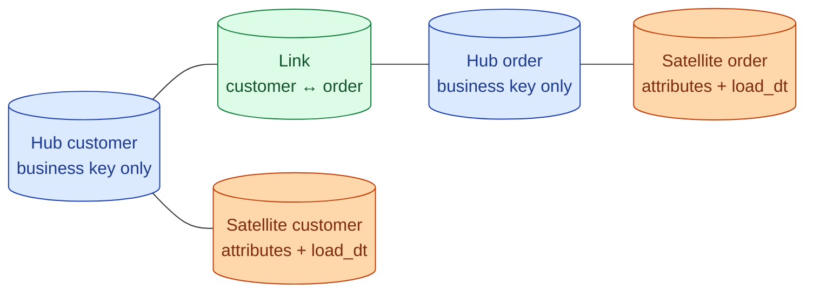

Data Vault is a modeling approach that separates business keys, relationships, and changing attributes into three table types. It is built for warehouses that ingest from many source systems, need full audit trails, and expect the schema to keep changing. The cost is more tables and more joins. The win is a model that absorbs change instead of breaking under it.

**What this page will cover.**

- The three table types: hubs, links, satellites — what each holds.
- Why every satellite is append-only and includes a `load_dt`.
- How Data Vault handles multiple source systems for the same entity.
- When Data Vault makes sense: regulated industries, M&A-heavy companies, source systems that change often.
- The "Raw Vault" and "Business Vault" layers.
- Why most teams don't need Data Vault and a star schema fits better.

*Page coming soon.*

This concept sits in **Stage 2 (Data modeling and warehousing)** of the [Data Engineering Roadmap](/practice/data-engineering/roadmap/).
