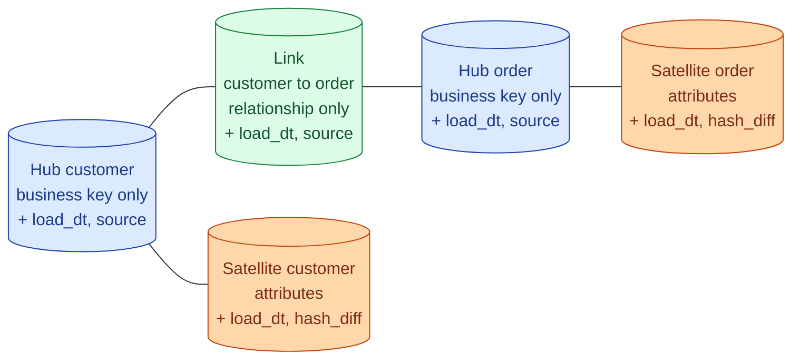
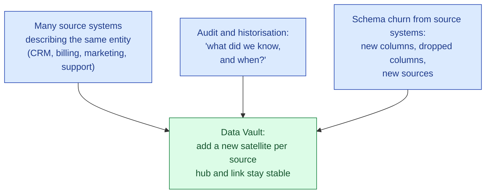
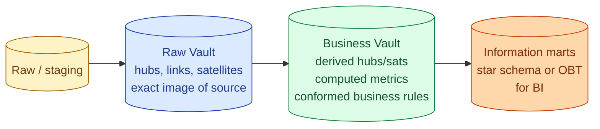

Data Vault is a modeling approach that separates business keys, relationships, and changing attributes into three table types: hubs, links, and satellites. It is built for warehouses that ingest from many source systems, need full audit trails, and expect the schema to keep changing. The cost is many more tables and many more joins. The win is a model that absorbs change instead of breaking under it. Most teams do not need it. The ones who do are usually clear about why.

## The three table types



**Hub.** Holds the business key of an entity (customer, order, product) and nothing else. One row per unique business key, ever. Append-only.

**Link.** Holds a relationship between two or more hubs (a customer placed an order, an order contains a product). One row per unique relationship instance. Append-only.

**Satellite.** Holds the descriptive attributes of a hub or link. Multiple rows per parent, one per change. Append-only.

Everything is append-only. The vault never updates a row in place. Change is modelled as new rows with a later `load_dt`.

## Worked example

A minimal vault for customers and orders, including a name change on the customer.

```sql
-- Hub: one row per unique customer business key
CREATE TABLE hub_customer (
    customer_hk   bytea primary key,       -- hash of business key
    customer_id   text not null,           -- business key
    load_dt       timestamp not null,
    record_source text not null
);

-- Hub: one row per unique order business key
CREATE TABLE hub_order (
    order_hk      bytea primary key,
    order_id      text not null,
    load_dt       timestamp not null,
    record_source text not null
);

-- Link: one row per unique (customer, order) relationship
CREATE TABLE link_customer_order (
    link_hk       bytea primary key,       -- hash of (customer_hk, order_hk)
    customer_hk   bytea references hub_customer,
    order_hk      bytea references hub_order,
    load_dt       timestamp not null,
    record_source text not null
);

-- Satellite: customer attributes over time
CREATE TABLE sat_customer (
    customer_hk   bytea references hub_customer,
    load_dt       timestamp not null,
    hash_diff     bytea not null,          -- hash of all attribute columns
    name          text,
    email         text,
    city          text,
    record_source text not null,
    primary key (customer_hk, load_dt)
);
```

When the customer's city changes from Berlin to Stockholm, the load process computes the `hash_diff` of the new attribute set, compares it to the latest satellite row, and inserts a new satellite row if anything changed. The hub and link tables stay untouched. Nothing is ever updated.

```text
sat_customer
customer_hk | load_dt             | name | city      | hash_diff
0xab12...   | 2024-01-01 00:00:00 | Anna | Berlin    | 0x4f...
0xab12...   | 2026-03-15 00:00:00 | Anna | Stockholm | 0x9e...
```

To get "current Anna," take the row with the latest `load_dt` for that `customer_hk`. To get "Anna at the time of the order," join on the order's load timestamp.

## The hash key pattern

Every hub, link, and satellite primary key is a hash of the business key (and, for links, the parent hash keys). The point is parallel ingestion: two loader processes from two source systems can compute the same hash for the same customer independently, without coordinating.

```sql
hub_customer.customer_hk = md5(upper(trim(customer_id)));
link_customer_order.link_hk = md5(customer_hk || '|' || order_hk);
```

This is what makes Data Vault load in parallel. There is no sequence to serialise on, no surrogate to look up before inserting. Every loader does its own hashing and the keys line up.

## Why Data Vault exists

Three problems Data Vault solves better than a star schema.



A satellite is per-source. CRM has its own `sat_customer_crm`, billing has its own `sat_customer_billing`. Both hang off the same `hub_customer`. Adding a new source means adding a new satellite, not changing existing tables. The audit trail is built in because nothing is ever updated.

Insurance, banking, healthcare, and regulated finance gravitate to Data Vault for exactly these reasons.

## The typical layered architecture



The Raw Vault is the auditable source-of-truth layer. It maps to source systems 1:1, with no business rules applied. The Business Vault layers calculations and conformance on top: a derived `sat_customer_segment` that combines CRM signals and billing data, for example.

Consumers never query the vault directly. The marts on top are stars or OBTs and look like a normal warehouse to the BI tools. The vault sits underneath as the historicised source of truth.

## Why most teams should not use Data Vault

Honestly: operational complexity.

- A star schema for orders is 1 fact and 4 dims: 5 tables. The vault equivalent is 4 hubs, 3 links, 6 satellites: 13 tables. Query "show me last week's orders by customer region" is a 6-table join in the vault, 2-table in the star.
- Every consumer query needs a current-view layer on top of the vault. That layer is more code to maintain.
- The benefits (parallel load, audit, multi-source absorption) only matter at a certain scale. A 5-person team with one source system is paying all of the cost and getting almost none of the benefit.
- The tooling assumes you are committed. `dbtvault`, `Automate DV`, Coalesce. Picking up the patterns ad-hoc usually produces a vault that is shaped right but missing the discipline that makes it work.

The honest test: do you have more than three source systems for the same entity, do you have regulatory or audit pressure, do you expect the source schemas to keep changing? If yes to at least two, look at Data Vault. If no, stay with a star.

## When Data Vault genuinely fits

- **M&A-heavy companies** absorbing source systems from acquired entities.
- **Regulated industries** (banking, insurance, healthcare) where the audit trail is non-negotiable.
- **Enterprise warehouses** with dozens of source systems describing overlapping entities.
- **Long-lived warehouses** (10+ years) where source systems have already changed twice and will again.
- **Teams that have already lost a migration** to schema churn and want a model that bends instead.

The pattern can absolutely be the right answer. It just is not the default.

## Common mistakes

- **Adopting Data Vault for a small team with one source.** Every cost, none of the benefit. Use a star.
- **Querying the vault directly from BI.** The vault is the source-of-truth layer, not the consumption layer. Build marts.
- **Updating satellites in place.** Defeats the entire point. Satellites are append-only; change is a new row with a later `load_dt`.
- **Forgetting the `hash_diff`.** Without it, every load inserts a new satellite row even when nothing changed. Storage and complexity explode.
- **Mixing business rules into the Raw Vault.** The Raw Vault is the audit layer; if it has rules baked in, you have lost auditability. Put rules in the Business Vault.
- **One satellite per attribute.** Pathological. Group attributes by rate of change or by source.
- **Adopting Data Vault without committing to the tooling.** Hand-rolling hubs and links almost never produces the discipline the methodology requires. Use `dbtvault` or similar.

## Quick recap

- Data Vault splits each entity into a hub (business key), links (relationships), and satellites (attributes), all append-only.
- Hash keys make parallel loading possible across sources without coordination.
- The standard architecture: Raw Vault (source-of-truth), Business Vault (derived), marts on top (star or OBT) for consumption.
- The model absorbs new sources and schema changes without rewrites. That is the win.
- The cost is 2-3x more tables and queries that join more. Most teams do not need it.
- Use it when you have many sources, regulatory audit pressure, or a warehouse that needs to live 10+ years.

This concept sits in **Stage 2 (Data modeling and warehousing)** of the [Data Engineering Roadmap](/practice/data-engineering/roadmap/).
