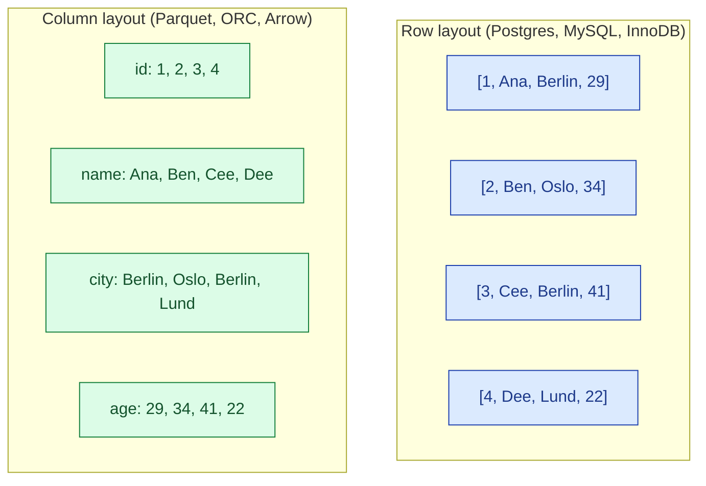
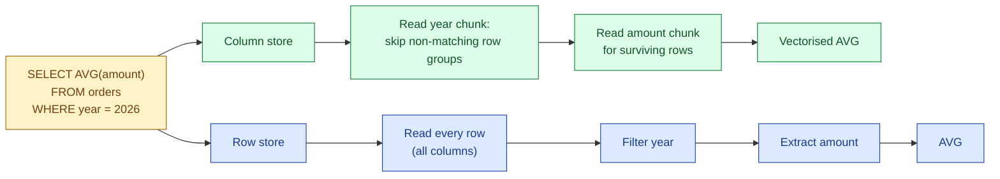
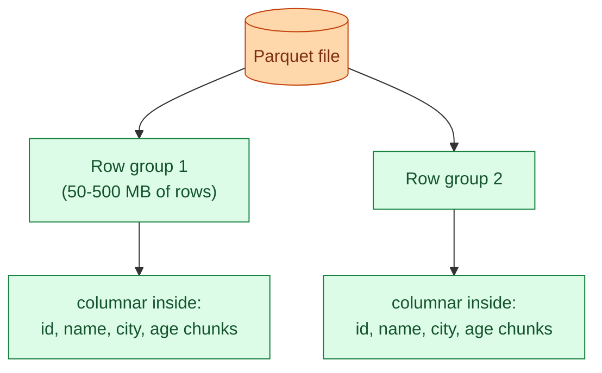

A row store keeps every column of one row together on disk. A column store keeps every value of one column together. The two layouts read the same logical table, but they read very different bytes. Almost every analytical question reads a few columns from many rows, which is why column stores dominate analytics and row stores dominate OLTP.

## The two layouts on disk

Same four-row table, two layouts.

In the row layout, reading `WHERE id = 3` is a single page read that returns every column. In the column layout, the same lookup reads four separate column chunks and stitches them back together. Symmetrically, `SELECT AVG(age) FROM t` in the row layout reads every row to get one column, while the column layout reads only the `age` chunk.

## Why column wins for analytics

Three reasons stack up.

**Projection pushdown.** A query that touches 2 columns out of 50 reads roughly 4% of the data from disk in a column store. The same query in a row store reads 100% (every row contains every column). On a 1 TB table that is 40 GB vs 1 TB on the wire.

**Compression.** Values in the same column share a type and often a distribution. Repeated strings, sorted integers, narrow ranges all compress well. Snappy on a column of country codes shrinks 10x or more. Snappy on a row of mixed types shrinks 2x. Column stores routinely report 5-10x on-disk reduction over row stores for the same data.

**Vectorised execution.** Modern CPUs operate fastest when they apply the same operation to a long contiguous array. A column chunk is exactly that shape. `SUM(amount)` over a million-row column becomes a tight loop the CPU can SIMD. The same sum in a row store has to skip past every other field, killing the pipeline.

## Why row wins for OLTP

The same properties flip when the workload is "one row in, one row out."

Inserting a row in a column store has to touch every column file, one tiny write per column. Inserting a row in a row store is one append to one page. For a system doing 10,000 single-row inserts per second, the row layout is the only sane choice.

Updates and deletes are worse in column stores. Modifying one row touches every column chunk and forces a rewrite (or a delete vector). Row stores update one tuple in place. This is why operational databases (Postgres, MySQL, Oracle) are row stores, and why column stores prefer batch writes.

Reading one row by primary key is also faster in a row store: one page, one I/O, every column present. The column store has to do `N` reads (one per column) and reassemble.

## The cache-line argument

A modern CPU loads 64 bytes per cache line. When code reads a long integer column sequentially, every cache line is full of useful data. When code reads one column out of a wide row, most of the 64 bytes are columns it does not care about. The column layout uses the cache line; the row layout wastes most of it.

This effect compounds at every level: L1 cache, L2 cache, L3 cache, main memory, disk. The same query that reads 4% of the bytes from disk also reads 4% of the bytes from RAM, also fills 4% of the L3 cache. Columnar wins on bandwidth at every level of the memory hierarchy.

## Hybrid layouts: PAX and row groups

Pure columnar has one cost: reassembling a full row across many column files is expensive. Pure row layout has the opposite cost: reading one column means touching every row. Most modern formats split the difference with row groups.

A Parquet row group is a horizontal slice of the table (50-500 MB worth of rows). Within a row group, data is laid out column by column. A reader that wants two columns of a row group reads only those two column chunks. A reader that wants all columns of a small range reads one row group end to end. This is the PAX layout (Partition Attributes Across), and it is what makes Parquet, ORC, and most modern column stores practical.

## Predicate pushdown

Each row group in Parquet/ORC stores min/max statistics per column. When a query filters `WHERE year = 2026`, the engine reads the footer, looks at the `year` min/max for each row group, and skips any row group whose range cannot match. On a date-sorted table, a query for one week reads roughly 1/52 of the row groups and ignores the rest.

This is the killer feature of columnar formats with row groups: not "read less per row" but "skip whole regions of the file without opening them." Combine it with partitioning at the directory level and the engine often reads less than 1% of the table on a normal filter.

## Where each layout lives in 2026

| Workload | Layout | Examples |
|---|---|---|
| Operational, one-row-at-a-time | Row | Postgres, MySQL, Oracle, SQL Server, DynamoDB |
| Analytical, scan-heavy | Column | Parquet, ORC, Arrow, BigQuery, Snowflake, ClickHouse, Redshift |
| Mixed (HTAP) | Hybrid | TiDB (TiFlash), SingleStore, Postgres with Citus columnar |
| Streaming payloads | Row | Avro, Protobuf, JSON |

The split is so durable that "is this a row store or a column store?" is the first question to ask about any new database you meet. The answer predicts almost every other trade-off it will make.

## Common mistakes

- **Picking a column store for write-heavy OLTP.** Column stores expect batch writes. A column store taking 10,000 single-row inserts per second will fall over or amplify writes 50x. Use a row store for the transactional path and stream to columnar for analytics.
- **Picking a row store for warehouse-scale analytics.** A 10 TB row-store table answering "sum amount by month" scans the full 10 TB. The same query on Parquet scans the amount and month columns only.
- **Reading "row vs column" as a database brand difference.** Postgres is row, but extensions like Citus columnar add column storage to the same engine. The layout is per table, not per database.
- **Ignoring row group size.** A Parquet file with 10,000 tiny row groups defeats the layout's advantages. Aim for 128 MB to 1 GB per row group depending on the engine.
- **Believing column stores are always smaller on disk.** They usually are, but a wide table where every row is unique compresses about the same in either layout. The gain comes from repeated values within a column.
- **Treating row vs column as a 2026 decision.** The split was settled by the early 2010s. The decision now is which columnar format and which table format on top of it.

## Quick recap

- Row layout keeps a row's columns together; column layout keeps a column's values together.
- Column wins for analytics through projection pushdown, compression, and vectorised execution.
- Row wins for OLTP because one row goes in or out in one I/O.
- Modern columnar formats use row groups (PAX layout) to balance both extremes.
- Min/max stats per row group let queries skip whole regions of the file without opening them.
- Pick the layout per workload, not per company. The two coexist in every mature data platform.

This concept sits in **Stage 5 (Storage and file formats)** of the [Data Engineering Roadmap](/practice/data-engineering/roadmap/).
