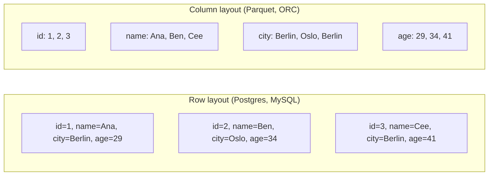

A row-oriented store keeps all columns of one row next to each other on disk. Reading a single row is one I/O. A column-oriented store keeps all values of one column next to each other. Reading a single column across millions of rows is one I/O. Almost every analytics question reads few columns from many rows, which is why columnar formats dominate data warehousing.

**What this page will cover.**

- Why "select 2 columns from 10 million rows" reads ~20% of the data in a column store vs 100% in a row store.
- Compression: same-type values next to each other compress 5-10x better.
- The cost: writing one row touches many physical files. Row stores beat column stores on transactional writes.
- Hybrid storage: PAX, row groups in Parquet.
- Predicate pushdown: reading only the row groups that could contain a matching row.
- Why every OLAP system you reach for in 2026 is columnar under the hood.

*Page coming soon.*

This concept sits in **Stage 5 (Storage and file formats)** of the [Data Engineering Roadmap](/practice/data-engineering/roadmap/).
