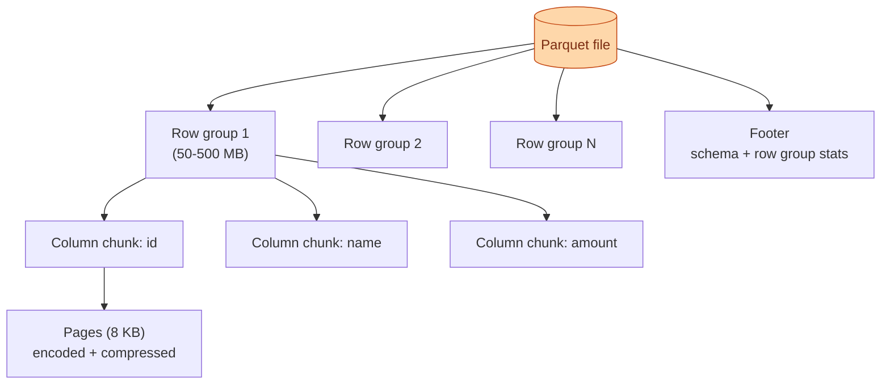

Parquet is the default analytics file format in 2026. Spark reads it. DuckDB reads it. Snowflake imports from it. BigQuery exports to it. Every lakehouse table format (Delta, Iceberg, Hudi) wraps Parquet files. Knowing what is inside a Parquet file explains 90% of why one query is fast and another is slow.

**What this page will cover.**

- Row groups, column chunks, pages — what each level holds.
- The footer: schema, min/max per column per row group, where the predicate pushdown lives.
- Encoding: dictionary, RLE, bit-packing. Why "low-cardinality string" is the cheapest column you can store.
- Compression on top of encoding: Snappy by default, Zstd when storage matters.
- Why row group size of 128-512 MB hits the sweet spot for most engines.
- Reading a single column without touching the rest. The killer feature.

*Page coming soon. Until then, see [#012 Parquet vs CSV vs JSON](/practice/data-engineering/012-parquet-vs-csv-vs-json/) for the practice problem.*

This concept sits in **Stage 5 (Storage and file formats)** of the [Data Engineering Roadmap](/practice/data-engineering/roadmap/).
