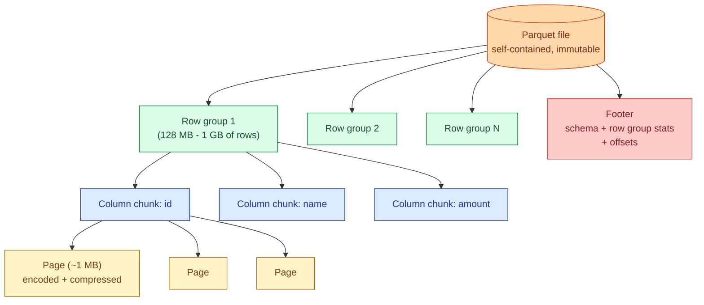
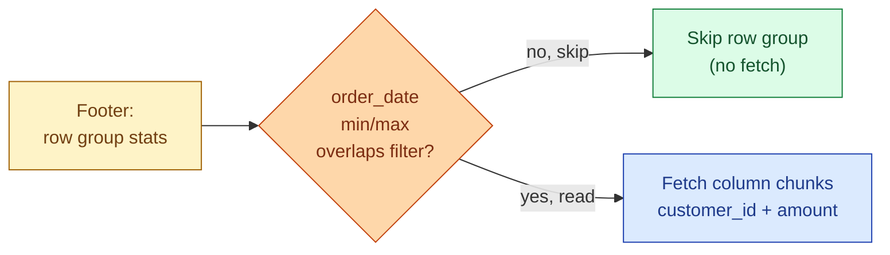

Parquet is the default analytics file format in 2026. Spark reads it. DuckDB reads it. Polars reads it. Snowflake imports from it. BigQuery exports to it. Every lakehouse table format (Delta, Iceberg, Hudi) is Parquet plus metadata. Knowing what is inside a Parquet file explains most of why one query is fast and another is slow.

## The four-level layout

A Parquet file is a tree, four levels deep.



- A **file** is one self-contained Parquet object on disk or S3. The footer at the end lists everything inside.
- A **row group** is a horizontal slice of the table. Pick a row group size that matches your engine: 128 MB to 1 GB is the standard range.
- A **column chunk** is one column's data within one row group. This is the unit the reader fetches when it wants column `amount` from row group 7.
- A **page** is the smallest read unit inside a column chunk. Each page is independently encoded and compressed, so a reader can decode one page at a time without touching the rest.

## The footer is the index

The footer sits at the end of the file and is read first. It carries:

- The full schema (column names, types, nesting).
- For each row group, the byte offset and length of each column chunk.
- For each column chunk, statistics: min, max, null count, distinct count.
- Optional bloom filters for high-cardinality columns.
- Encoding and compression metadata.

A query engine reads the footer (a few KB), then issues range reads on S3 for exactly the column chunks it needs. The rest of the file is never touched. This is why Parquet on S3 is fast even when the file is 5 GB: the reader downloads megabytes, not gigabytes.

## Predicate pushdown using row group stats

The min/max stats per column per row group power Parquet's killer feature: skipping row groups without opening them.

```sql
SELECT customer_id, amount
FROM orders
WHERE order_date BETWEEN '2026-06-01' AND '2026-06-07';
```

The reader walks the footer. For each row group it checks the `order_date` min and max. Any row group whose range falls outside the filter is skipped entirely. On a date-sorted file with 100 row groups, this query might touch 2 of them. The other 98 column chunks are never fetched.



For pushdown to work, the data must be sorted or at least clustered on the filter column. A randomly shuffled file has overlapping min/max in every row group, and pushdown skips nothing. Sorting before write is the cheapest performance win Parquet gives you.

## Encoding: dictionary and run-length

Inside a page, values are not stored raw. Parquet picks an encoding per page.

**Dictionary encoding.** Each distinct value is assigned a small integer ID, the dictionary maps ID to value, and the page stores IDs. A column of country codes with 200 distinct values becomes a stream of 1-byte indices. This is the cheapest column you can store: low-cardinality strings shrink ~50x before compression.

**Run-length encoding (RLE).** Consecutive repeated values are stored as `(value, count)`. A sorted column of order statuses (`pending, pending, pending, shipped, shipped, ...`) becomes a tiny header. RLE pairs well with dictionary: RLE the dictionary indices, not the original strings.

**Bit-packing.** A column of dictionary IDs with 16 distinct values needs 4 bits per row, not a full byte. Bit-packing crams them together. Combined with RLE this gives Parquet's "RLE/bit-pack hybrid" encoding, the default for almost every column.

**Plain.** Falls back to raw values when nothing else fits (high-cardinality floats, random text).

The reader handles all of this transparently. You write Parquet, the writer picks per-column encodings, the reader decodes them. The practical lesson: low-cardinality columns are nearly free; high-cardinality random columns cost full size.

## Compression on top of encoding

After encoding, each page is compressed. Snappy is the historical default (fast decompress, ~2-3x ratio). Zstd is the 2026 default (slightly slower, ~3-4x ratio, much better for cold data). Gzip exists for legacy reasons and is rarely the best answer.

Compression happens per page, not per file, so the reader can decompress only the pages it actually needs. See [#021 Compression](/practice/data-engineering/concepts/021-compression/) for the codec trade-offs.

## Picking a row group size

Row group size is the single most impactful Parquet knob.

| Row group size | Effect |
|---|---|
| **Too small (< 32 MB)** | Footer is bloated; many tiny S3 reads; pushdown wastes its budget. |
| **128-512 MB (sweet spot)** | Good for Spark, Trino, DuckDB. Pushdown stays effective. Page count manageable. |
| **1 GB+** | Better for S3 throughput on big-scan workloads; some engines fall over above this. |
| **Way too big (entire file = one row group)** | Pushdown becomes useless; the reader has to decode everything. |

The default in most writers (Spark, pandas, polars, Arrow) is 128 MB or 256 MB. Leave it alone unless you have a measured reason to change it.

## A concrete file walk

A 2 GB orders Parquet file with 8 row groups, sorted by `order_date`.

```text
orders.parquet (2.0 GB)
├── Row group 0: order_date 2026-01-01..2026-01-15  (260 MB)
│   ├── id chunk         (40 MB, dict+RLE+snappy)
│   ├── customer_id chunk(45 MB, dict+RLE+snappy)
│   ├── amount chunk     (55 MB, plain+snappy)
│   └── order_date chunk (12 MB, dict+RLE+snappy)
├── Row group 1: 2026-01-15..2026-01-30
├── ...
└── Footer: schema, 8 row groups × 4 chunks of (min,max,null_count)
```

Query: `SELECT SUM(amount) FROM orders WHERE order_date >= '2026-06-01'`.

The reader reads the footer (a few KB), sees that only row groups 5-7 overlap the date range, then fetches the `amount` and `order_date` column chunks of those 3 row groups only. Total bytes pulled from S3: maybe 200 MB out of 2 GB. The rest of the file is never opened.

## Common mistakes

- **Writing tiny Parquet files.** A 1-MB Parquet file pays full footer overhead per file. Aim for at least 128 MB per file. See [#023 The small files problem](/practice/data-engineering/concepts/023-small-files-problem/).
- **Not sorting before write.** Unsorted files have overlapping min/max in every row group, so pushdown skips nothing. Sort or cluster on the columns you filter on.
- **Picking row group size by guess.** Defaults are good. Only change row group size if you have measured a bottleneck.
- **Choosing Gzip in 2026.** Zstd beats Gzip on both ratio and speed for almost every workload. Pick Snappy for hot reads, Zstd for cold storage.
- **Forgetting that schema lives per file.** Each Parquet file carries its own schema. A directory of files written by different code versions is a schema-evolution problem. See [#022 Schema evolution](/practice/data-engineering/concepts/022-schema-evolution/).
- **Reading Parquet through a row-store interface.** If your engine has to materialise full rows before processing, you lose the columnar advantage. Use a vectorised reader (Arrow, DuckDB, Spark).
- **Treating Parquet as a database.** It is an immutable file format. Updates, deletes, and transactions require a table format on top (Delta, Iceberg, Hudi).

## Quick recap

- Parquet structure is file → row groups → column chunks → pages. The footer indexes everything.
- The footer's min/max per row group powers predicate pushdown, which is the format's killer feature.
- Encoding (dictionary, RLE, bit-pack) makes low-cardinality columns nearly free; compression sits on top.
- Row group size of 128 MB to 1 GB is the sweet spot for almost every engine.
- Sorting on the filter column before write is the cheapest performance gain Parquet offers.
- Parquet is immutable. For mutability, wrap it in Delta, Iceberg, or Hudi.

This concept sits in **Stage 5 (Storage and file formats)** of the [Data Engineering Roadmap](/practice/data-engineering/roadmap/).
