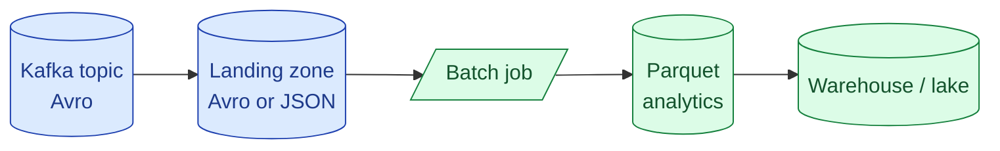

Parquet and ORC are columnar formats for analytics reads. Avro is row-oriented and built for streaming and message bus payloads. All three are binary, all three carry their own schema, and all three are still everywhere. Picking the right one per job is a five-minute decision that saves teams from a year of avoidable pain.

| Format | Layout | Best at | Compression | Where it lives |
|---|---|---|---|---|
| **Parquet** | Columnar | Analytics, lakehouse tables | Snappy / Zstd | S3, GCS, every warehouse |
| **ORC** | Columnar | Hive, large-scale Hadoop | Zlib / Snappy | HDFS, mostly legacy |
| **Avro** | Row-oriented | Kafka payloads, write-heavy logs | Snappy / Deflate | Kafka topics, schema registry |

**What this page will cover.**

- The columnar vs row layout decision in one sentence.
- Why Avro dominates streaming pipelines and Parquet dominates the analytical end.
- ORC's schema evolution rules and why Parquet is catching up.
- Bloom filters in ORC and Parquet (and when they matter).
- Schema-on-write (these three) vs schema-on-read (JSON, CSV).
- The honest take: in 2026, default to Avro on the bus, Parquet at rest, ORC only if you already have it.

*Page coming soon.*

This concept sits in **Stage 5 (Storage and file formats)** of the [Data Engineering Roadmap](/practice/data-engineering/roadmap/).
