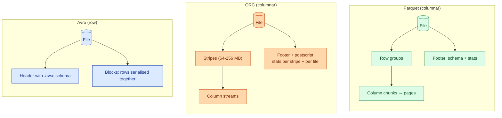
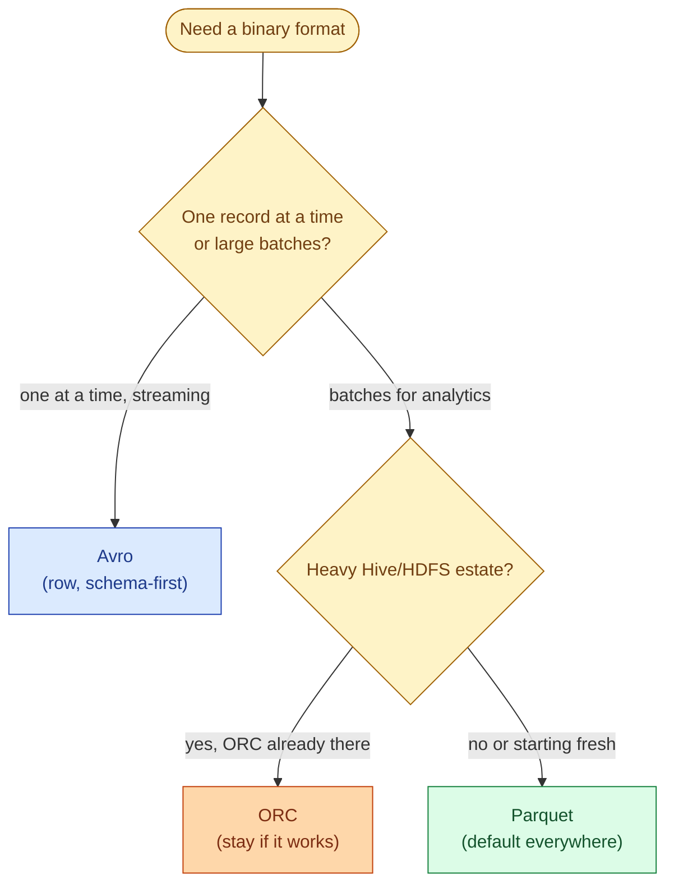
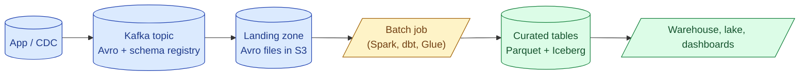

Parquet and ORC are columnar formats built for analytics reads. Avro is row-oriented and built for streaming and message-bus payloads. All three are binary, all three carry their own schema, and all three are still in production somewhere. Picking the right one per job is a five-minute decision that saves teams a year of avoidable rewrites.

## The shape of each format

Parquet and ORC are siblings: both columnar, both group rows into chunks (row groups vs stripes), both carry per-chunk min/max stats for pushdown, both compress per column. Avro is the odd one out: row by row, schema in the header, optimised for writing one record at a time.

## Side by side

| Property | Parquet | ORC | Avro |
|---|---|---|---|
| Layout | Columnar | Columnar | Row |
| Origin | Twitter + Cloudera, 2013 | Hortonworks for Hive, 2013 | Doug Cutting, Hadoop, 2009 |
| Schema carried in file | Yes | Yes | Yes (`.avsc`) |
| Predicate pushdown | Row group min/max + bloom filters | Stripe min/max + bloom filters | None (row format) |
| Compression | Snappy, Zstd, Gzip, LZ4 | Zlib, Snappy, Zstd | Snappy, Deflate |
| Schema evolution | Add/drop columns; rename is brittle | Add columns; ORC ACID had rename | First-class via schema registry |
| Splittable for parallel read | Yes (row group boundaries) | Yes (stripe boundaries) | Yes (sync markers between blocks) |
| Best at | Analytics on object storage | Hive analytics on HDFS | Streaming records, Kafka |
| Where it lives in 2026 | Everywhere | Legacy Hive estates | Kafka topics, change data capture |

## When to pick which

**Parquet.** The 2026 default. Spark, DuckDB, Polars, Snowflake import, BigQuery import, every lakehouse (Delta, Iceberg, Hudi) wraps Parquet. If you do not have a specific reason to pick something else, pick Parquet.

**ORC.** Was the analytics format for Hive on HDFS. Slightly better compression than Parquet on average, slightly faster on Hive's vectorised reader, and was the only format with native ACID before Iceberg and Delta caught up. In 2026, the install base is shrinking. Keep ORC if you already have petabytes of it. Do not start new pipelines on it.

**Avro.** The streaming format. Kafka payloads, CDC events, debezium output, any pipeline where one row is produced per event. Avro's schema-first design pairs with a schema registry: producers and consumers agree on a schema ID, the registry holds the full `.avsc`, and forward/backward compatibility is checked at registration time. This is the only format here designed for "one record, one write."

## A concrete pipeline

A common shape: data lands as Avro on the streaming side, gets curated to Parquet at rest.

This pattern uses each format for what it is good at: Avro at the wire (small, row-shaped, schema-checked), Parquet at rest (columnar, compressed, pushdown-friendly). Mixing them is the norm, not the exception.

## Schema-on-write vs schema-on-read

All three formats are **schema-on-write**: the schema is written into the file or registry and any reader must conform to it. This is the opposite of CSV and JSON, where the schema is inferred at read time and every reader picks their own interpretation.

Schema-on-write catches problems at the write side. A producer that adds an incompatible field fails at the registry, not at the dashboard three weeks later. CSV and JSON pipelines defer that pain to whoever runs the query.

## Bloom filters

Parquet and ORC both support optional bloom filters per column chunk or stripe. A bloom filter is a small probabilistic structure that answers "is this value possibly here?" with no false negatives. For high-cardinality columns like `user_id`, min/max stats are useless (every row group covers nearly the full range), but a bloom filter still says "no" for most lookups.

Bloom filters cost a few KB per chunk and pay off on point lookups (`WHERE user_id = 'abc123'`). They do nothing for range scans. Turn them on for columns you point-look up by; leave them off for everything else.

## Avro's schema registry contract

Avro's killer feature in 2026 is not the file format itself but the schema registry workflow.

- A producer wants to publish a new event version.
- The producer registers the new `.avsc` schema with the registry.
- The registry checks compatibility against the previous schema (backward, forward, or full).
- If compatible, a new schema ID is issued; the producer embeds the ID, not the full schema, in each event.
- Consumers fetch the schema by ID once and cache it.

This shifts compatibility checks left, before bad events hit the bus. Parquet has no equivalent because nobody writes one Parquet row at a time. The trade-off: Avro is row-based and slow to scan; you would not run analytics directly on Avro files.

## Common mistakes

- **Picking Avro for analytics tables.** Row format on a query engine means every column is read for every row. Reserve Avro for the streaming half.
- **Picking Parquet for Kafka payloads.** Parquet expects batches and a footer at the end. A single Parquet record per message is absurd.
- **Starting a new project on ORC.** The ecosystem has consolidated on Parquet. New tooling (DuckDB, Polars, Arrow, modern Spark connectors) is Parquet-first.
- **Skipping the schema registry on Avro.** The format's value lives in the registry's compatibility checks. Avro files in S3 with no registry are worse than Parquet for the same job.
- **Mixing formats inside one table.** A table that is half ORC and half Parquet works on paper but breaks pushdown, partitioning, and most engines' optimisations. Pick one per table.
- **Believing format compression ratios in benchmarks.** ORC reports better numbers than Parquet on TPC-DS, but real data with real cardinality often makes the gap disappear. Test on your data.
- **Ignoring bloom filters when you do point lookups.** A few KB per chunk turns a full row group scan into a fast skip on user IDs and order IDs.

## Quick recap

- Three formats: Parquet (columnar, default), ORC (columnar, Hive-heritage), Avro (row, streaming).
- Pick Parquet for analytics at rest. Pick Avro for messages on the wire. Pick ORC only if you already run it.
- All three are schema-on-write, which catches incompatibilities before they reach readers.
- Predicate pushdown lives in row group / stripe min/max plus optional bloom filters.
- The 2026 default architecture is Avro at the bus, Parquet (often wrapped by Iceberg or Delta) at rest.
- The decision is rarely "which is best" and almost always "which fits this stage of the pipeline."

This concept sits in **Stage 5 (Storage and file formats)** of the [Data Engineering Roadmap](/practice/data-engineering/roadmap/).
