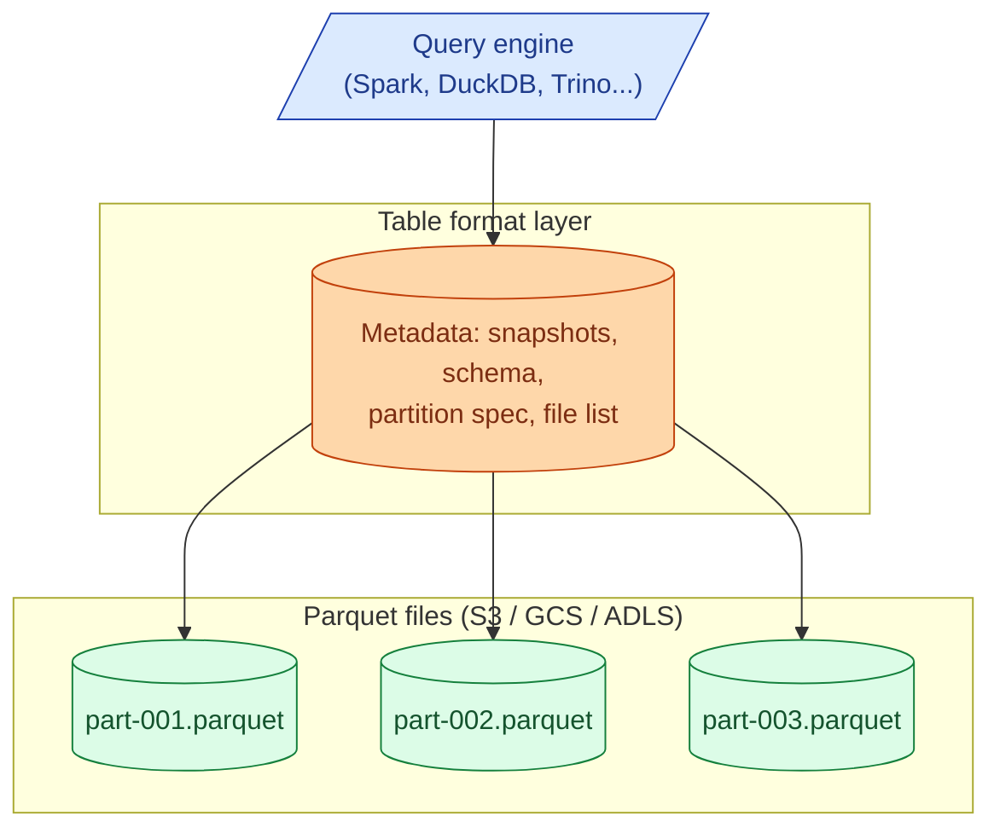

Raw Parquet on S3 is fast to read but cannot do updates, deletes, transactions, or time travel. A table format adds a layer of metadata on top of Parquet so you can. Delta Lake (Databricks), Apache Iceberg (Netflix, now everywhere), and Apache Hudi (Uber) all solve the same problem. They picked different trade-offs.

**What this page will cover.**

- ACID on top of object storage: how each one does it without a database.
- Time travel: query a table as of a previous version or timestamp.
- Schema evolution: add, drop, rename columns without rewriting files.
- Partition evolution: change the partition column without breaking history.
- Delta vs Iceberg vs Hudi: who is best at what (Delta = Databricks, Iceberg = open ecosystem, Hudi = write-heavy / CDC).
- The 2026 honest take: pick Iceberg unless you are on Databricks.

*Page coming soon. Until then, see [#013 Data lake vs warehouse vs lakehouse](/practice/data-engineering/013-data-lake-vs-warehouse-vs-lakehouse/) for the practice problem.*

This concept sits in **Stage 5 (Storage and file formats)** of the [Data Engineering Roadmap](/practice/data-engineering/roadmap/).
