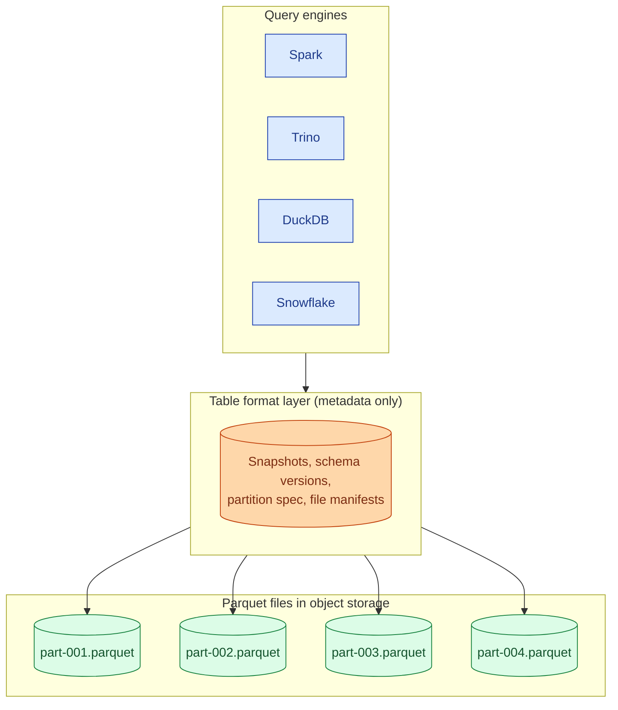
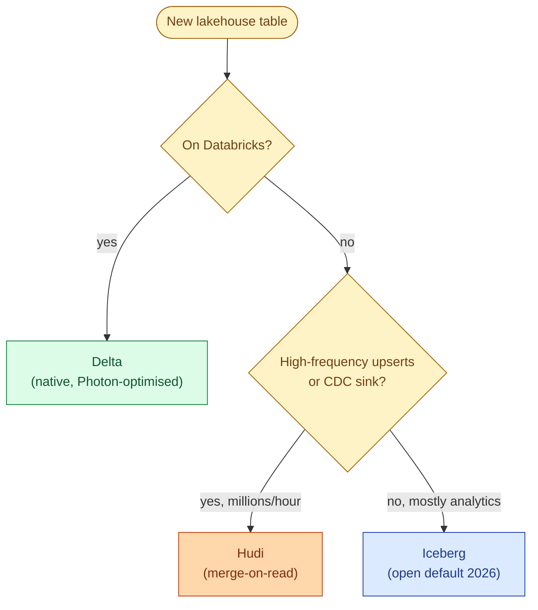

Raw Parquet on S3 is fast to read but cannot do updates, deletes, transactions, or time travel. A table format adds a metadata layer on top of the Parquet files so a directory in object storage behaves like a table. Delta Lake (Databricks), Apache Iceberg (Netflix, now everywhere), and Apache Hudi (Uber) all solve the same problem and picked different trade-offs. In 2026 the open ecosystem has consolidated around Iceberg, but Delta still owns Databricks and Hudi still wins for high-frequency CDC.

## What an open table format actually is



The metadata layer tracks which files belong to which version of the table, the current schema, the partition spec, and per-file statistics. A reader queries the metadata first, gets back a list of file paths to read, then issues object-store reads for those Parquet files. A writer atomically swaps the metadata pointer to a new snapshot. That swap is the transaction.

All three formats do this. The differences live in the details of how the metadata is structured and what operations it makes cheap.

## Origins shape the trade-offs

| Format | Origin | Optimised for | Format spec controlled by |
|---|---|---|---|
| **Delta Lake** | Databricks, 2017 | Spark and Photon on Databricks | Linux Foundation (Databricks-led) |
| **Iceberg** | Netflix, 2018 | Multi-engine, multi-cloud, large tables | Apache (vendor-neutral) |
| **Hudi** | Uber, 2017 | High-frequency upserts, CDC, near-real-time | Apache (Uber-heavy contributions) |

Each format reflects the workload it was born for. Delta is best when Databricks Spark is the only engine. Iceberg is best when you want Spark and Trino and Snowflake and DuckDB to all read the same table. Hudi is best when you stream millions of upserts an hour and need merge-on-read to keep up.

## Feature matrix

| Feature | Delta | Iceberg | Hudi |
|---|---|---|---|
| ACID transactions | Yes (log-based) | Yes (snapshot-based) | Yes (timeline-based) |
| Time travel | Yes, by version or timestamp | Yes, by snapshot ID or timestamp | Yes, by commit time |
| Schema evolution | Add, drop, rename (Delta 2+) | Add, drop, rename, reorder (column IDs) | Add, drop, type widening |
| Partition evolution | Limited | Yes (change spec without rewriting) | Limited |
| Hidden partitioning | No | Yes (transform: `bucket`, `truncate`, `day`) | No |
| Merge on read | No (copy-on-write only) | Optional (v2 spec) | Yes (default for streaming) |
| Engine ecosystem | Databricks-first, OSS readers | Truly multi-engine | Spark-heavy |
| Catalog | Unity, Hive, file-based | REST catalog, Glue, Nessie, Polaris | Hive, Glue, DataHub |

## The 2026 standardisation

Iceberg has become the default for new lakehouse projects outside Databricks. Snowflake, BigQuery, Trino, Starburst, ClickHouse, DuckDB, and AWS (S3 Tables, Glue) all ship Iceberg reading and most ship Iceberg writing. The REST catalog spec means catalogs are interoperable across vendors. The format spec is controlled by Apache, not one vendor.

Databricks acquired Tabular (the Iceberg-led company) in 2024 and committed to bidirectional Iceberg/Delta compatibility through Delta UniForm. The practical result in 2026: Delta tables on Databricks can be read as Iceberg, and external Iceberg tables can be read by Databricks. The "pick one" decision is less painful than it was in 2023.

Hudi sits in a narrower niche. It is still the strongest format for high-frequency upserts and CDC, but for analytical lakes it has lost mindshare to Iceberg.

## When each one is the right call



## Time travel in practice

All three support time travel. The syntax varies; the idea is the same: each commit produces a new snapshot, old snapshots stay valid until vacuumed.

```sql
-- Delta
SELECT * FROM orders VERSION AS OF 142;
SELECT * FROM orders TIMESTAMP AS OF '2026-06-01 09:00:00';

-- Iceberg
SELECT * FROM orders FOR VERSION AS OF 7283649103;
SELECT * FROM orders FOR TIMESTAMP AS OF '2026-06-01 09:00:00';

-- Hudi
SELECT * FROM orders
WHERE _hoodie_commit_time <= '20260601090000';
```

Time travel is cheap (it is just reading an older manifest) but storage retention is not. Every retained snapshot keeps its Parquet files alive. Default retention is 7 days for Delta, 5 days for Iceberg, configurable for Hudi. Set retention to what your compliance requires and run vacuum, or your storage bill will grow forever.

## Hidden partitioning (Iceberg's killer feature)

Classic Hive-style partitioning leaks into the schema: if you partition by `dt = date_trunc('day', ts)`, every query that wants the date partition has to filter on `dt`, not `ts`. Junior engineers filter on `ts`, the engine reads every partition, the query is slow.

Iceberg's hidden partitioning lets you partition on a transform of a column without exposing it in the schema:

```sql
CREATE TABLE orders (id BIGINT, ts TIMESTAMP, amount DOUBLE)
PARTITIONED BY (days(ts));
```

A query filtering on `ts >= '2026-06-01'` automatically prunes partitions. The user did not have to know the partition column exists. Delta and Hudi do not do this; you partition on the column directly and the user must filter on it.

## Schema evolution

Delta and Iceberg both support adding, dropping, and renaming columns. The difference is **how** they handle renames.

Parquet matches columns by name. Rename `country` to `country_code` and every old Parquet file's `country` column becomes invisible to a reader expecting `country_code`. Iceberg solves this with stable per-column IDs in the metadata: the metadata says "column ID 7 was once called `country` and is now called `country_code`," and the reader uses ID 7 to find it in old files. Delta added similar column mapping in Delta 2.0+.

Hudi handles add and drop but lags on rename. If you rename columns often, prefer Iceberg.

See [#022 Schema evolution](/practice/data-engineering/concepts/022-schema-evolution/) for the full playbook.

## ACID, briefly

Each format implements transactions through a single atomic operation on object storage:

- **Delta** writes a JSON log entry to `_delta_log/`. The next commit number atomically claims the file. Whoever lands the next sequential JSON wins; losers retry.
- **Iceberg** writes a new metadata JSON and swaps the catalog pointer atomically. The catalog (Glue, REST, Nessie) is the source of truth.
- **Hudi** writes a timeline file under `.hoodie/`. Concurrency control is handled by the timeline plus optional optimistic locking.

The common thread: the actual data files are immutable Parquet; only the metadata pointer moves.

## Common mistakes

- **Picking a table format for a small table.** Below a few GB and a few writers per day, raw Parquet with manual overwrites is simpler. Add a table format when you need ACID, time travel, or many concurrent writers.
- **Running Delta outside Databricks and expecting parity.** Open-source delta-rs and OSS Spark Delta work but lag the Databricks-managed version on features and performance. If your home is not Databricks, Iceberg is the safer bet.
- **Picking Hudi for analytics-only tables.** Hudi's complexity pays off for high-frequency upserts. If your workload is "write batch, read often, rarely update," Iceberg or Delta is simpler.
- **Skipping vacuum/expire snapshots.** Time travel keeps old files alive. Without retention policy and vacuum, storage cost grows linearly forever.
- **Treating these formats as interchangeable.** They can be migrated between, but it is a project. Pick deliberately and stick with it for at least a year.
- **Writing tiny commits in a stream.** Each commit produces a metadata file. A streaming sink that commits every second produces thousands of metadata files an hour. Batch commits to once a minute or use a format with built-in micro-batching.
- **Ignoring catalog choice.** The catalog (Glue, Unity, Nessie, Polaris, REST) is half the answer. The same Iceberg table behaves very differently under Glue vs Nessie. Pick the catalog with the same care as the format.

## Quick recap

- A table format is metadata on top of Parquet files. It adds ACID, time travel, and schema evolution.
- Delta = Databricks-native; Iceberg = open default in 2026; Hudi = high-frequency upserts and CDC.
- Iceberg's hidden partitioning and column-ID-based schema evolution are the strongest open features.
- Delta UniForm makes Delta and Iceberg interoperable enough that the "pick one" call is less binding than before.
- Time travel is cheap to enable, expensive to retain. Set retention and run vacuum.
- Catalog choice matters as much as format choice.

This concept sits in **Stage 5 (Storage and file formats)** of the [Data Engineering Roadmap](/practice/data-engineering/roadmap/).
