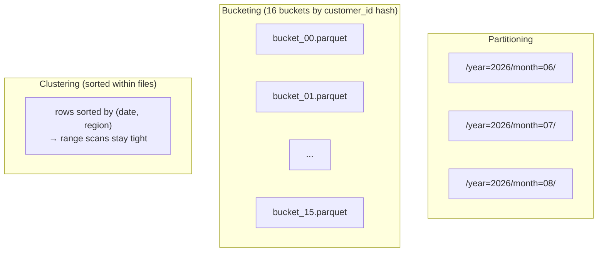

A query that filters by date is fast when the data is partitioned by date — the engine can skip every other folder. Bucketing groups rows into a fixed number of files by a hash. Clustering (Z-ordering, sort-keys) physically sorts rows so range scans stay tight. All three move the same lever: read fewer bytes per query.

**What this page will cover.**

- When to partition (and when over-partitioning makes things worse).
- The "10x rule": each partition should hold roughly 1 GB+ of data.
- Bucketing in Hive/Spark vs Snowflake's automatic clustering.
- Z-ordering in Delta and Iceberg's sort-order spec.
- BigQuery's clustering (free, automatic, up to 4 columns).
- The decision tree: partition by the column you filter on, cluster by what you join on.

*Page coming soon. Until then, see [#006 Partitioning vs clustering in BigQuery](/practice/data-engineering/006-partitioning-vs-clustering-in-bigquery/) for the practice problem.*

This concept sits in **Stage 5 (Storage and file formats)** of the [Data Engineering Roadmap](/practice/data-engineering/roadmap/).
