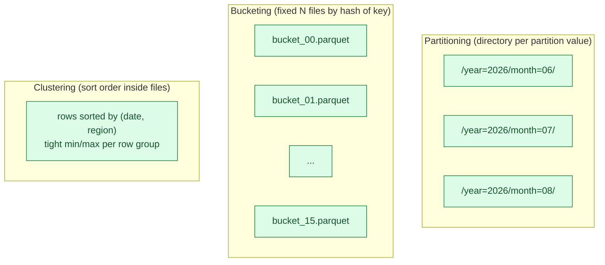
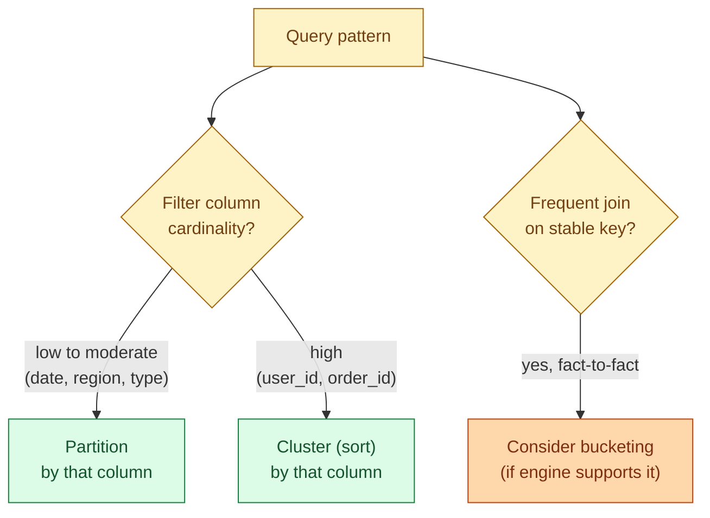

A query is fast when the engine can skip the data that does not matter. Partitioning, bucketing, and clustering are three different ways to organise files so the engine can skip. They look similar from a distance, solve overlapping problems, and trip people up because the right one depends on the query shape, not the table shape.

## The three at a glance



- **Partitioning** splits the table into separate directories or subtables, one per distinct value of the partition column. The engine prunes whole directories before opening any file.
- **Bucketing** writes a fixed number of files per partition, each file holding rows whose key hashes to that bucket. Two tables bucketed the same way can join without shuffling.
- **Clustering** sorts the rows inside files on one or more columns. Per-row-group min/max stats become tight, so predicate pushdown skips most row groups for a range filter.

The three are stacked, not exclusive. A well-designed table is often partitioned by date, clustered by user ID inside each partition, and (in some engines) bucketed by tenant for joins.

## Partitioning

A partitioned table lays out files into directories named after the partition column:

```text
orders/
  year=2026/month=05/part-001.parquet
  year=2026/month=06/part-001.parquet
  year=2026/month=07/part-001.parquet
```

A query for `WHERE year = 2026 AND month = 06` reads only the `year=2026/month=06/` directory. The engine never opens the other partitions; they could be petabytes and it would not matter.

**When partitioning helps.**

- The filter column is one you almost always filter on.
- The cardinality is moderate (a few hundred to a few hundred thousand partitions).
- Each partition holds a meaningful amount of data, ideally 1 GB+.

**When it hurts.** Partition on `user_id` with 10 million users and you create 10 million directories, each with a single 1 KB file. Listing the directory takes longer than scanning the data. This is the most common partitioning mistake and the most expensive to undo.

The rule of thumb: **never partition on a high-cardinality column**. Day-level date is fine. Country is fine. User ID is not. Order ID is not.

## Bucketing

Bucketing writes a fixed number of files, distributing rows by `hash(key) mod N`:

```sql
CREATE TABLE orders (...)
PARTITIONED BY (dt DATE)
CLUSTERED BY (customer_id) INTO 16 BUCKETS;  -- Hive/Spark syntax
```

Two tables bucketed on the same column with the same bucket count can be joined without a shuffle: bucket 7 of one table only joins with bucket 7 of the other. For massive fact-to-fact joins on a stable key, this is a real win.

Bucketing also caps file count. Per partition, you get exactly 16 files no matter how much data lands. No more "I tried to write 10 GB into one partition and got 5,000 files."

The catch: bucketing is rigid. The bucket count is fixed at table creation. Doubling the data does not double the bucket count, and rebucketing means rewriting the table. Many modern engines (Snowflake, BigQuery) drop bucketing in favour of automatic clustering.

## Clustering (sort order)

Clustering sorts rows on one or more columns inside the files. The engine still writes the same number of files, but the rows inside are ordered.

```sql
-- Delta / Iceberg
OPTIMIZE orders ZORDER BY (customer_id, region);

-- BigQuery
CREATE TABLE orders (...)
PARTITION BY DATE(ts)
CLUSTER BY customer_id, region;

-- Snowflake (automatic clustering on a key)
ALTER TABLE orders CLUSTER BY (customer_id, region);
```

A clustered table's per-row-group min/max stats become tight. A query for `customer_id = 'abc'` reads only the row groups whose `customer_id` range includes `abc`. On a 100 GB table that might be 200 MB of actual reads.

**Z-ordering** is the multi-column variant. Standard sort works for one column; the second column is essentially random within each first-column run. Z-order (a space-filling curve) keeps both columns roughly clustered. Delta and Iceberg implement Z-order; BigQuery and Snowflake do equivalent multi-column clustering automatically.

## When each one helps



A working decision tree:

1. **What do queries filter on most?** That column is a partition candidate if its cardinality is low.
2. **What do queries filter on next, especially with high cardinality?** Cluster on that column inside each partition.
3. **Are there big joins on a stable key?** Bucket on that key, if the engine and the join frequency justify it.

The mistake to avoid: trying to partition by everything. Many real-world tables only need partitioning on date and clustering on the highest-cardinality filter. That covers 80% of analytical workloads.

## Engine-specific notes

**Spark / Delta / Iceberg.** Explicit partition columns; `OPTIMIZE ZORDER BY` for clustering. Iceberg adds hidden partitioning, which lets you partition by a transform of a column without exposing it in the schema. See [#019 Delta vs Iceberg vs Hudi](/practice/data-engineering/concepts/019-delta-vs-iceberg-vs-hudi/).

**BigQuery.** One partition column (usually a date/timestamp), up to 4 cluster columns. Clustering is free and re-runs automatically as the table grows. This is the simplest model in the industry.

**Snowflake.** No explicit partitioning. Tables are micro-partitioned automatically (every commit produces ~16 MB micro-partitions). You define a clustering key; Snowflake reclusters in the background. Pay for the reclustering compute.

**Hive.** Partition + bucket is the original model. Most other systems are simplifications of this.

## A worked example

Logs table, 500 GB per month, 5 TB per year, queried by date and by user ID.

```sql
CREATE TABLE logs (
  ts TIMESTAMP,
  user_id STRING,
  event STRING,
  payload STRING
)
PARTITION BY DATE(ts)
CLUSTER BY user_id;
```

A query for one user over one week:

```sql
SELECT event, COUNT(*) FROM logs
WHERE DATE(ts) BETWEEN '2026-06-01' AND '2026-06-07'
  AND user_id = 'abc123'
GROUP BY event;
```

What the engine does: prune to 7 date partitions (~120 GB of the 5 TB), then within each partition use clustering stats to read only the row groups that contain `user_id = 'abc123'`. Final bytes scanned: ~200 MB. Without partitioning: 5 TB. Without clustering on user_id: 120 GB. Both together: 200 MB.

## Common mistakes

- **Partitioning on a high-cardinality column.** This is the number one partitioning mistake. You end up with millions of directories and tiny files. See [#023 The small files problem](/practice/data-engineering/concepts/023-small-files-problem/).
- **Partitioning on a column you do not filter on.** Partitions only help when queries actually prune. If nobody filters by `country`, partitioning by it just creates skew.
- **Over-partitioning by combining multiple columns.** `year/month/day/region/source` creates a tree with most leaves nearly empty. Pick one or two partition dimensions.
- **Bucketing on a low-cardinality column.** Bucketing on `country` with 200 distinct values into 16 buckets gives you skewed buckets and no join benefit.
- **Confusing clustering with partitioning.** Clustering does not create directories; it just sorts inside files. Engines still scan all files to find the matching row groups, just very efficiently.
- **Not re-clustering after big writes.** A table clustered on `user_id` with 10 daily appends becomes 10 partially-sorted files until you re-cluster. Run `OPTIMIZE` or the engine's equivalent.
- **Trying to optimise without measuring.** Look at the query plan's "bytes scanned" before and after the change. If it does not move, the optimisation did not help.

## Quick recap

- Partition by a low-cardinality column you filter on. Each partition should hold 1 GB+ of data.
- Cluster (sort) by a high-cardinality column you filter on. This makes row group stats tight.
- Bucket only when you have a frequent join on a stable key and the engine supports it.
- Never partition on user_id or any high-cardinality column. It kills you with small files.
- BigQuery's "partition by date, cluster by up to 4 columns" is the simplest model and the default to copy.
- Measure bytes scanned. If a change does not move that number, it did not help.

This concept sits in **Stage 5 (Storage and file formats)** of the [Data Engineering Roadmap](/practice/data-engineering/roadmap/).
