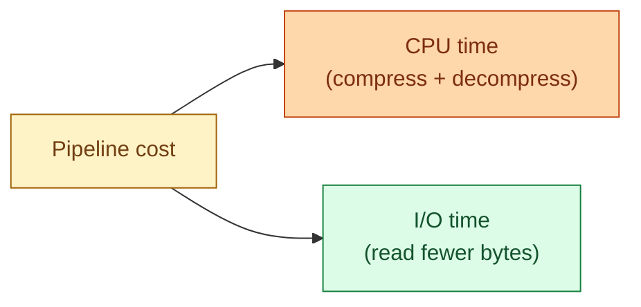

Every analytics file format compresses each column chunk. The codec choice trades CPU time for disk size and read time. Snappy decompresses fast and shrinks 2-3x. Zstd shrinks 3-4x at modern speeds. Gzip is the historical default and rarely the best answer in 2026.

| Codec | Speed | Ratio | Where it fits |
|---|---|---|---|
| **Snappy** | Very fast | 2-3x | Default for Parquet, "scan everything" workloads |
| **Zstd (lvl 3-9)** | Fast | 3-4x | The 2026 default for new pipelines |
| **Gzip** | Slow decompress | 3-4x | Legacy logs, archived data |
| **LZ4** | Fastest | 2x | Streaming, latency-sensitive paths |
| **Brotli** | Slow compress | 4x | One-time encode, many reads (CDN-style) |

**What this page will cover.**

- The trade: more CPU on write = less I/O on read, sometimes worth it 100x over.
- Why Zstd at level 3 beats Snappy in most modern pipelines.
- Block-level vs file-level compression: why Parquet picks block-level.
- Dictionary encoding before compression: the cheap win.
- The "compressed-on-disk + uncompressed-in-memory" rule.
- Quick test you can run in 5 minutes to pick the right codec for your data.

*Page coming soon.*

This concept sits in **Stage 5 (Storage and file formats)** of the [Data Engineering Roadmap](/practice/data-engineering/roadmap/).
