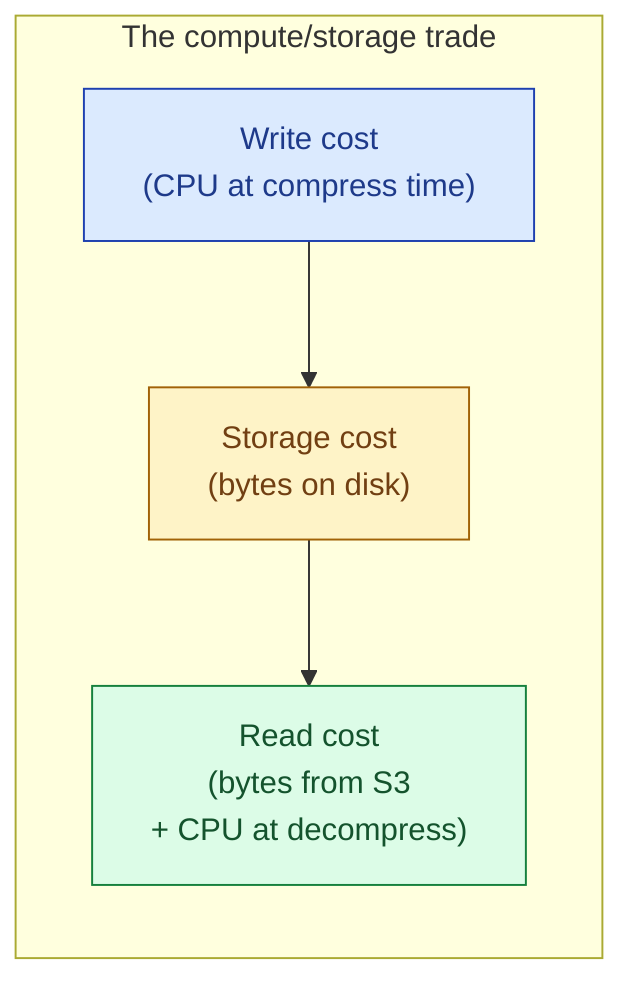
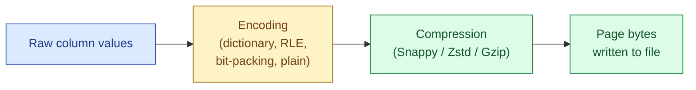

Every analytics file format compresses each column chunk before writing. The codec choice trades CPU time for disk size and read time. Snappy is the historical default, fast and modest. Zstd has become the new default in 2026: it compresses tighter than Snappy at competitive speed. Gzip is mostly legacy. LZ4 is for latency-sensitive streaming. Picking the right one cuts storage cost and shrinks query latency at the same time.

## The codec table

| Codec | Compress speed | Decompress speed | Ratio | Where it fits |
|---|---|---|---|---|
| **Snappy** | Very fast | Very fast | 2-3x | Parquet default, scan-everything workloads |
| **Zstd (lvl 3)** | Fast | Fast | 3-4x | The 2026 default for new pipelines |
| **Zstd (lvl 9-22)** | Slow | Fast | 4-6x | Cold archives, one-write many-read |
| **Gzip** | Slow | Slow | 3-4x | Legacy logs, archive compatibility |
| **LZ4** | Fastest | Fastest | ~2x | Streaming, latency-sensitive paths |
| **Brotli** | Slow | Medium | 4x+ | CDN-style: one encode, many reads |

The headline: Zstd dominates Snappy on ratio at modest CPU cost, and dominates Gzip on both speed and ratio. If you are still defaulting to Snappy or Gzip in 2026, switch to Zstd and measure.

## The trade visualised

Every codec sits somewhere on this trade. Snappy spends almost no CPU and accepts larger files. Zstd spends a little more CPU and saves real I/O. Gzip spends a lot of CPU on the read side, which is exactly the wrong end.

The math for analytics is usually:

- A file is written once, scanned many times.
- Decompression CPU is cheap and parallelisable.
- Object-store reads are the slow, expensive part.

That math favours tighter compression. A 30% smaller file means 30% less to fetch from S3 every time the table is queried. Over a year of scans, the one-time write CPU is a rounding error.

## The codec by codec walk

**Snappy.** Designed by Google for the "fast not small" end. Roughly 2-3x ratio on typical analytics data. Decompresses at near memory bandwidth. The Parquet default since 2013. Still a fine choice for hot tables that get scanned constantly and where storage cost is not the bottleneck.

**Zstd.** Facebook open-sourced it in 2016. Tunable levels from 1 (close to Snappy speed) to 22 (close to xz ratio). At level 3 it compresses about as fast as Snappy and shrinks 30-40% more. At level 9 it is slower to write but the read side is still fast. Zstd has become the new default in Parquet writers (Spark, polars, DuckDB), Iceberg, and modern warehouses.

**Gzip.** The classic. Deflate-based, slow on both sides. The only reason to keep it is compatibility with old systems that read it and nothing else. For new pipelines, pick Zstd instead and forget Gzip exists.

**LZ4.** Even faster than Snappy, but compresses less. Useful for streaming systems where latency matters more than bytes (Kafka, RocksDB blocks, in-memory cache eviction). Rare in Parquet because Snappy is fast enough and shrinks more.

**Brotli.** Heavy compress side, modest decompress side, very tight ratio. The shape that fits CDN-style "compress once, serve forever" but not the analytics workload.

## Where compression happens in Parquet

Parquet compresses **per page**, not per file or per row group. Each page is independently compressed and can be decoded without touching neighbours. This matters for two reasons:

- A reader that wants one column of one row group decompresses only the pages of that column chunk it needs.
- Different pages can use different encodings before compression (dictionary, RLE, plain).

The order of operations:

Encoding does most of the work. A low-cardinality string column dictionary-encoded becomes 1 byte per row. The compressor on top has very little left to do. This is why Parquet on real data often beats raw compression benchmarks: the encoding has already shrunk things 50x before the codec runs.

## Why Zstd is the 2026 default

Three reasons stacked.

**Better ratio at competitive speed.** On real Parquet data, Zstd level 3 typically shrinks 30-40% smaller than Snappy with decompress speeds within 20%. That is a free win on cold data.

**Smaller files mean cheaper S3 listing and faster network reads.** A 1 TB table compressed with Zstd instead of Snappy is around 700 GB. Every scan pulls less; every list operation covers more table per S3 prefix.

**Tunable to your workload.** Hot table that gets scanned 1000 times a day? Zstd level 3, balanced. Cold archive that gets read twice a year? Zstd level 19, get the smallest file. Same codec, different level, same reader.

The migration is usually a one-line config change in the writer. Snappy and Zstd Parquet files are both standard; engines read either. Old files do not need to be rewritten.

## A back-of-envelope worked example

A pipeline writes 100 GB of raw Parquet data per day. Storage on S3 is $0.023/GB-month. The data is scanned 100 times per month at $5 per TB scanned.

| Codec | On-disk size | Monthly storage cost | Monthly scan cost (100 scans) |
|---|---|---|---|
| **Snappy** | 100 GB | $2.30 | $50 |
| **Zstd (lvl 3)** | 70 GB | $1.61 | $35 |
| **Zstd (lvl 9)** | 60 GB | $1.38 | $30 |
| **Gzip** | 65 GB | $1.50 | $30, plus higher decompress CPU on each scan |

Across a year and a few hundred tables, the difference between Snappy and Zstd-3 is real money and noticeably faster queries. The write CPU cost is a one-time penalty measured in seconds.

## When Snappy still wins

Not every table should switch. Snappy is the right call when:

- The table is rewritten constantly (streaming append every minute) and write CPU dominates.
- The table is short-lived (intermediate stage, scratch table).
- The downstream reader cannot do Zstd (rare in 2026 but check old Spark, old Hive).

For everything else, especially long-lived analytical tables, Zstd wins.

## Common mistakes

- **Defaulting to Snappy because "Parquet uses Snappy."** That was true in 2014. In 2026 Zstd is the better default for almost every long-lived table.
- **Picking Gzip in a new pipeline.** Gzip is slower than Zstd and compresses worse. Pick it only when an external system literally cannot read anything else.
- **Picking maximum Zstd level on hot data.** Zstd-22 compresses tighter but writes much slower. Pick level 3 for general use, level 9 for cold archives.
- **Compressing without encoding.** Compression on top of plain-encoded data is fine, but the real win comes from dictionary and RLE encoding first. Make sure your writer is doing both.
- **Re-encoding old data just to switch codecs.** Old Snappy files keep working. Switch the writer config, let new files use the new codec, rewrite only if storage cost or query latency justifies it.
- **Benchmarking codecs on synthetic data.** Random integers compress differently than real user IDs and event names. Test on your data, on the column shapes you actually have.
- **Forgetting decompress CPU on the reader side.** Heavy codecs (Brotli, Gzip-9) cost real CPU on every read. A small query is fine; a thousand concurrent dashboard queries can saturate the warehouse.

## Quick recap

- Codec choice trades write CPU for storage size and read I/O. Analytics workloads almost always want the trade biased toward smaller files.
- Zstd at level 3 is the 2026 default. It beats Snappy on ratio at competitive speed and beats Gzip everywhere.
- Snappy is still fine for hot intermediate tables where write CPU dominates.
- Gzip is legacy. LZ4 is for streaming. Brotli is for CDNs.
- Parquet compresses per page after per-column encoding, so dictionary + RLE often does the bulk of the shrinking before the codec runs.
- Migrating codecs is a writer-side config change. Old files keep working.

This concept sits in **Stage 5 (Storage and file formats)** of the [Data Engineering Roadmap](/practice/data-engineering/roadmap/).
