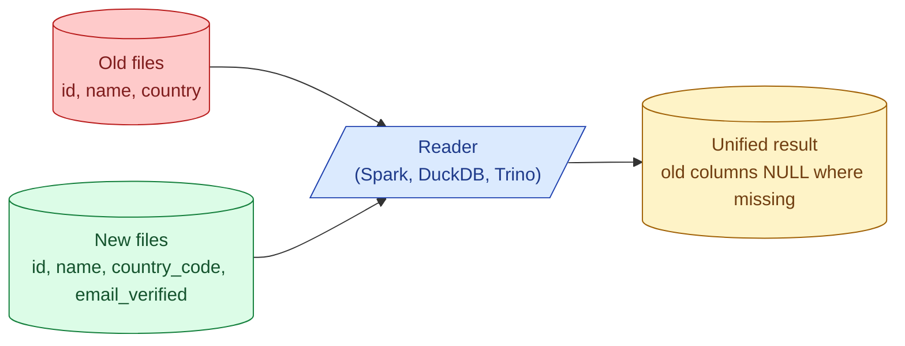

A table that has lived for a year has been written by different code versions. Some files have a `country` column. Newer files have `country_code` instead. Older files have no `email_verified` flag at all. Schema evolution rules say which of these changes a reader can still handle without rewriting every file in the table.

**What this page will cover.**

- The safe changes: add a column (default NULL), drop a column, widen a numeric type.
- The risky changes: rename a column, narrow a type, change a column's type.
- Why Iceberg's column IDs make renames cheap and Parquet's name-based matching makes them painful.
- How Avro's schema registry handles forward and backward compatibility for streaming.
- Backfill vs evolve: when you have to rewrite the old files anyway.
- The contract: never silently allow a breaking change.

*Page coming soon.*

This concept sits in **Stage 5 (Storage and file formats)** of the [Data Engineering Roadmap](/practice/data-engineering/roadmap/).
