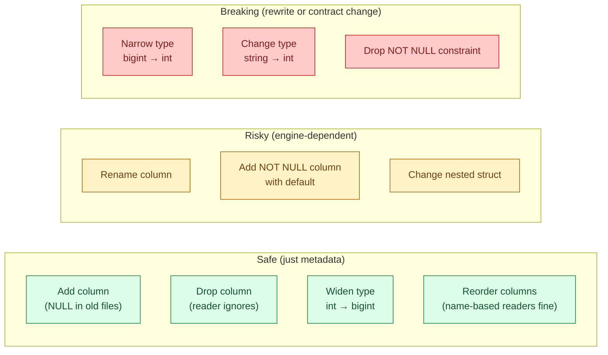
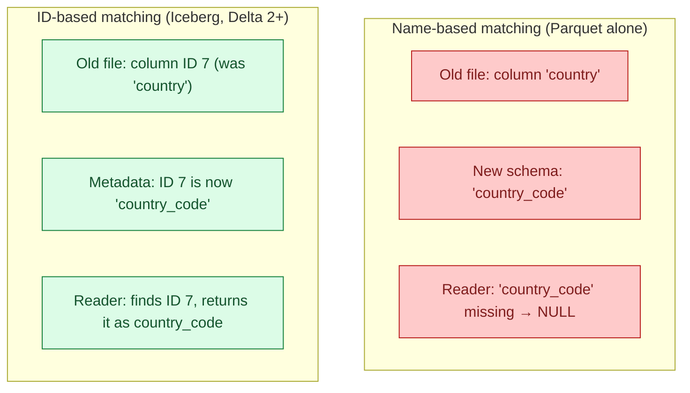
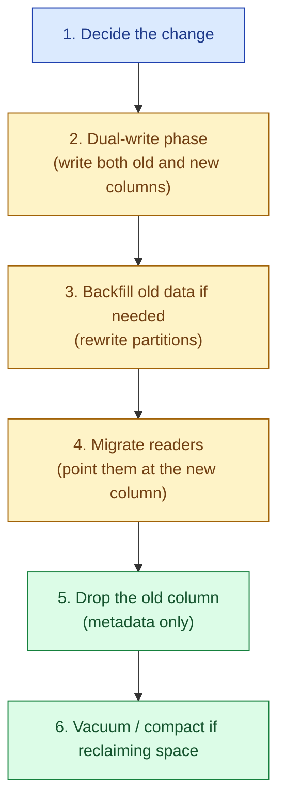

A table that has lived a year was written by several code versions. Some files have a `country` column, newer files have `country_code` instead, older ones never had an `email_verified` flag. Schema evolution rules say which of these changes a reader can still handle without rewriting every old file. Knowing those rules is what keeps a long-lived table maintainable.

## Safe, risky, and breaking



The mental model: a change is **safe** if old files can be read by new readers and new files can be read by old readers without error. A change is **risky** if it works in some formats but not others. A change is **breaking** if no reader can handle the mixed corpus and you must rewrite or version the data.

## Adding a column

Adding a column is the easiest case. The table format updates the metadata to say "column `email_verified` now exists, type boolean, default NULL." Old Parquet files do not have the column; readers see NULL. New Parquet files have it; readers see the real value.

```sql
ALTER TABLE users ADD COLUMN email_verified BOOLEAN;
```

This works the same way in Delta, Iceberg, and Hudi. It works on raw Parquet too, as long as the reader is configured to treat missing columns as NULL (Spark, Trino, DuckDB all do).

Watch out for two things:

- A `NOT NULL` constraint on a new column on a table with old data is not safe. Old rows would violate the constraint. Most engines refuse this unless you supply a default value, and even then the default applies only to new rows.
- Pandas and some lightweight readers fail on missing columns instead of returning NULL. Test the actual reader path before shipping.

## Dropping a column

Dropping a column is metadata-only. The data stays in old files; the metadata just stops listing the column. Readers no longer return it. New files do not write it.

```sql
ALTER TABLE users DROP COLUMN deprecated_field;
```

Safe in every modern table format. The old data is still on disk, taking storage. If you need to actually reclaim that space, run a rewrite (`OPTIMIZE` / `REWRITE`) on the affected partitions.

A subtle gotcha: in Parquet without a table format, "drop column" is not a real operation. The file still has the column; readers that ask for it get the data. You have to filter at the query layer or rewrite the files.

## Renaming a column: the column ID problem

Renaming is where things get interesting, because Parquet matches columns by **name**. Rename `country` to `country_code` and every old Parquet file's `country` column becomes invisible to a reader expecting `country_code`. The data is still there, but the name does not match.



Iceberg solved this on day one with **stable column IDs**. The metadata says "column ID 7 was once named `country` and is now named `country_code`." Old Parquet files do not store names internally; the column ID maps to the physical position. The reader uses the ID, not the name, to find the data.

Delta added column mapping in Delta Lake 2.0+, which works the same way. Hudi has more limited support: rename works on some configurations and not others.

Raw Parquet without a table format does not have column IDs. Renaming a column there is a breaking change. The choices are:

- Rewrite every old file with the new name (expensive on big tables).
- Add the new column, dual-write for a while, drop the old column once readers have migrated (the safe playbook).
- Switch to a table format that has column IDs.

If you anticipate renames at all, use Iceberg.

## Type widening and narrowing

Some type changes are safe (widening); some are not (narrowing).

**Widening (safe).**

- `int32` to `int64`
- `float` to `double`
- `decimal(10,2)` to `decimal(18,2)` (more precision, same scale)
- Adding optional fields to a struct

**Narrowing (breaking).**

- `int64` to `int32` (values might overflow)
- `double` to `float` (precision loss)
- `string` to `int` (parse failures)
- Making an optional field required

Widening works because every old value still fits in the new type. The reader reads the column as the new type and casts up. Narrowing breaks because old values may not fit; even if 99% do, the reader cannot promise the file is safe to read.

The safe playbook for narrowing is the same as renaming: dual-write, migrate readers, then drop.

## Reordering columns

Iceberg and Delta both handle column reordering through metadata. The physical column order in old Parquet files stays the same, but the logical schema lists them in the new order. Readers project columns by name or ID, not by position, so reordering is free.

Raw Parquet handles it too, as long as readers project by name. A reader that uses positional access (`row[3]`) breaks on reorder. This is mostly an issue with hand-written code; engines like Spark, DuckDB, and Trino always project by name.

## Schema evolution in streaming: Avro and the registry

Avro's story is different because Avro is row-based and used on Kafka. The schema lives in a registry; producers and consumers agree on schema IDs.

The registry enforces compatibility at registration time:

- **Backward compatibility.** New consumer can read old data. Adding optional fields, removing fields with defaults. This is the most common mode.
- **Forward compatibility.** Old consumer can read new data. Useful when consumers update slower than producers.
- **Full compatibility.** Both directions. The strictest, safest mode.

If a producer tries to register an incompatible schema, the registry rejects it before any bad events hit the bus. This is the schema evolution discipline pushed all the way to the write side.

See [#018 ORC vs Parquet vs Avro](/practice/data-engineering/concepts/018-orc-vs-parquet-vs-avro/) for the broader Avro picture.

## The safe-evolution playbook

For any non-trivial schema change on a long-lived table:



The dual-write phase is the safety net. While both columns exist, any reader still works. Old readers use the old column, new readers use the new column. Once metrics confirm nothing reads the old one, drop it. This works for renames, type changes, and most refactors.

Skip the dual-write and you depend on every consumer migrating in lockstep. In any team larger than one, that lockstep does not happen.

## Common mistakes

- **Renaming a Parquet column without a table format.** Name-based matching silently drops the data. Old files become invisible until you rewrite them.
- **Adding a NOT NULL column with no default.** Old rows violate the constraint. The engine either refuses the change or silently breaks reads.
- **Narrowing a type without checking the range.** Even if today's values fit, tomorrow's might not. Treat narrowing as a breaking change.
- **Skipping the dual-write phase.** You will have at least one reader you forgot. The dual-write window lets that reader keep working until somebody notices.
- **Trusting "schema-on-read" to fix evolution problems.** It does not. JSON and CSV happily produce wrong answers when columns shift; they just produce them silently.
- **Forgetting that engines vary.** Spark might allow a change that Trino rejects. Test the actual reader matrix, not just one engine.
- **Backfilling by rewriting in place.** A failed rewrite leaves the table half-converted. Use a table format with atomic commits, or write to a new table and swap.

## Quick recap

- Safe changes: add column, drop column, widen type, reorder.
- Risky changes: rename column (needs column IDs), nested struct edits.
- Breaking changes: narrow type, change type, tighten nullability without a migration.
- Iceberg's column IDs and Delta 2+ column mapping make renames cheap; raw Parquet alone cannot.
- For streaming, the Avro schema registry pushes compatibility checks to the producer side.
- The safe playbook for non-trivial changes: dual-write, backfill, migrate readers, drop.

This concept sits in **Stage 5 (Storage and file formats)** of the [Data Engineering Roadmap](/practice/data-engineering/roadmap/).
